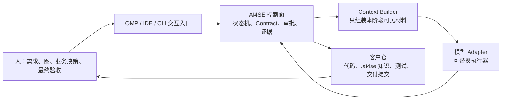

# Customer-Repo Delivery Operating Model · 客户仓交付操作模型

> **状态：目标产品契约 / 整改总纲。** 本文定义用户怎样使用 AI4SE、模型在系统中的位置，以及一次需求交付必须留下哪些可执行制品。它不把某一次实验的手工步骤当作最终产品体验；实现是否完成以各能力域的 Contract、代码和真实客户仓运行证据为准。
>
> 相关： [Vision](./vision.md) · [Capability Map](./capability-map.md) · [Philosophy](./philosophy.md) · [Repository Facts Contract](../10-repository-intelligence/repository-facts-contract.md) · [Context Package 执行手册](../20-context-engineering/context-package-execution-handbook.md) · [真实运行手册](../90-status/m1-real-customer-story-runbook-v1.md)

---

## 1. 一句话定位

**AI4SE 是运行在客户代码仓旁边的、受控且可恢复的软件交付系统（delivery control plane）；不是一个 Agent，也不是一个模型。**

它把人给出的自然语言、图像和业务决定，变成客户仓中可审计的规格和阶段输入；再把可替换的模型当作受约束的执行器，最终交付可验证的本地代码提交，等待人工验收。



模型没有流程所有权、没有业务知识所有权，也不能自行宣布交付成功。模型负责在明确上下文内分析、设计、编码、修复和评审；AI4SE 负责阶段、范围、持久化状态、输入输出校验、独立验证和停止/恢复；人负责业务含义与接收决定。

### 1.1 这不是“把聊天记录攒长”

长对话会发生上下文漂移、遗漏、无法复核、换 Adapter 失效。AI4SE 的记忆单位是**客户仓内有版本、有引用、有格式的制品**，不是某个模型会话。

每次模型调用只收到该阶段的 Context Package：

- **P1（必读且冻结）**：当前需求规格、澄清结论、相关仓库事实、适用规则、已冻结验收和前阶段产物；缺失即拒跑；
- **P2（可裁剪）**：相关知识、代码摘录、历史模式、架构补充；有预算和相关性上限；
- **禁止**：整仓 dump、无关历史 Story、模型私有聊天记录、未来阶段的结论。

因此，系统可重启、可换模型、可在第二天恢复，并能回答“这次代码为什么这样改”。

---

## 2. 用户真正看到的操作方式

第一版可以是 CLI/IDE 命令，后续可以是 OMP 对话面板；两者只是一层交互外壳，必须落到同一组持久化状态和文件。**不能把交互体验实现成一个永不退出的模型子进程。**

### 2.1 初次进入一个客户项目：一次摸底，持续更新

```text
用户：/ai4se onboard
AI4SE：扫描仓库、识别模块/语言/构建/测试/启动入口和风险面；
       在客户仓创建 .ai4se/ 的仓库事实与初始知识骨架；
       展示发现、未知项和需要补充的环境信息。
```

摸底只产生可复查事实，不臆测业务方案。业务含义由已有文档、代码、数据库模型、接口定义和人工补充形成知识材料。任何“未能确认”的项目必须显式标为 Unknown，不能伪装成结论。

### 2.2 一张需求卡：对话输入，受控运行

```text
用户：粘贴文字、截图/原型或文件；执行 /ai4se analyze ORD-102
AI4SE：构建 Analysis Package，输出影响面、风险、澄清问题或“可进入计划”。

用户：在 OMP 中回答问题；执行 /ai4se continue ORD-102
AI4SE：把回答封装为 Clarification Package，专门调用模型处理答案；
       仍有问题则再次等待，问题清楚才进入 Planning。

用户：查看计划；执行 /ai4se approve-plan ORD-102
AI4SE：Development → Verification → Defect loop → Review → 本地 commit。

用户：人工验收并决定接收；执行 /ai4se accept 或 /ai4se reject。
```

当 Analysis 判定需求已清晰时，界面必须明确显示：范围、影响文件、风险、验收项和拟采用的测试策略，并请求“进入计划/开发”的确认；不能静默从一句模糊需求直接写代码。

### 2.3 两种运行模式

| 模式 | 适用 | Gap/BLOCKED 时的行为 | 后半段 |
|---|---|---|---|
| `interactive` | 白天协作、单张卡澄清 | 持久化问题并显示给人；可在同一入口回答或稍后 resume | 计划批准后无人值守 |
| `batch` | 夜间队列、已澄清的卡 | 立即停止该卡并记录待回答项；不等待 stdin、不猜答案 | 只运行已具备批准条件的卡 |

“无人值守”从计划被批准开始，而不是取消业务澄清。业务决策无人知晓时，停下是正确结果，不是失败体验。

---

## 3. 人、AI4SE 与模型的责任边界

| 主体 | 负责 | 不负责 / 禁止 |
|---|---|---|
| 人（产品/开发/验收） | 原始需求、业务选择、风险授权、计划批准、最终接收 | 手工替模型拼 Context、伪造验证结论、替 Runtime 绕门禁 |
| AI4SE 控制面 | 状态机、审批、停止/恢复、输入输出 Contract、写入范围、证据、独立验证、调度建议 | 用模型记忆代替状态；替人拍业务决策；直接做业务代码 |
| Context Builder | 从客户仓的规格、事实、知识和前序制品构建阶段 Package | 让模型遍历全仓；混入未来结论；自行控制流程 |
| 模型 / Adapter | 读取被授权的 Package，按角色输出 Analysis/Plan/Code/Review 产物 | 擅自扩大范围、决定是否跳过验证、拥有长期业务记忆 |
| 客户仓 | 业务代码、客户知识、测试、运行配置、每张 Story 的过程制品 | 把客户源码/凭据回流到 AI4SE 产品仓 |

**模型输出永远是候选制品，只有通过 Contract 和独立验证才成为阶段事实。** 例如模型写出的测试不能作为“它自己实现正确”的唯一证明；模型在 Review 里写 PASS 也不能覆盖验证系统已冻结的验收结果。

---

## 4. 客户仓的文件布局：持久化工作记忆

客户业务知识和交付痕迹住在客户仓；AI4SE 产品仓只保存 Runtime、Contract、模板和 Adapter。建议布局如下：

```text
customer-repo/
├── .ai4se/
│   ├── repository/
│   │   ├── entries.yaml                 # 构建、测试、启动等已验证入口
│   │   ├── facts.yaml                   # 模块、技术栈、数据库、依赖等可复查事实
│   │   ├── module-map.md                # 面向人阅读的模块地图
│   │   └── baseline.md                  # 基线 commit、环境、已知限制
│   ├── knowledge/
│   │   ├── business-context.md          # 术语、核心业务规则、角色
│   │   ├── architecture-context.md      # 分层、边界、主要调用链
│   │   ├── domains/                     # order.md、inventory.md 等领域知识
│   │   └── data/                        # 关键表/状态机/事件说明
│   ├── rules/
│   │   ├── coding-standards.md          # 可执行代码约束
│   │   ├── domain-invariants.md         # 不变量与禁止行为
│   │   └── frontend-standards.md        # 仅当前仓含前端时存在
│   ├── index/
│   │   └── knowledge.yaml               # 知识索引、标签、版本和适用范围
│   └── runtime/                         # Adapter/角色模型等客户侧运行配置
├── .story/
│   └── ORD-102/                         # 一张卡的全过程，见下一节
└── <客户原有代码与测试>
```

文件名可以按客户规范调整；**语义、引用关系和冻结规则不能调整。** 若客户不允许提交 `.ai4se/`，应存于与客户仓绑定、同样可版本化和可访问的受控工作目录，并在每个 Package 中记录精确引用和 SHA-256。

### 4.1 Repository 与 Knowledge 的区别

| 制品 | 内容 | 谁产生/维护 | 谁读取 |
|---|---|---|---|
| `repository/*` | 可机器复查的事实、入口、基线、模块地图 | onboard + 人校正 | Analysis、Planning、Verification |
| `knowledge/*` | 有来源的业务语义、架构解释、领域规则 | 人维护为主；人验收后受控更新 | Analysis、Planning、Development |
| `rules/*` | 必须遵守的工程/领域约束 | 客户技术负责人/平台 | 对应阶段 P1 |
| `.story/*` | 单卡输入、决策、计划、执行和证据 | AI4SE + 人 | 本卡阶段及审阅 |

Repository Intelligence 只说“仓里有什么”；Knowledge 不把猜测写成事实；Analysis 负责把两者与当前需求关联起来。

---

## 5. 每张 Story 的规范文件包

一张卡不是一篇长 Markdown。它是少量职责单一、可验证、可被模型按阶段消费的文件包。YAML/JSON 用于稳定字段、校验和机器状态；Markdown 用于人可读的依据、设计和叙述；代码/脚本用于可执行验证。

```text
.story/<story-id>/
├── requirement.md
├── requirement.meta.properties
├── requirement-attachments/
│   ├── manifest.properties
│   └── <frozen files: png/jpg/pdf/...>
├── analysis/
│   ├── discovery.report.md
│   ├── gap.report.properties
│   ├── clarification.request.properties # 仅有歧义时
│   ├── clarification.answer.properties  # 人的原始决定，不由模型改写
│   └── clarification.resolution.md       # 模型处理答案后的结论
├── planning/
│   ├── plan.md
│   ├── change-map.properties
│   ├── test-strategy.md
│   ├── effective-constraints.md
│   ├── effective-constraints.properties
│   ├── api-contract.md                   # 条件产物
│   ├── data-change.md                    # 条件产物
│   └── approval.properties
├── packages/                             # 每次 Adapter 调用的阶段输入快照
├── development/                          # 轮次、changed files、实现摘要
├── verification/                         # AC 矩阵、命令和报告
├── defects/                              # 每次失败一个结构化 Defect Package
├── review/
├── delivery/
└── run/                                  # 状态机、ledger、各阶段 SHA
```

这里保留现有 `.story/<id>` 宿主，不为了目录外观迁移大量已验证代码。每一阶段只消费其明确声明的上游文件。

### 5.1 必有、条件、自动生成：避免文档主义

| 类别 | 制品 | 目的 | 产生时机 |
|---|---|---|---|
| 必有且人可读 | `requirement.md`、`analysis-report.md`、`plan.md`、`test-strategy.md`、`verification-report.md`、`delivery-report.md` | 让需求、方案、验收和交付可审阅 | 每张卡 |
| 必有且机器校验 | 元数据、Gap、澄清问答、变更地图、验收矩阵、批准、Review 结果 | 停止/恢复、范围和状态的一致性 | 对应阶段 |
| 条件产物 | `api-contract.md`、`data-change.md`、`release-notes.md`、迁移/回滚方案 | 仅当 API、数据、发布行为变化时 | Planning 判定并列出理由 |
| 自动生成 | Package manifest、命令输出、ledger、probe 结果、diff 摘要 | 证据与可复现性 | Runtime 生成，模型不可伪造 |

禁止为了“文档齐全”复制相同内容到多个文件。每个结论必须有唯一事实源，其它地方使用 `story-id + path + SHA` 引用。

---

## 6. 各文件的最小格式与模型消费规则

### 6.1 需求规格：`.story/<story-id>/requirement.md`

该文件由人发起、模型可协助整理、**人冻结**。不能只写一段聊天散文。

```markdown
# ORD-102：后台订单可执行操作

## goal
让运营在订单详情中看到当前状态允许的后台操作，避免执行非法状态变更。

## business-context
- 管理员可代用户确认收货；退款只允许未发货订单。

## in_scope
- 后台订单详情的操作投影和对应服务校验

## out_of_scope
- 数据库迁移、支付渠道退款、用户端 UI 改版

## acceptance
- AC1: 已付款订单返回 ship 与 refund 两项可执行操作。
- AC2: 已发货订单返回 confirmReceive，不返回 refund。
- AC3: 已取消订单不返回任何可执行操作。
- AC4: 非法操作被服务层拒绝，并保持原订单状态。
- AC5: 指定的独立验收探针和正式测试入口均通过。
```

`requirement.meta.yaml` 至少保存 `story_id`、作者/时间、baseline commit、版本、SHA、状态（draft/frozen/superseded）。需求或 AC 发生实质变化必须创建新版本；不得在已开始开发后静默改写。

### 6.2 附件：`requirement-attachments/manifest.properties`

每个图、原型、PDF、接口说明都要有路径、MIME、SHA-256、来源、用途和可见角色。Analysis Package 必须包含附件快照或可验证只读引用，并明确要求模型读取并引用。

```properties
attachment.1.id=order-detail-wireframe
attachment.1.file=order-detail.png
attachment.1.mime=image/png
attachment.1.sha256=<sha256>
attachment.1.purpose=后台订单详情操作区原型
attachment.1.required_by=analysis,planning,review
```

Adapter 必须声明是否支持该类型。视觉不支持时，系统应停在可回答的澄清问题上，或要求人提供文本描述；绝不把“附件索引存在”当作“模型已经理解图片”。

### 6.3 分析与澄清：不要直接从答案跳到 CLEAR

`analysis-report.md` 要回答影响模块、现有行为、证据、未知和风险；不得提前定实现方案。`gap-report.yaml` 是机器门禁，至少包括：

```yaml
status: CLEAR | BLOCKED
blocking_count: 0
questions_ref: analysis/clarification.request.properties
evidence_refs: []
```

当 `BLOCKED` 时，`clarification-request.yaml` 必须含具体问题，不能只写“需要澄清”：

```yaml
questions:
  - id: Q-01
    question: 管理员确认收货是可执行动作还是仅展示状态？
    why: 决定状态迁移、权限和审计边界。
    evidence_refs: [.ai4se/knowledge/domains/order.md]
    options:
      - id: A
        text: 管理员可执行确认收货
      - id: B
        text: 仅展示状态
    recommended: A
    impact_if_unanswered: 禁止生成状态变更代码。
```

人的 `clarification-answer.yaml` 必须保留选项 ID、自由补充、回答人和时间。它作为下一次**专门的 Clarification Package 的 P1 输入**。模型输出的 `clarification-resolution.md` 必须逐题说明“答案如何消除了哪个 Unknown / 仍留下什么”，随后由系统重新生成 Repository Context 和 Gap；只有重新判定为 `CLEAR` 才能进入 Planning。

### 6.4 开发计划：`planning/`

`plan.md` 是批准对象，不是模型的思维草稿，必须包含：

- 目标与已冻结的需求/澄清引用；
- 设计选择及其原因，明确沿用当前仓已有分层/模式；
- 逐条 AC → 实现步骤 → 验证方式的对照；
- 风险、回滚和非目标；
- API、数据、权限、兼容性、可观测性影响的“有/无”结论；无变化也要声明。

`change-map.yaml` 是可机器读取的写入范围与依赖：

```yaml
allowed_files:
  - litemall-core/src/main/java/.../AdminOrderHandleOption.java
  - litemall-admin-api/src/main/java/.../AdminOrderService.java
declared_new_files: []
forbidden_paths: [.ai4se/, .story/, db/production/]
dependencies: []
parallel_safety: serial
```

允许路径由计划提出、由人批准、由 Runtime 强制。模型不能通过“顺手格式化整个仓库”扩大范围。

`test-strategy.md` 必须按 AC 描述独立验收、回归、集成/启动和人工检查的分工。`api-contract.md` 至少包含请求/响应、错误语义、兼容性、鉴权；`data-change.md` 至少包含 schema/dataset 影响、迁移、回滚、数据风险。二者只在确有变化时生成。

### 6.5 开发、验证、缺陷与交付

- `development-rounds.jsonl`：每轮模型调用的输入 manifest、变更摘要、命令、结果和停止原因。不是让模型自行写“我已完成”。
- `acceptance-matrix.yaml`：逐条 AC 的 `PROVEN / FAILED / UNPROVEN`、对应 probe、命令、exit、超时、输出摘要和证据 SHA。
- `defects/<id>/`：独立验证失败后生成，包含复现命令、期望/实际、关联 AC、最小日志/栈、可疑范围；Development 只依据它修复，不重猜需求。
- `review-result.yaml`：结构化 `PASS / CONDITIONAL / REJECT`、`review_source`、阻断项；只有 PASS 可进 Delivery。
- `delivery-report.md`：commit、变更摘要、AC 完成率、测试结果、已知限制、回滚方式、人工验收项。它不是自动上线授权。

---

## 7. 代码一致性的约束体系

“统一”不是把所有客户仓强行改成一个架构。正确优先级是：

```text
法律/安全与客户明确规则
  > 客户现有架构、构建和编码规范
  > 本 Story 已批准计划与范围
  > AI4SE 平台通用工程规则
  > 模型偏好
```

### 7.1 后端与 DDD

- 若客户仓已有 DDD / 六边形 / 分层边界，规则文件应规定聚合、应用服务、领域服务、仓储、DTO/Command 的放置与依赖方向，模型必须遵守。
- 若客户仓是传统 MVC/Service/Mapper，不得为了“使用 DDD”在一张小卡里凭空引入聚合、事件总线或全新分层；应在当前架构边界内完成，并把结构债务写入交付/复盘。
- DDD 是**需要时使用的业务建模方法**，不是每个类都套一层的文件命名仪式。跨状态机、不变量、实体边界或复杂业务规则时，才需要在 Plan 中显式说明领域模型与不变量。

### 7.2 前端

- 优先复用客户现有框架、目录、组件库、状态管理、请求封装、国际化、路由与测试工具；禁止同一仓库混入另一套前端范式。
- `frontend-standards.md` 应写可执行规则：组件目录、TypeScript/JavaScript、表单校验、接口类型、错误/加载/空态、可访问性、lint/typecheck/test 命令。
- 有截图/原型时，Plan 应区分“视觉还原”“交互行为”“接口契约”，分别列出验收方式；视觉比较不能替代状态与权限测试。

### 7.3 可执行规则，而不是空泛口号

规则应尽量有路径、命令或检查方式。例如“所有写接口必须校验权限”要引用现有鉴权拦截器/测试模式；“禁止 N+1 查询”要给出代码检查点或集成数据场景。只有无法自动化的规则，才标记为 Review 检查项。

### 7.4 规则必须被编译成每次写代码都带着的 `Effective Constraint Bundle`

把 `coding-standards.md` 放在客户仓里还不够。它若只是 P2 检索材料，模型在第二张卡、第三轮修 Bug 时很容易不再看到它，或被长日志挤掉。正确做法是：在每张 Story 从 `Planning` 获批准前，由控制面根据目标模块和变更范围**确定性地编译**一份有效约束包；此后每一次会写代码的调用都把同一份包作为 P1 输入。

```text
客户全局规则 + 当前架构约束 + 目标模块规则 + 已批准 Story 计划
                           │
                           ▼
              Effective Constraint Bundle（冻结、带 SHA）
                           │
        ┌──────────────────┼──────────────────┐
        ▼                  ▼                  ▼
  首轮 Development    每一轮 Defect 修复      Review / Delivery Gate
        同一版本            同一版本             同一版本
```

建议制品：

```text
.ai4se/rules/
├── coding-standards.md                # 硬约束 + 原因 + 正确范例
├── architecture-rules.md              # 分层/依赖/模块边界
├── frontend-standards.md              # 条件规则
└── domain-invariants.md               # 领域不变量

.story/<story-id>/planning/
├── effective-constraints.properties   # 本卡实际生效的规则引用、版本、SHA
└── effective-constraints.md           # 给人和模型阅读的精简说明
```

客户规则 Markdown 的头部承载能被系统选择和检查的硬条件：角色、适用路径、严重级别、check 或 review check；正文只保留原因和少量仓内正确范例。一个规则至少要有 `id`、`roles`、`paths`、`severity`、来源和检查方式；没有检查方式的规则不能假装是自动门禁。第一版扩展现有 `.ai4se/rules/*.md` 合同，不引入新的 YAML 解析依赖。

```markdown
# id: backend-service-must-authorize
# roles: Planning,Development,Review
# paths: litemall-admin-api/**
# severity: blocker
# check: mvn -pl litemall-admin-api -am test

写操作必须沿用现有管理员鉴权与服务层校验。
正确范例：litemall-admin-api/.../AdminOrderService.java
```

`effective-constraints.properties` 必须声明 `baseline_commit`、Plan SHA、每个规则文件的 SHA、命中的规则 ID、适用路径、强制命令、例外及其批准人。它和 Change Map 一同进入批准范围；开发过程中不可被模型改写。规则需要改变时，必须由人创建新的规则版本，并让受影响 Story 重新生成 Plan/Constraint Bundle 后再次批准，不能在修 Bug 时悄悄换标准。

### 7.5 阶段上下文矩阵：什么时候给模型什么

精准不来自“给模型更多资料”，而来自**在正确阶段提供稳定、相关且不可被后续日志冲掉的资料**。表中的“需求/Plan/规则”指由其冻结源和 SHA 编译出的短 `Control Card` / `Task Card`，不是每轮拼接全文；具体的包形状、切片和预算见 [Context Package 执行手册](../20-context-engineering/context-package-execution-handbook.md)。以下矩阵是系统的强制装包规则：

| 阶段 / 调用 | 不可裁剪 P1 | 可检索 P2 | 明确禁止 | 输出如何反哺下游 |
|---|---|---|---|---|
| Onboard | 工作区、只读入口、环境声明 | 代码树/构建文件 | 需求方案、改码指令 | Facts、入口、基线、模块地图 |
| Analysis | 冻结需求、附件 manifest/快照、相关 Facts、领域不变量、适用规则索引 | 匹配知识正文、候选代码/测试摘录 | 全仓、历史聊天、实现方案 | Repository Context、Gap、问题清单 |
| Clarification resolution | 原问题、人的原始回答、需求 SHA、相关证据 | 知识摘录 | Plan/Patch、把回答改写成新需求 | 更新 Context、重新判定 Gap |
| Planning | 需求、澄清结论、Context、适用规则、现有模块范例、基线入口 | 相关架构/知识 | 全仓日志、未来 Defect | Plan、Change Map、Test Strategy、Constraint Bundle |
| **首次 Development** | **需求/AC、澄清、已批准 Plan、Change Map、Effective Constraint Bundle、独立 probes 的接口、目标文件及相邻范例、正式命令** | 相关测试、知识、最小调用链 | 模型旧对话、无关 Story、修改 probe/规则 | 受限 diff、实现测试、轮次记录 |
| **每轮 Defect 修复** | **与首次 Development 完全相同的 Constraint Bundle + 原冻结需求/Plan/范围 + 当前 Defect Package + 当前验收矩阵** | 最小失败日志、相关代码摘录 | 只给失败日志后“自由修复”；修改 AC/探针/规则 | 新 diff、重跑结果、无进展判定 |
| Verification | 冻结 probe manifest、AC 矩阵、正式入口、基线/约束版本 | 运行日志 | 模型自评、可修改的探针 | PROVEN/FAILED/UNPROVEN、Defect |
| Review | 冻结 Constraint Bundle、Plan、AC 矩阵、最终 diff、范围/依赖检查结果 | 架构范例、相关知识 | 自己改规则、覆盖验证结果 | PASS/CONDITIONAL/REJECT |

这里最重要的一行是 Defect 修复：**缺陷上下文是增量，不是替代。** 不能因为模型现在只处理一个测试失败，就只给它测试日志；它仍必须看到本卡已经批准的边界、精确 AC、命中架构规则、允许文件与独立 probe。它不需要重读全量原始 Plan、规则库或历史日志——这些由同一版本的短 Control Card 表达，并由 manifest 指回完整冻结源。这是避免“修了一个 bug，又破坏安全、分层、接口兼容性或另一条 AC”的核心机制。

### 7.6 规则既要给模型，也要由系统验证

同一条约束至少应落在两个位置，避免只靠模型自律：

| 层 | 作用 | 例子 |
|---|---|---|
| Context | 让模型在写前知道标准和正确范例 | 服务层不得绕过鉴权；前端必须使用现有请求封装 |
| Pre-write Gate | 拒绝不具备约束/批准范围的执行 Package | 无 `Effective Constraint Bundle`、范围未批准则不进 Development |
| 自动检查 | 用客户已有 formatter、lint、typecheck、架构测试、测试入口检查 | Maven/Gradle、ESLint、TypeScript、ArchUnit 等，按客户仓实际能力选择 |
| Diff/Scope Gate | 检查实际改动没有越过 Change Map、规则或生成目录 | 改了探针、规则、无关模块即停止 |
| Review | 处理暂不能自动化的架构、可维护性、领域不变量 | 不允许一个 Service 偷偷承担跨聚合事务 |
| 人验收 | 判断业务意图、体验和可接受风险 | 原型交互是否符合运营实际 |

模型拿到的规则必须带**仓内可仿照的最小范例**，而不只是“遵守 DDD”“代码要优雅”这种抽象话。Context Builder 应为每个目标模块提供当前正确实现、对应测试和调用边界的短摘录；若找不到可信范例，Analysis/Planning 应标为风险或澄清项，不能让模型临场发明新范式。

---

## 8. 验证：用独立证据回答“功能真的完成了吗”

验证分层，不能只用 `mvn test` 或模型新写的单测代替所有结论。

| 层 | 目标 | 证据拥有者 | 失败后的去向 |
|---|---|---|---|
| 基线 | 原仓能在声明环境构建/测试 | onboard/operator | 环境或入口问题，开发前停止 |
| 实现测试 | 新增代码的局部行为和回归 | Development | 先暴露给模型，但不单独决定 AC |
| 独立验收 probe | 每条 AC 的外部可观察结果 | 人在开发前冻结，Runtime 执行 | Defect Package → Development |
| 集成/启动 | API、DB、消息、前后端或实际运行链路 | Plan 指定 | Defect Package 或人工阻断 |
| Review | 范围、安全、架构、可维护性 | Review Adapter + 控制面 | CONDITIONAL/REJECT 停止 |
| 人工验收 | 业务是否接收、是否合入/发布 | 人 | 接收或退回新的 Story/缺陷 |

### 8.1 验收探针的硬规则

1. 每一条 AC 必须在 Development 前映射到一个或多个独立 probe；无 probe 的 AC 是 `UNPROVEN`，不能自动交付。
2. Probe 不在本 Story 的允许写入范围内，且其内容、命令和 SHA 在开发前冻结。
3. Probe 可以调用客户已有测试、启动产物或只读 harness；不能只 grep 模型刚写的源代码。
4. 入口测试成功只说明“入口通过”；功能 AC 是否满足由 `acceptance-matrix.yaml` 单独判定。
5. 对 DB/API/前端改动，至少有一个能穿过真实边界的验证；无法自动化的风险列为人工验收项，不能伪造为 PROVEN。

### 8.2 修 Bug 的有界回环

`Verify FAILED → Defect Package → Development` 是允许的自动回环，但必须有最大轮次、无进展检测和不可修改的验收标准。超预算时停止并交付可诊断证据；不得无限重试、偷偷放宽 AC 或把失败改写成 PASS。

---

## 9. 多 Story：先批量理解，再按依赖安全调度

批量能力不是“同时让多个模型改仓库”。分三步：

1. **批量分析**：每卡独立读取同一冻结仓库基线，生成 Context、问题、候选改动面、风险和依赖声明；可并行但只读。
2. **集中澄清与批准**：人一次性回答各卡问题；每张卡独立形成冻结的澄清结论和 Plan。
3. **调度交付**：控制面根据 `change-map.yaml`、模块/表/API 依赖、共享测试资源和计划依赖图提出串/并行建议。

| 情形 | 默认策略 |
|---|---|
| 共享同一文件、聚合、表、接口或状态机 | 串行 |
| B 依赖 A 的 API/数据契约 | A 先交付并成为 B 的新 baseline |
| 改动范围不交叉，测试/环境可隔离 | 独立 worktree 并行，分别验证/Review/commit |
| 依赖或范围不确定 | 先澄清/补摸底；不以“可能没冲突”并行 |

每张卡都有独立 Story 状态、Package、probe、commit 和 evidence；批次只保存队列、依赖图、调度决定和汇总指标。模型可以提出建议，**控制面按声明与规则执行，最终并行授权仍由人确认。**

---

## 10. 可恢复状态与停止语义

每个阶段转换都写入 `workflow-state.yaml` 与 append-only `ledger.jsonl`，记录 input manifest、输出 SHA、adapter/model、命令、时间、终态和理由。恢复不是“让同一个聊天窗口接着想”，而是从已持久化状态重建下一阶段 Package。

| 状态 | 人看到什么 | 可执行动作 |
|---|---|---|
| `AWAITING_HUMAN_CLARIFICATION` | 明确问题、选项、推荐和影响 | 提交答案 → 重新分析 |
| `AWAITING_PLAN_APPROVAL` | 计划、范围、测试策略、风险 | 批准/驳回/补充信息 |
| `DEVELOPING` / `VERIFYING` | 自动进度和本轮证据 | 只读观察；不手工插入修改 |
| `STOPPED_NEEDS_CLARIFICATION` | 未解决问题及其证据 | 进入交互澄清；batch 不等待 |
| `FAILED_VERIFICATION_BUDGET` | Defect、已尝试轮次、失败 probe | 人决定新卡/修正规格/最小系统改进 |
| `AWAITING_HUMAN_ACCEPTANCE` | 本地 commit、AC 矩阵、已知限制 | 接收、拒绝或创建后续 Story |

回答、批准、拒绝、切换 Adapter 和恢复都必须成为 ledger 事件。不得靠手工创建一个“resolved”文件就把 Gap 直接改成 CLEAR。

---

## 11. 实现整改范围与先后顺序

这是一套统一目标，不等于一次大爆炸重写。每一步都必须能在真实客户仓验证，且不破坏已有状态机、写入范围、PASS-only Delivery 和独立 probe 纪律。

### M0 · 有效工程约束包与阶段装包纪律（P0）

**目标：** 先让模型在任何一次写代码或修 Bug 前都收到同一份、被人批准且可验证的工程约束，消除多卡、多轮修复中的标准漂移。

- 为客户仓 Rule 建立机器可读的最小 schema，并允许 Markdown 解释/范例；
- 在 Planning 依据目标模块和 `change-map.yaml` 编译、冻结 `Effective Constraint Bundle`；
- 让首次 Development、Defect loop、Review 都把该 Bundle 作为不可裁剪 P1，并记录 manifest/SHA；
- 没有 Bundle、Bundle 与计划/基线不一致、模型尝试改规则/probe 或超范围时拒绝运行；
- 先接入客户已有的 formatter/lint/typecheck/架构测试，不另造检查平台；不能自动检查的才交 Review；
- 覆盖：第二张卡、第三轮 Defect 修复、规则版本变更、Adapter 切换和重启恢复时的规则一致性。

**完成定义：** 在一张真实卡的至少一次 Defect 回环中，审计可证明 Development 与修复调用收到相同的约束版本；范围、静态检查和 AC 都没有因修复而退化。

### M1 · 交互澄清成为正式主链（P0）

**目标：** 人能在 OMP/CLI 回答模型提出的具体问题，系统重新分析后自动进入 Planning；无歧义卡不增加阻塞。

- 新增结构化 `ClarificationRequest` / `ClarificationAnswer` / `ClarificationResolution` 制品与 schema；
- Analysis 在 `BLOCKED` 时强制输出具备 question id、证据、选项、影响的问题清单，否则合同失败；
- 新增 `run --interactive` 与受控 `continue/resume --answers` 入口；答案注入专门的 Clarification Package P1；
- 调用模型重新解析 Gap，禁止“有答案文件即 CLEAR”；
- 覆盖：多问题、再次 BLOCKED、重启恢复、Adapter 切换、batch 立即停止、答案不能静默改 AC/范围。

**完成定义：** 用一张真实但有业务歧义的客户卡，完成“提问 → 人回答一次 → 自动 Plan → 批准后无人值守到本地 commit”。

### M2 · 客户仓摸底与可读知识（P0/P1）

**目标：** Analysis/Planning 真正读取与引用客户仓的 facts、入口和相关知识，不让模型从空白猜。

- onboard 产出/校正 `entries.yaml`、facts、module map、baseline；
- Analysis Package 将已验证入口、相关 Repository Facts 与匹配知识正文按 P1/P2 明确装入；
- 引入最小人工维护的 `business-context.md`、`architecture-context.md`，先读通再讨论自动写回；
- Package manifest 记录来源和 SHA，Analysis 报告必须引用它使用过的证据。

**完成定义：** 用第二张真实卡证明模型引用了正确模块/业务规则，并减少无效澄清或范围误判；不是只生成若干空 Markdown。

### M3 · 附件与计划文件包（P1）

**目标：** 截图/原型/API 文档成为可审计的需求输入；Plan 成为开发和验证的一致依据。

- 附件 snapshot/manifest、Adapter 能力声明和显式 prompt 指令；
- 建立本文第 5–6 节的最小 Story 模板；先覆盖 requirement、analysis/gap、clarification、plan/change-map/test strategy、verification/delivery；
- API/数据文件仅在 Plan 判定有影响时生成；
- 为每类制品实现 schema 与 P1/冻结校验。

**完成定义：** 真实含截图的卡，模型能引用截图内容或诚实地请求文本补充，且最终 AC、计划、probe、交付报告可一一对照。

### M4 · 多卡批量分析与安全调度（P2）

**前置：** 至少 3 张单卡完成真实运行，M1–M3 有证据，而非只靠单元测试。

- 只读批量分析队列；
- 显式依赖/冲突清单和串并行建议；
- worktree 隔离、每卡独立验证和批次 scorecard；
- 不做通用 Graph/Ranking/Policy Engine，除非真实运行连续证明现有显式规则不足。

---

## 12. 不做什么，以及何时才做

| 不做 / 暂不做 | 原因与替代 |
|---|---|
| 把 AI4SE 改成“模型即编排器”的超长 Markdown skill | 会失去确定状态、测试保护、审计和 Adapter 可替换性；交互由控制面实现 |
| 复制其他项目的固定 Pause 点 | 停止点应来自 `Gap/Approval/Verification` 状态，而非模仿聊天产品 |
| 自动从客户代码“生成全部业务知识” | 代码扫描只能出事实；业务语义要有来源并由人确认 |
| 在读知识都未通前做复杂自动写回 | 先保证 Analysis/Plan 真读、真引用；写回须在人验收后受控发生 |
| 只看测试绿或模型自评就 Delivery | 必须 AC probe + 入口验证 + Review PASS |
| 过早做多 Agent、并发调度、图引擎、Dashboard | 单卡交互闭环没有稳定前，它们只会放大不确定性 |
| 自动 push / 发布 | AI4SE 的自动终点是本地受控 commit；发布始终另有授权流程 |

---

## 13. 对标成熟编排理念：借原则，不盲目搬框架

AI4SE 应持续参考 LangGraph、AutoGen、OpenHands 等已经在真实人机协作中验证过的机制；但采用的单位应是**可证明能补主链缺口的原则/Contract**，不是某个框架的 API、术语或运行时依赖。

| 对标理念 | 应借用的本质 | AI4SE 的落点 | 当前决定 |
|---|---|---|---|
| Human-in-the-loop interrupt/resume | 在需要业务决定时保存状态、暂停；人的输入成为后续模型调用的一部分；恢复可跨进程/跨天 | `ClarificationRequest → Answer → Clarification Package → Gap re-check`，持久化在客户仓 ledger/story | **立即采用（M1）** |
| 图式状态建模 | 阶段、合法转换、条件边、终态和 checkpoint 必须显式 | 现有 Workflow + Control + ledger；用状态转换表和测试表达 | **采用思想，不引入 Graph Engine** |
| Context/message injection | 人回答、工具结果不是“背景文件”，而是下一次推理的高优先级输入 | P1 Context Package，带 request/answer/SHA/evidence 引用 | **立即采用（M1）** |
| 多 Agent / 子图 | 在独立、可隔离任务中并行，并汇合到可审计结果 | 先做只读批量分析和隔离 worktree；每卡独立证据 | **M4 后评估** |
| 长期记忆/学习 | 有来源、有生命周期、可撤回的知识沉淀 | 客户仓 `.ai4se/knowledge`，人验收后受控更新 | **先读通（M2），写回后置** |
| 通用调度/策略/图运行时 | 动态路由、并行、重试、可视化 | 仅当显式 Control 规则在真实卡上连续不足时再考虑 | **当前不引入** |

官方文档将 interrupt 描述为保存图状态、等待外部输入后以该输入恢复执行；AutoGen 的人机协作也将人的回复作为后续消息继续对话。这证明“持久化中断 + 将人答复注入下一次模型调用”是成熟模式，但并不要求 AI4SE 采用其 Python 图运行时或聊天会话模型。[LangGraph interrupts](https://docs.langchain.com/oss/python/langgraph/interrupts) · [AutoGen human-in-the-loop](https://microsoft.github.io/autogen/0.2/docs/tutorial/human-in-the-loop/)

### 13.1 为什么现在不引入 Graph Engine

AI4SE 已经有阶段状态、持久化 ledger、门禁、写入范围、验证回环和 Adapter 抽象。现在换成通用 Graph Engine 的成本是重建状态迁移、恢复语义、审计映射、失败码、测试与 Adapter 边界；收益却主要是“图看起来更直观”，不能直接让一张客户卡写得更正确。

只有同时出现以下事实时，才立项评估 Graph Engine，而不是凭架构偏好引入：

1. 至少三张真实卡证明现有显式状态/if-else 无法清楚表达动态分支或汇合；
2. 这种问题反复造成错误交付、不可恢复或人工调度成本，而非只是代码不够优雅；
3. 能用一个最小原型证明它保留现有 ledger、Package、独立验证、写入范围和 Adapter Contract；
4. 迁移成本、依赖风险、运维方式和回退路径已明确，且不需要把客户状态迁出客户仓。

在此之前，采用“图的**语义**”即可：把状态、边、条件、暂停点、恢复输入和终态写清楚并覆盖测试；实现仍由 Java 控制面完成。这比引入一套图框架更贴合 AI4SE 的定位。

### 13.2 引入任何外部理念前的四问

每项候选能力都必须先回答：

1. 它阻塞了哪一段已被真实 evidence 证明的主链？
2. 对标项目的该机制是否在相近场景被验证，而不只是 Demo？
3. AI4SE 能否以最小 Contract/Adapter/状态扩展实现同等效果，而不引入整个框架？
4. 引入后是否提升“需求澄清质量、AC 完成率、独立缺陷率、恢复能力或操作成本”之一，并可在下一张真仓卡量化？

任一问题没有答案，就只记录候选项，不纳入主链整改。

---

## 14. 真仓启用门槛：什么完成后才开始实际使用

“可以拿到客户真仓用”不要求 M4 全部完成，也不等于先做大规模并发。首个真实使用应满足下列最小门槛：

| 门槛 | 必须事实 |
|---|---|
| M0 已落地 | 每个 Development/Defect/Review 调用都记录相同版本的 `Effective Constraint Bundle`；范围、规则、probe 不能被模型修改 |
| M1 已落地 | `BLOCKED` 一定产出结构化问题；人的回答进入专门 P1 Package；模型重新判定，而非文件存在即 CLEAR |
| M2 最小可用 | 客户仓存在经人校正的 build/test 入口、baseline、模块事实及最小业务/架构知识；Analysis 报告能引用它们 |
| M3 按需完成 | 该 Story 有截图、原型、PDF 等输入时，附件 snapshot、能力声明和引用证据必须可用；纯文字卡不以此阻塞 |
| 验证准备完成 | 需求/AC 冻结，独立 acceptance probe 开发前为 baseline-red 或明确适用，计划和写入范围已批准 |
| 运行隔离 | 客户基线、worktree、数据库/外部副作用和凭据边界已确认；自动终点仍是本地 commit，不 push |

首张卡应选择中低风险、3–5 条 AC、存在至少一个真实可澄清业务选择、且能独立验证的需求。它的目标不是“上线”，而是证明从客户仓输入到本地受控 commit 的产品体验。通过后才开始第二、第三张卡；三卡之前不开放自动并行开发。

---

## 15. 成功标准与每卡复盘

一张卡的“成功”不是模型写出很多代码，而是以下事实同时成立：

1. 需求、附件、澄清和计划有版本、SHA 与明确负责人；
2. 模型使用的 Context 可重建，且未靠整仓/聊天历史偷渡信息；
3. 每条 AC 有独立的 `PROVEN/FAILED/UNPROVEN` 结论；
4. 写入范围、测试入口、Review 和本地 commit 都可审计；
5. 未解决风险被诚实列入人工验收，而不是被自动掩盖；
6. 终态可恢复或有清晰停止原因。

每张卡结束后，自动生成交付报告并由人完成短复盘：功能完成率（`PROVEN AC / AC 总数`）、首次交付与否、独立缺陷、逃逸缺陷、人工澄清次数、开发轮次、耗时、最早阻断阶段。只从冻结 evidence 归因。

跨多张卡时，满足下列条件才把经验固化为 Runtime/模板/规则：

- P1 安全、误交付、不可运行：立即最小修复并回归；
- 单次 P2：登记，不阻断下一张卡；
- 同类问题在两张卡复现：下张卡前做最小流程改进；
- 在三张卡稳定复现：提炼为通用能力或模板。

---

## 16. 采用本模型后的第一轮行动

1. **先实现 M0，再实现 M1；不启动新的复杂验证。** 先保证写代码/修 Bug 的约束不漂移，再把“停在 Gap”变成“展示问题—回答—模型重新判定—继续”。
2. 在一个隔离客户 worktree 执行一次 onboarding，人工校正 `.ai4se/repository/`、两份最小知识文件和一份有效工程规则；不要追求全仓百科。
3. 选一张 3–5 条 AC、至少包含一个可回答业务歧义、无高风险数据迁移的 Story，按本文文件包准备输入、独立 probe、Constraint Bundle 和计划批准。
4. 跑到本地 commit 或诚实停止，冻结 evidence；只根据本卡最早的真实阻断点决定下一项最小改进。
5. 单卡闭环稳定后，再把 3 张卡放入“批量分析—集中澄清—依赖调度”的验证。

这就是 AI4SE 应被使用、被验证和被演进的方式：**人负责决定，系统负责记住和把关，模型负责受限执行，客户仓保留可复用的知识与可验收的交付。**
