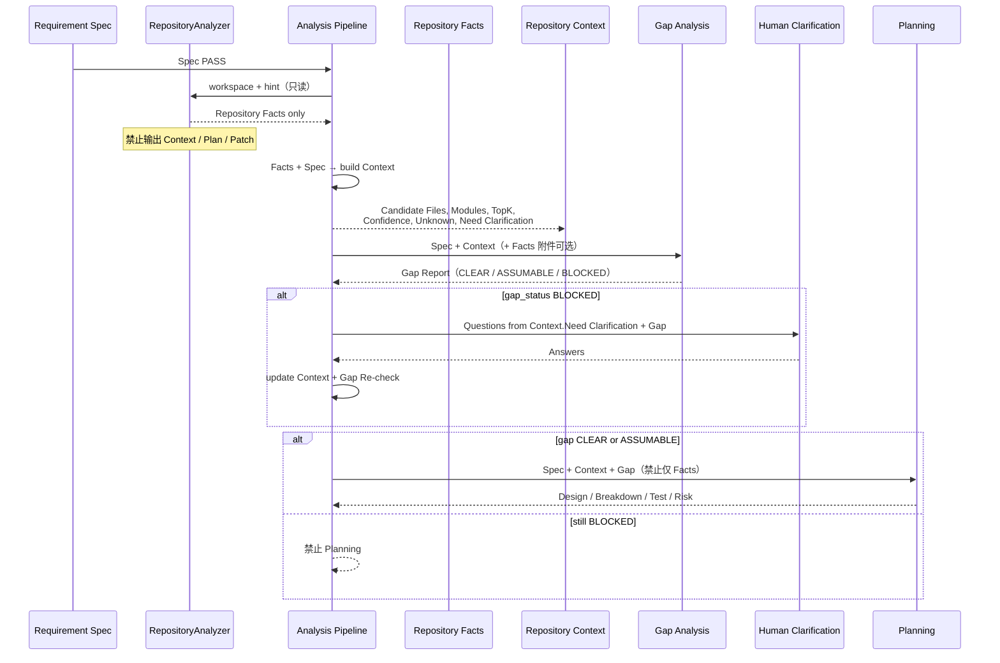

# Repository Context Contract

> **Sprint-8.1 · 补充 Requirement Analysis Pipeline**  
> **Status:** Contract（规范）· **禁止实现代码** · 禁止改 Runtime · 禁止 Graph · 数字化 Facts；需求向 Context 由 Analysis+Builder 消费  
> 挂在能力域 **01 · Repository Intelligence**（Facts / 基线侧）。  
> **同伴：** [`../30-delivery-orchestration/workflow/stages/analysis-contract.md`](../30-delivery-orchestration/workflow/stages/analysis-contract.md) · [`../20-context-engineering/context-engineering-spec.md`](../20-context-engineering/context-engineering-spec.md)

本文只补一层抽象：

> **RepositoryAnalyzer 仍只输出 Repository Facts；  
> Repository Context 由 Analysis Pipeline 从 Facts（+ Spec）构建，供 Gap / Clarification / Planning 消费。**

---

## 1. Repository Facts vs Repository Context

| | **Repository Facts** | **Repository Context** |
|--|----------------------|-------------------------|
| **是什么** | 仓库上可复查的**原始/半原始事实** | 相对**本需求**整理后的**工作上下文** |
| **回答** | 「仓库里有什么 / 搜到了什么」 | 「就这条需求而言，相关什么、有多确信、还缺什么」 |
| **生产者** | **RepositoryAnalyzer**（只读分析） | **Requirement Analysis Pipeline**（编排层） |
| **需求相关？** | 弱相关（hint 只影响检索，不解释意图） | **强相关**（必须对照 Requirement Spec） |
| **允许推断？** | **否**（或仅截断/TopK 机械排序） | **有限**：相关性归类、Confidence、Unknown 标注；**禁止**出方案 |
| **稳定性** | 同仓库同学预算下应可复现 | 随 Spec/答案变化而变 |
| **例子** | `pom.xml 存在`；`路径 X 含关键字 timeout` | `Candidate Files=[…]`；`Need Clarification=[超时默认值?]` |

**一句话：**  
Facts = 证据材料；Context = 办案卷宗封面（仍不是判决书/施工图）。

---

## 2. 谁负责从 Facts 构建 Context

| 角色 | 职责 |
|------|------|
| **RepositoryAnalyzer** | **只**产出 Facts（map / hit.set / facts / meta / 机械 gaps.hints） |
| **Requirement Analysis Pipeline** | **唯一**负责：`Facts + Requirement Spec (+ 可选 Clarify 答案) → Repository Context` |
| **Gap Analysis** | 读 Context（及 Spec）；可写 Gap Report；**不**回头改 Analyzer 契约 |
| **Human** | 可修正 Context 中的 Unknown / Need Clarification（经 Clarification）；**不**手写 Patch 进 Context |
| **Runtime / Worker** | **不构建** Context；不拥有该对象 |

**禁止：** Analyzer「顺手」输出 Context；Planning「自己从裸 Facts 猜 Context」而不经 Pipeline 构建步骤（合同上视为违规捷径）。

---

## 3. Planning 消费 Facts 还是 Context？

**消费：Repository Context（主）+ Requirement Spec + Gap Report（须 CLEAR/ASSUMABLE）。**

| 输入 | Planning |
|------|----------|
| Context | **必须** |
| Spec | **必须** |
| Gap Report | **必须**（状态合法） |
| 原始 Facts | **可选附件**（审计/复查）；**不得**仅凭 Facts 开 Plan |

理由：Planning 要的是「与需求对齐的相关面与未知」，不是全仓原始检索日志。

---

## 4. Clarification 应消费哪个？

**主消费：Repository Context（尤其 `Unknown` / `Need Clarification`）+ Gap Report。**

| 输入 | Clarification |
|------|----------------|
| Context.`Need Clarification` / `Unknown` | **必须**（生成问题的主来源） |
| Gap Report.`Decision Needed` / Blocking | **必须** |
| 原始 Facts | 可选（人要核对证据时打开） |
| Plan / Patch | **禁止作为输入**（尚未存在或不应存在） |

Clarification 答案回来后：Pipeline **更新 Context**（降 Unknown、提高 Confidence）并 **Gap Re-check**；Analyzer **不必**重跑（除非人要求刷新 Facts）。

---

## 5. Context 允许 / 禁止字段

### 5.1 允许（第一版合同字段）

| 字段 | 必须 | 说明 |
|------|------|------|
| `requirementRef` | 是 | 指向 Requirement Spec id/hash |
| `factsRef` | 是 | 指向本轮 Facts 产物 id/hash |
| `Candidate Files` | 是 | 候选路径列表（可空列表 + 说明） |
| `Relevant Modules` | 是 | 相关模块/包/子树 |
| `TopK` | 是 | 有序相关命中（路径/符号 + 短摘录）；K 有上限 |
| `Confidence` | 是 | 整体或分项置信（如 low/medium/high 或 0–1，须定义量表） |
| `Unknown` | 是 | 仍不知、影响理解仓库与需求对齐的条目 |
| `Need Clarification` | 是 | **建议提问**的条目（可与 Unknown 重叠；标给 Clarify 用） |
| `meta` | 否 | 构建时间、截断、构建规则版本 |

### 5.2 禁止（写入 Context 即合同 FAIL）

| 禁止字段/内容 | 原因 |
|---------------|------|
| **Patch** / diff / 文件正文替换 | 属 Execution |
| **Implementation** / 设计定案 / API 形状拍板 | 属 Planning/Approval 之后或之内，不是 Context |
| **Plan** / Task Breakdown / Test Plan | 属 Planning 输出 |
| **Task**（Runtime Task） | Kernel 对象；Context 不持有 |
| **Review** / Delivery 结论 | 属后段 |
| 「应该用 Xxx 框架实现」类句子 | 实现建议，违反 Discovery/Context 只描述相关面 |

---

## 6. Sequence Diagram



---

## 7. Boundary

```text
RepositoryAnalyzer
    │  only Facts
    ▼
Analysis Pipeline ── builds ──► Repository Context
    │                              │
    │                              ├─► Gap
    │                              ├─► Clarification（条件）
    │                              └─► Planning（主输入）
    ▼
Delivery Bundle（含 Spec/Facts/Context/Gap/Plan/Approval）
    ▼
Runtime（不认识 Context 类型；只跑 Bundle 执行段）
```

| 层 | 可接触 Context？ |
|----|------------------|
| Analyzer | **否**（只出 Facts） |
| Analysis Pipeline | **是**（构建与更新） |
| Gap / Clarify / Plan | **是**（只读为主；Clarify 后由 Pipeline 写回） |
| Runtime / Worker SPI | **否** |
| Graph Engine | **不存在**（本 Sprint） |

---

## 8. Contract（摘要条款）

1. Analyzer **不得**输出 Repository Context。  
2. Context **必须**由 Analysis Pipeline 从 **Facts + Spec**（+ 可选答案）构建。  
3. Planning **必须**以 Context 为主输入；禁止「无 Context 仅 Facts」的正式 Plan。  
4. Clarification **必须**优先消费 Context.`Need Clarification` / `Unknown` 与 Gap。  
5. Context **不得**含 Patch / Implementation / Plan / Task / Review。  
6. Context 与 Facts **均非** Kernel Object；不改 Runtime。  
7. 本契约 **不授权** 实现 Analyzer 或 Graph。

---

## 9. Acceptance（合同验收 · 文档级）

本 Sprint **不写代码**；验收指契约本身是否可执行、可评审：

| # | 准则 | 期望 |
|---|------|------|
| A1 | Facts / Context 职责表无重叠越权 | PASS |
| A2 | 构建者唯一且为 Pipeline | PASS |
| A3 | Planning / Clarification 消费对象明确 | PASS |
| A4 | 允许字段含 Candidate/Modules/Confidence/Unknown/Need Clarification/TopK | PASS |
| A5 | 禁止字段含 Patch/Implementation/Plan/Task/Review | PASS |
| A6 | 有 Sequence + Boundary | PASS |
| A7 | 未要求改 Runtime / 实现 Graph / 实现 Analyzer | PASS |

编码实现本契约时，另立实现 Sprint；本文件不算实现完成。

---

## 10. Architecture Drift

| 检查 | 结果 |
|------|------|
| 新增 Runtime / Kernel Object？ | **否** |
| 新增 Graph / Knowledge / Scheduler / Workflow？ | **否** |
| 提前实现 Analyzer？ | **否**（本 Sprint 禁止） |
| 新抽象是否正当？ | **是**：Facts（证据）与 Context（需求相关卷宗）分离，避免 Analyzer 变「小 Planning」 |
| 风险 | 有人把 Context 写成 Plan；合同用禁止字段约束 |

---

## 文档信息

| 项 | 值 |
|----|-----|
| 文件 | `docs/10-repository-intelligence/repository-facts-contract.md` |
| 补充对象 | Requirement Analysis Pipeline |
| Next | 不实现；待 Pipeline 门禁/Bundle 时再落地字段文件 |
