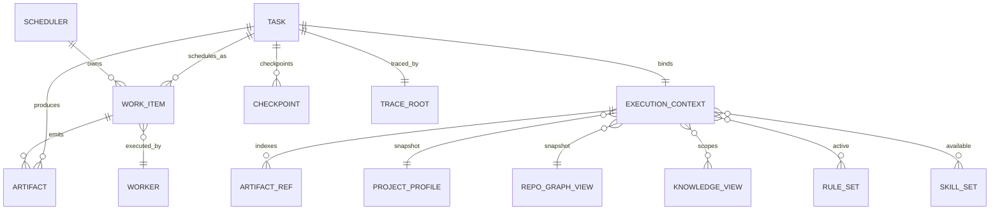
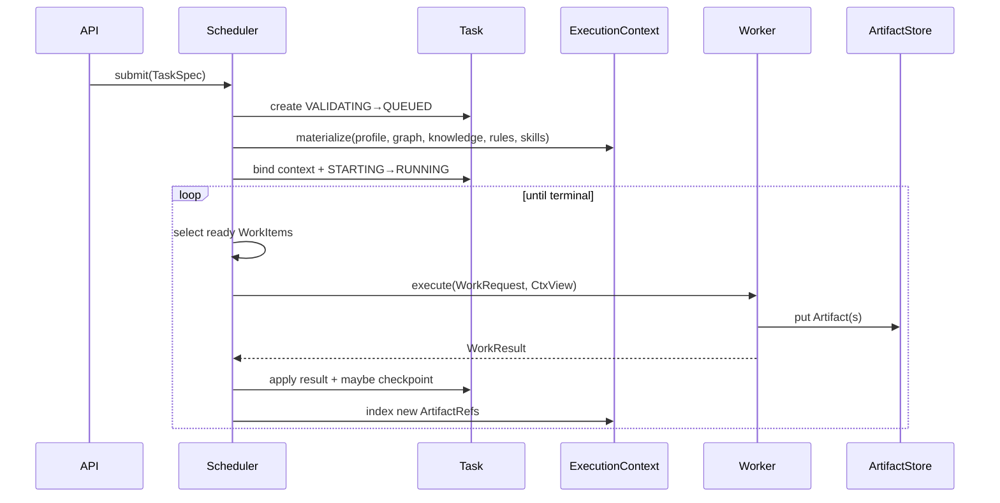

# 00 · Kernel Object Model

> **Status: Frozen** — 任何后续修改必须通过 ADR。

## 核心命题

Kernel 不“跑 Agent”，Kernel 做四件事：

1. **接纳并推进 Task**
2. **按依赖与策略把 WorkItem 交给 Worker**
3. **在 ExecutionContext 约束下执行**
4. **把所有产出收成 Artifact，并挂到 Task / Trace / Checkpoint**

## 对象关系（ER）

## 运行时调用链

## 非核心但关联的对象（不进入“五大”）

| 对象 | 关系 | 为何不进五大 |
|------|------|----------------|
| Checkpoint | Task 的耐久切片 | 恢复机制，不是日常编排货币 |
| Trace/Span | Task 的观测投影 | 横切观测 |
| Capability | Worker 调用前的权限契约 | 扩展契约层，不是 Kernel 调度主对象 |
| Workflow/Skill/Rule | 进入 ExecutionContext / 驱动 WorkItem 生成 | 声明与引擎层 |
| Plugin/Adapter | 贡献与端口 | 扩展层 |

五大对象是 **Kernel 调度与执行的骨架**；其余是骨架上的肌肉与皮肤。

## 不变式（Kernel Invariants）

| ID | 不变式 |
|----|--------|
| I1 | 任何副作用执行必须经由 Worker（并先过 Capability/Rule 门禁） |
| I2 | 阶段之间只传递 Artifact 引用，不传递隐式全局可变状态 |
| I3 | Worker 只见 ExecutionContext 的 **不可变/受控视图**，不见 Scheduler 内部队列 |
| I4 | Scheduler 是唯一推进 Task 状态机与 WorkItem 状态机的组件 |
| I5 | Task 终态后 ExecutionContext 冻结；仅 Artifact/Trace/Checkpoint 可继续只读访问 |
| I6 | 同一 WorkItem 的成功结果在幂等键下可重放而不重复危险副作用 |

## 标识符约定

| 对象 | ID 类型 | 示例 |
|------|---------|------|
| Task | `task_<ulid>` | `task_01J...` |
| Artifact | `art_<ulid>` | `art_01J...` |
| Worker | `worker.<kind>.<name>` | `worker.cli.claude` |
| WorkItem | `wi_<ulid>` | `wi_01J...` |
| ExecutionContext | `ctx_<ulid>`（通常 = 1:1 Task） | 与 taskId 可同派生 |
