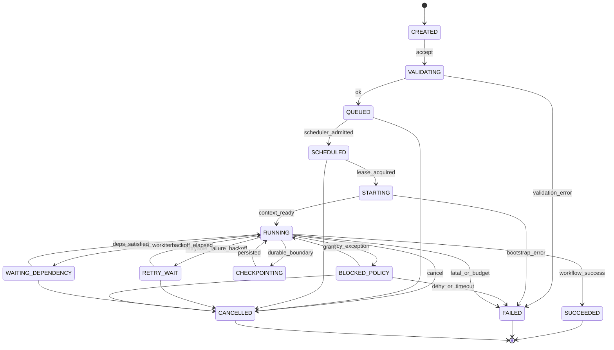
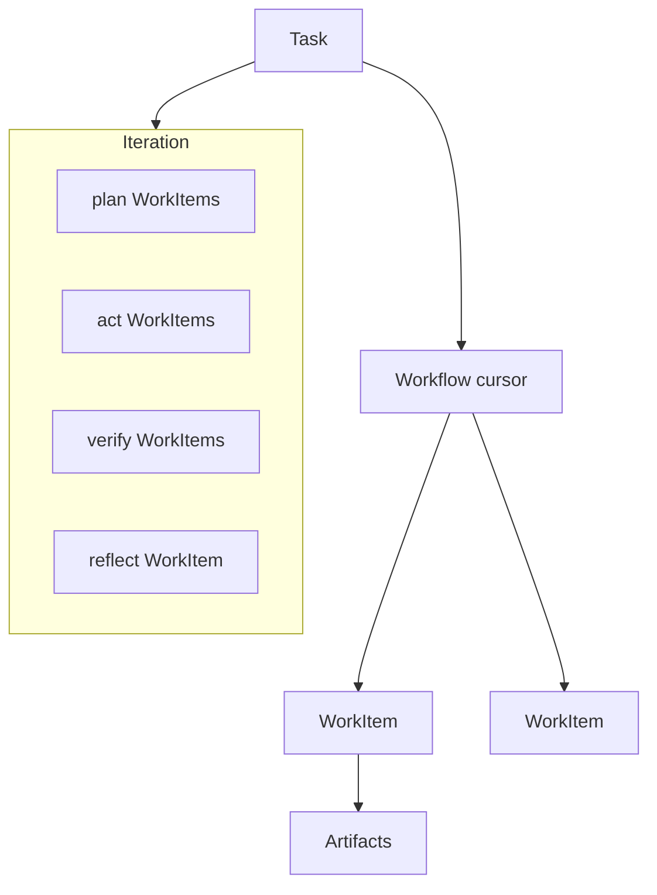

# 01 · Task（Kernel Core Object）

> **Status: Frozen** — 任何后续修改必须通过 ADR。

## 1. 定义

**Task** 是 Kernel 中唯一的 **工作单元主实体**：表达一次软件工程请求从接受到终态的完整生命周期。

- Task 不是 Chat Session  
- Task 不是单次 Worker 调用（那是 WorkItem）  
- Task 不是 Artifact（产物挂在 Task 下）

Scheduler 是 Task 状态机的 **唯一推进者**（见不变式 I4）。

## 2. 稳定状态机（v1 冻结）

### 状态字典（稳定枚举名）

| Status | 含义 |
|--------|------|
| `CREATED` | 已构造，未校验 |
| `VALIDATING` | Profile/权限/工作区/规格校验 |
| `QUEUED` | 已入 Scheduler 队列，未录取 |
| `SCHEDULED` | 已被调度器录取，等待租约 |
| `STARTING` | 物化 ExecutionContext、开 Trace |
| `RUNNING` | 正在执行 WorkItem |
| `WAITING_DEPENDENCY` | 等待依赖 WorkItem/Artifact |
| `RETRY_WAIT` | 可重试失败后的退避等待 |
| `CHECKPOINTING` | 写 Checkpoint 临界区 |
| `BLOCKED_POLICY` | 等待策略例外 |
| `SUCCEEDED` / `FAILED` / `CANCELLED` | 终态 |

> 相对 Blueprint `15`：增加 `SCHEDULED`、`WAITING_DEPENDENCY`、`RETRY_WAIT`，以匹配 Scheduler 一等化。Blueprint 15 视为概述；**状态枚举以本文为准**。

## 3. 稳定数据契约

### Task（持久化主记录）

| 字段 | 类型 | 说明 |
|------|------|------|
| `taskId` | ID | 主键 |
| `projectId` | string | 项目 |
| `profileId` / `profileRevision` | string | 绑定的 Profile 快照 |
| `workflowId` / `workflowRevision` | string | 工作流 |
| `goal` | GoalSpec | 结构化目标 |
| `workspaceRef` | WorkspaceRef | 工作区 |
| `runMode` | enum | 默认 `UNATTENDED` |
| `status` | enum | 上表 |
| `priority` | int | 调度优先级（大者优先，默认 0） |
| `budget` / `budgetRemaining` | Budget | 预算 |
| `permissions` | set | 授予权限 |
| `executionContextId` | ID | 绑定上下文 |
| `latestCheckpointId` | ID? | |
| `traceId` | ID | |
| `parentTaskId` | ID? | retry 谱系 |
| `idempotencyKey` | string? | 提交幂等 |
| `labels` | map | |
| `createdAt` / `updatedAt` / `terminalAt` | time | |
| `lastError` | ErrorRef? | taxonomy + reasonCode |

### GoalSpec（最小）

| 字段 | 说明 |
|------|------|
| `type` | `FEATURE` `BUGFIX` `REFACTOR` `DEPENDENCY` `REVIEW` `CUSTOM`… |
| `acceptanceRef` | 验收 Artifact 模板或规则引用 |
| `inputArtifactIds` | 启动时已有输入产物 |
| `params` | 结构化参数（非自由 Prompt 正文） |

## 4. Task × WorkItem × Iteration

- **TaskIteration**：逻辑分组（Plan-Act-Verify-Reflect），不是独立持久主实体；可用 `iterationIndex` 字段表达
- **WorkItem**：Scheduler 调度的最小可执行单元（见 `04-scheduler.md`）

## 5. 生命周期事件（稳定名）

`TaskCreated` `TaskValidated` `TaskQueued` `TaskScheduled` `TaskStarted` `TaskStatusChanged` `TaskCheckpointed` `TaskBlockedPolicy` `TaskSucceeded` `TaskFailed` `TaskCancelled`

所有事件必须携带：`taskId`, `fromStatus?`, `toStatus`, `at`, `traceSpanId?`。

## 6. API 面（Kernel 级，非 HTTP 细节）

| 操作 | 语义 | 谁可调用 |
|------|------|----------|
| `submit` | 创建并进入 VALIDATING | Facade |
| `cancel` | 终态 CANCELLED | Facade / Policy |
| `resume` | 从 BLOCKED_POLICY 或崩溃恢复 | Facade / Scheduler |
| `retry` | 派生新 Task（推荐） | Facade |
| `get` / `listArtifacts` | 只读 | Facade |

HTTP 映射见既有 RFC-0008；字段以本文为准做一次对齐。

## 7. 非职责

- Task 不直接调用 CLI / Maven / Git  
- Task 不解析 Workflow DSL（Workflow Engine 做）  
- Task 不存储大文件正文（Artifact Store 做）
