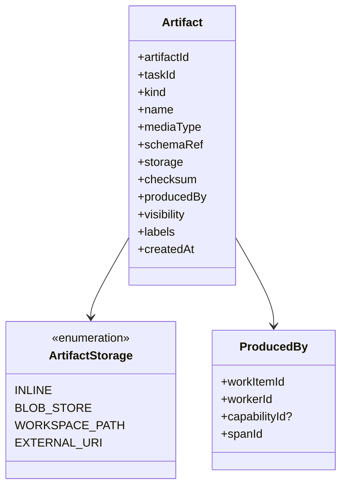
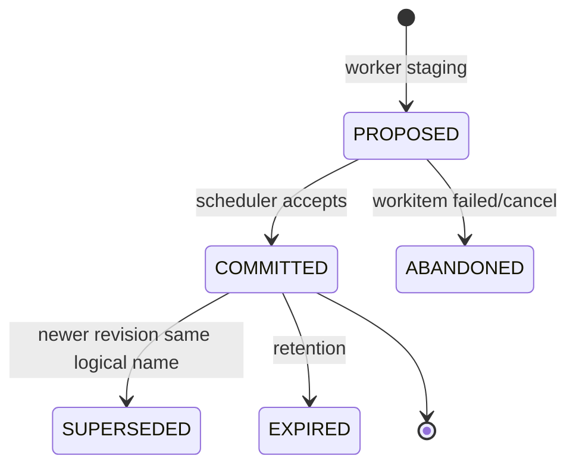
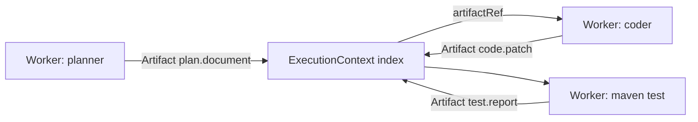

# 02 · Artifact（Kernel Core Object）

> **Status: Frozen** — 任何后续修改必须通过 ADR。

## 1. 定义

**Artifact** 是 Runtime 中 **所有阶段产物的统一抽象**：计划、补丁、测试报告、模型结构化输出、日志句柄、截图、SBOM、审查意见……一律是 Artifact。

没有 Artifact，阶段之间就会用“临时路径 / 字符串 / 私有 DTO”传递，无法审计、无法恢复、无法跨 Skill 复用。

## 2. 设计目标

1. **统一货币**：WorkItem 的输入输出都是 Artifact 引用
2. **可寻址**：稳定 `artifactId`，可在 Trace/Checkpoint/Context 中引用
3. **可分类**：用 `kind` + `mediaType` + `schema` 描述，而不是按阶段各搞一套
4. **可存储分层**：元数据在 DB；大正文在对象存储/工作区；可只有外部句柄
5. **可治理**：可见性、保留策略、敏感标记

## 3. 稳定数据契约



### 字段字典

| 字段 | 说明 |
|------|------|
| `artifactId` | 全局唯一 |
| `taskId` | 所属 Task（组织级共享 Artifact 用 `scope=ORG` 另表，v1 可后置） |
| `kind` | 稳定枚举/命名空间字符串，见下节 |
| `name` | 人类可读短名 |
| `mediaType` | 如 `application/json`, `text/x-diff`, `application/vnd.ai4se.plan+json` |
| `schemaRef` | 可选：JSON Schema / 契约 ID |
| `storage.kind` | `INLINE` \| `BLOB_STORE` \| `WORKSPACE_PATH` \| `EXTERNAL_URI` |
| `storage.locator` | 内联 JSON / blob key / 相对路径 / URI |
| `checksum` | sha256（INLINE/BLOB/文件） |
| `sizeBytes` | |
| `producedBy` | workItemId, workerId, capabilityId?, spanId |
| `inputOf` | 被哪些后续 WorkItem 消费（可反查） |
| `visibility` | `TASK` \| `PROJECT` \| `RESTRICTED` |
| `sensitivity` | `NONE` \| `PII` \| `SECRET_REDACTED` |
| `labels` | 自由标签 |
| `iterationIndex` | 可选 |
| `createdAt` | |

## 4. Kind 目录（v1 建议冻结集）

| kind | 典型 mediaType | 说明 |
|------|----------------|------|
| `goal.acceptance` | json | 验收标准结构化 |
| `plan.document` | json | 执行计划 |
| `plan.work-breakdown` | json | 工作拆解 |
| `code.patch` | `text/x-diff` / json patch | 代码变更 |
| `code.file-set` | json | 文件集合清单 |
| `vcs.diff-stat` | json | diff 统计 |
| `vcs.commit-ref` | json | commit sha 等 |
| `test.report` | junit+xml / json | 测试报告 |
| `test.coverage` | json | 覆盖率 |
| `lint.report` | json | 静态检查 |
| `build.log` | text / 外部句柄 | 构建日志 |
| `build.artifact` | 路径清单 | jar/wheel 等 |
| `model.structured` | json | 模型结构化输出（已校验） |
| `model.raw-ref` | external | 原始响应外置指针 |
| `browser.screenshot` | png uri | Playwright 截图 |
| `browser.trace` | zip uri | Playwright trace |
| `review.findings` | json | 审查发现 |
| `knowledge.hit-set` | json | 知识检索结果集 |
| `graph.snapshot-ref` | json | 图快照引用 |
| `report.summary` | json/markdown-ref | 阶段/最终摘要 |
| `log.chunk-ref` | uri | 日志段 |
| `policy.exception-request` | json | 策略例外单 |
| `custom/*` | 自定义 | Plugin 扩展（必须带 schemaRef） |

**规则**：新增官方 kind 要进本文；Plugin 自定义必须 `custom.<ns>.*`。

## 5. Artifact 生命周期



- Worker 先写 **staging** Artifact（`PROPOSED`）
- Scheduler 在 WorkItem 成功提交时 **COMMITTED**，并写入 ExecutionContext 索引
- 失败路径默认 ABANDONED（可保留供排障，visibility=RESTRICTED）

## 6. 作为阶段间唯一传递物



禁止：

- Skill 通过线程局部变量传大对象  
- 只把绝对路径写在 memory 而不创建 Artifact  
- Model 输出不经验证直接当“隐式产物”

## 7. ArtifactStore 端口（Kernel SPI 概念）

```
put(meta, content) -> Artifact
get(artifactId) -> Artifact
openStream(artifactId) -> stream
indexByTask(taskId, filter) -> list
linkConsume(artifactId, workItemId) -> void
```

Checkpoint 只保存 **Artifact 索引与 checksum**，不嵌入全部 blob。

## 8. 与 Trace / Console

- 每个 COMMITTED Artifact 在对应 Span 上 `links.artifactId`
- Vue Console：Task 详情页「Artifacts」页签按 kind 分组

## 9. 非职责

- Artifact 不做全文检索引擎（Knowledge 负责知识；Artifact 可被 Knowledge ingest）
- Artifact 不执行代码
