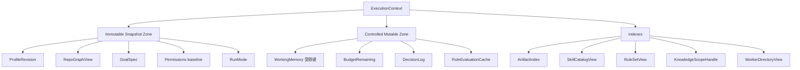
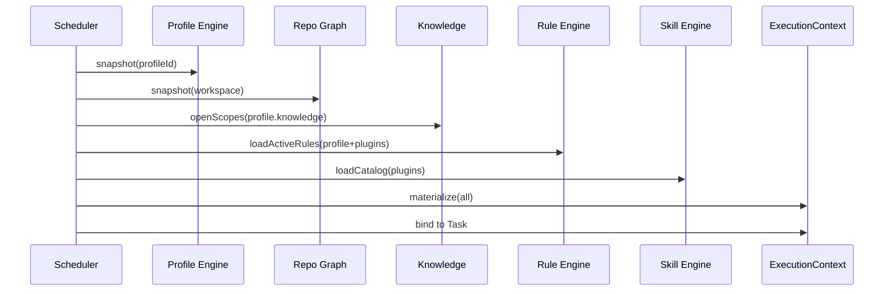

# 05 · ExecutionContext（Kernel Core Object）

> **Status: Frozen** — 任何后续修改必须通过 ADR。

## 1. 定义

**ExecutionContext** 是某次 Task 执行期间，Worker / Skill / Rule / Workflow **唯一允许读取的运行时上下文视图**。它物化并冻结（或受控更新）以下内容的访问面：

- Project Profile 快照  
- Repository Graph 视图  
- Knowledge 作用域与检索句柄  
- 生效中的 Rule 集  
- 可用 Skill / Workflow 元数据  
- Artifact 索引  
- Budget / Permissions / Decisions  
- Workspace 句柄（受控）

ExecutionContext ≠ 进程全局 Spring Bean 随便注入  
ExecutionContext ≠ Task 行本身（Task 是生命周期实体；Context 是执行视图）

## 2. 目标

1. **可重现**：同一 Checkpoint + Context 快照可解释当时决策  
2. **可裁剪**：Worker 只拿需要的 View，降低泄漏面  
3. **可进化**：内部 Engines 可变，View 接口稳定  
4. **跨项目**：Profile + Knowledge + Rules 通过 Context 注入，而不是写死在 Worker

## 3. 结构（稳定分区）



### 分区规则

| Zone | 可变性 | 谁可写 |
|------|--------|--------|
| Immutable Snapshot | Task STARTING 后不可变 | 仅物化阶段 |
| Controlled Mutable | 受 schema/键白名单约束 | Skill/Kernel/Rule 动作（受限） |
| Indexes | 追加为主 | Scheduler 提交 Artifact 时；Catalog 只读 |

## 4. 稳定接口形状（概念）

```
ExecutionContext {
  id, taskId, createdAt, frozen: boolean

  profile(): ProfileView
  graph(): RepoGraphView
  knowledge(): KnowledgeView
  rules(): RuleSetView
  skills(): SkillCatalogView
  artifacts(): ArtifactIndex
  budget(): BudgetView
  permissions(): PermissionView
  workspace(): WorkspaceView
  decisions(): DecisionLogView
  workers(): WorkerDirectoryView   // 只读目录，不含执行权

  asWorkerView(scope): ExecutionContextView
}
```

### ExecutionContextView（给 Worker）

最小暴露：

- `taskId`, `iterationIndex?`
- `profile.publicSettings`（无密钥）
- `artifacts.get/list`（按可见性）
- `graph.query`（白名单）
- `knowledge.search`（scope 内）
- `workspace` 读写经 **Capability/Worker 自己的 operation**，View 只给 root/ref，不给“任意删盘”API
- **无** Scheduler 队列句柄  
- **无** 任意 Rule 篡改 API  

## 5. 物化流程



失败 → Task `FAILED`（bootstrap_error），不进入 RUNNING。

## 6. 与五大对象的交互

| 对象 | 与 Context 关系 |
|------|-----------------|
| Task | 1:1 绑定 `executionContextId`；终态后 `frozen=true` |
| Artifact | COMMITTED 后进入 `artifacts()` 索引 |
| Worker | 只接收 `ExecutionContextView` |
| Scheduler | 唯一负责物化、冻结、在提交点更新索引 |

## 7. Graph / Knowledge / Profile / Rule / Skill 在 Context 中的形态

| 来源子系统 | Context 中的形态 | 备注 |
|------------|------------------|------|
| Project Profile | `ProfileView` 不可变快照 | EffectiveConfig 已 merge |
| Repository Graph | `RepoGraphView` | 白名单 query；可 `refresh` 受控 |
| Knowledge | `KnowledgeView` | search 返回 hit，并应落 Artifact `knowledge.hit-set` 或 Trace cite |
| Rule | `RuleSetView` | 真正 evaluate 仍走 Rule Engine；View 供列举与调试 |
| Skill | `SkillCatalogView` | 元数据；invoke 走 Skill Engine |
| Workflow | cursor 在 Task/Scheduler；定义只读元数据可挂 Context |

## 8. 冻结与 Checkpoint

Checkpoint payload 包含：

- `executionContextId`
- immutable zone 的修订号 / hash
- mutable zone 快照（memory/budget/decisions）
- artifact index 摘要

恢复时：**重建 Context**（按 snapshot 规格），而不是反序列化任意 Java 对象图。

## 9. 安全红线

- Secret 不进 Context 明文；只进 Worker 运行时 env（短时）  
- `RESTRICTED` Artifact 默认不对 CLI Agent Worker 可见（除非 Capability 授权）  
- Context 禁止携带“可执行脚本字段”

## 10. 非职责

- 不调度  
- 不执行 CLI  
- 不替代 Trace（决策可写 DecisionLog，观测仍以 Trace 为准）
