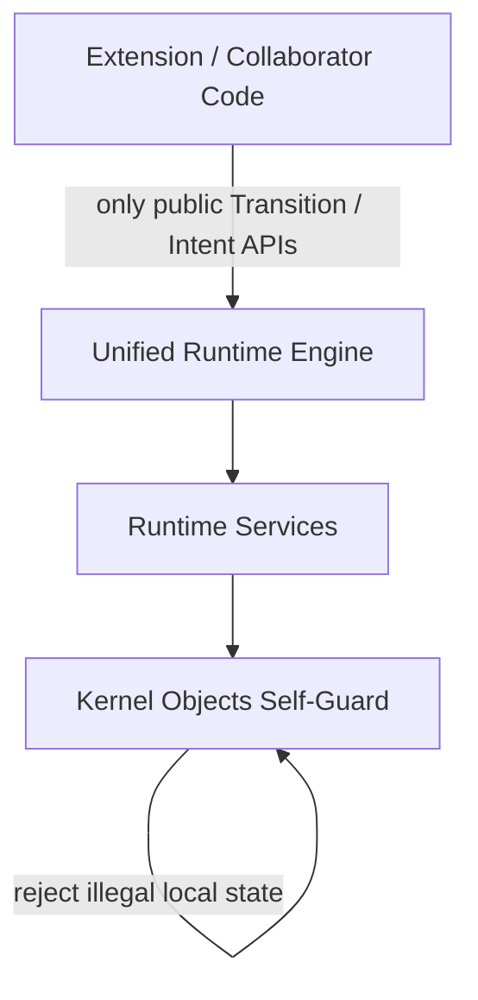
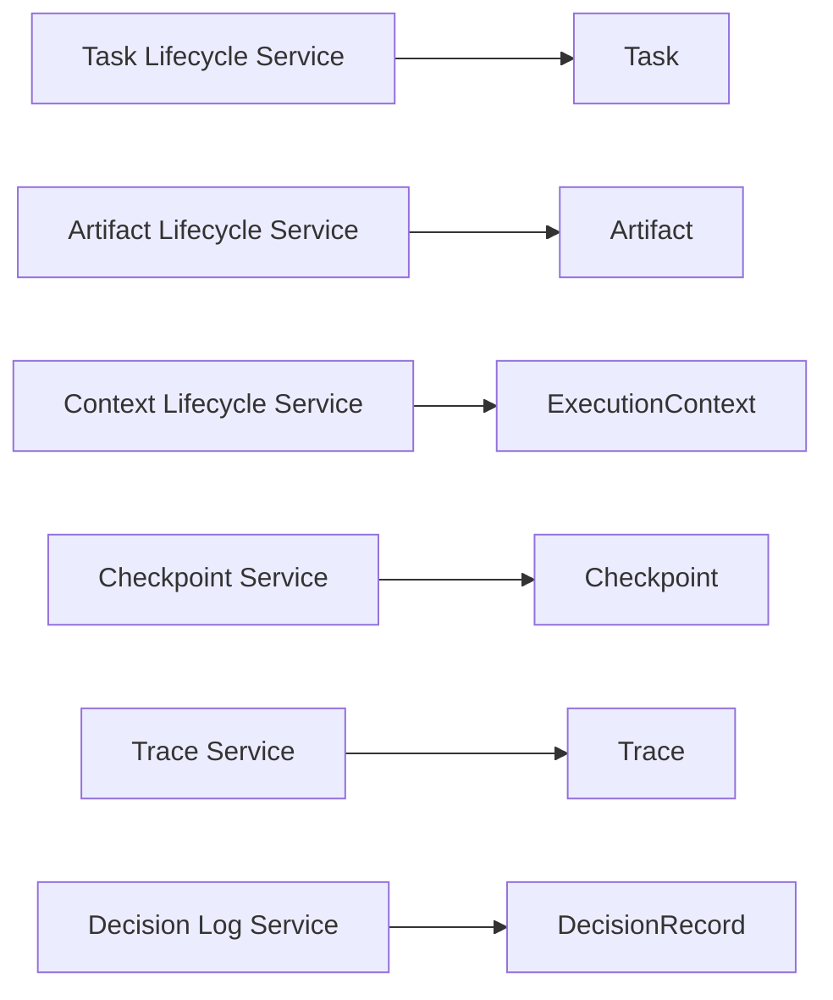
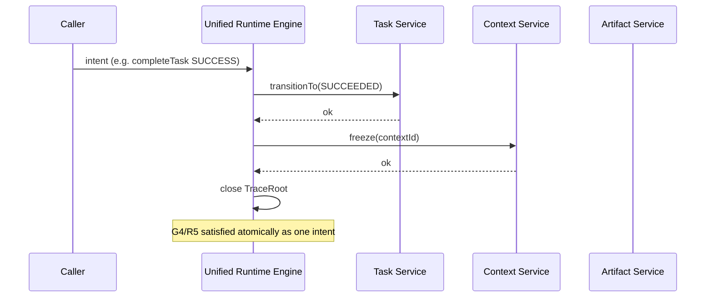
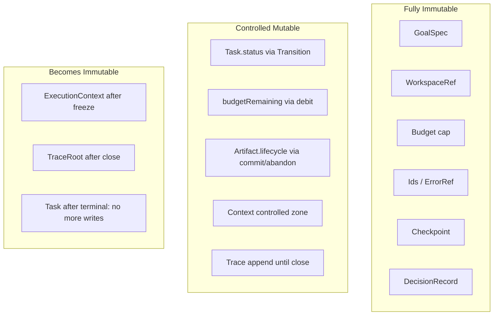

# Runtime Enforcement Strategy

> **Status: Frozen**  
> 任何后续修改必须通过 ADR。  
>
> **Sprint-2 / Task-001**  
> **目标：** 说明 `runtime-invariants.md` 中的约束 **如何在代码层被保证**（仅策略，不实现）  
> **禁止：** 新增 Runtime Object · 修改 Kernel · 写 Java / 业务代码  

权威约束来源：[runtime-invariants.md](./runtime-invariants.md)

本文不发明新的领域对象，只划分 **Enforcement Responsibility**：

| 层级 | 含义 |
|------|------|
| **Object Self-Guard** | 对象自身构造/方法内拒绝非法状态 |
| **Runtime Service** | 围绕单一聚合的用例服务（生命周期、提交、冻结、追加），协调该对象及其直接附属 |
| **Runtime Engine（统一）** | 跨对象编排与门禁：保证 G\* 及「终态↔冻结」「消费前 COMMITTED」等交叉约束 |
| **Access Policy** | 哪些 API 对扩展开发者关闭；哪些字段不可变 |

---

## 1. 哪些 Invariant 应由对象自身保证？

**原则：** 不依赖其它聚合、在单对象边界内即可判定真伪的约束 → **Object Self-Guard**。

| Invariant | 对象 | 自身如何保证（策略） |
|-----------|------|----------------------|
| T1 | Task | `taskId` 创建时必填；无 setter 可清空/替换 |
| T2（合法边） | Task | `transitionTo` 内查转移表；非法抛错，不改状态 |
| T3 | Task | 终态时 `transitionTo` / 写方法直接拒绝 |
| T4（绑定一次） | Task | `bindExecutionContext`：已绑定则拒绝再次绑定 |
| T5 | Task | `updateBudgetRemaining` 校验 ≤ budget 且 ≥ 0 |
| T6（身份字段） | Task | goal/workspace/runMode/budget上限/profileRevision **无公开写方法** |
| T8（可回答性） | Task | 状态字段始终有值；访问器只读 |
| A1–A2 | Artifact | 构造强制 taskId/identity；无偷换 setter |
| A3–A4 | Artifact | `commit`/`abandon`/`supersede` 内校验 lifecycle |
| A6（身份不改） | Artifact | storage/kind/mediaType 无写方法 |
| A7–A8（标记存在） | Artifact | visibility/sensitivity 构造后不可变（授权检查可在 Service/Engine） |
| E1（contextId/taskId 固定） | ExecutionContext | 构造绑定；无更换 taskId API |
| E2 | ExecutionContext | Immutable zone 无写 API |
| E3 | ExecutionContext | `frozen` 后所有写方法拒绝 |
| E6 | ExecutionContext | memory 写入口校验白名单键 |
| E7 | ExecutionContext | taskId 与构造一致，无漂移 API |
| C1–C3 | Checkpoint | 创建时强制 taskId；载荷字段只读；无 mutate API |
| C5（结构完备） | Checkpoint | 缺少 integrity 元数据则不得构造成「可恢复点」 |
| R1–R2（id 绑定） | Trace | root 绑定 taskId；span 强制 traceId |
| R3 | Trace | 追加 span 时校验 parent 同 trace、无环（局部结构） |
| R4 | Trace | 已结束 span 无改写结论 API |
| D1–D2 | DecisionRecord | 构造强制 taskId；无 update API |
| D5 | DecisionRecord | 类型上不提供「设为 TaskStatus」能力 |

**对象自身不负责（必须上交）的例子：**

- G4「终态必须 freeze Context」——跨 Task 与 Context  
- G5「下游只能消费 COMMITTED」——跨调用方与 Artifact  
- T7 放宽权限必须留 DecisionRecord——跨 Task 与 DecisionRecord  
- C4 `latestCheckpointId` 与 sequence 最大一致性——跨 Task 指针与 Checkpoint 集合  
- C6 恢复后仍遵守全家 Invariant——跨恢复流程  

---

## 2. 哪些应由 Runtime Service 保证？

**原则：** 仍以 **一个聚合根** 为主，但需要「用例级」步骤、持久化边界、或同一聚合内多实体协调 → **Runtime Service**（不是新 Kernel Object，是执行职责层）。

| Service（职责名） | 保证的 Invariants | 策略要点 |
|-------------------|-------------------|----------|
| **Task Lifecycle Service** | T2–T8 的用例级调用纪律；配合对象自检 | 唯一对外暴露 Task 变更入口的门面之一；创建时填充身份字段；拒绝扩展方直接 new 后乱改 |
| **Artifact Lifecycle Service** | A3–A5 的提交路径；索引通知前校验 | `propose` → `commit`/`abandon` 管线；commit 成功才允许「可被索引」信号 |
| **Context Lifecycle Service** | E1–E7；物化与冻结 | materialize（只写一次 immutable zone）；`freeze()` 仅在允许时机被调用 |
| **Checkpoint Service** | C1–C5；生成 sequence | 分配单调 sequence；写入后只读；提供「最新有效点」查询 |
| **Trace Service** | R1–R5；开闭 root | open root、append span、close root；拒绝关闭后追加正式执行 span |
| **Decision Log Service** | D1–D4 | 只提供 `append`；拒绝/放宽类意图必须走此服务留下记录 |

**Service 层禁止：** 实现 Provider、解释业务规则正文、解析编排 DSL。只保证 **该对象族** 的生命周期纪律。

---

## 3. 哪些应由统一 Runtime Engine 保证？

**原则：** 约束横跨 **两个及以上聚合**，或「谁有权发起变更」的全局门禁 → **Unified Runtime Engine**。

| Invariant | Engine 如何保证（策略） |
|-----------|-------------------------|
| G1 | 一切对外「开始工作」必须创建/取得 Task；禁止无 TaskId 的正式执行入口 |
| G2 | 协作方之间传递契约结果只允许 ArtifactId；Engine 级 API 不接受「裸路径当产物」 |
| G3 | 每个 Task 仅允许一个 Context；禁止注册旁路上下文 |
| G4 | Task → 终态 的 Transition **同一事务意图内** 调用 Context.freeze；缺一步则整次变更失败 |
| G5 | 任何「声明消费 Artifact」的入口先查 lifecycle==COMMITTED |
| G6 | 恢复/审计入口拒绝无 taskId 或 taskId 不匹配的 Checkpoint/Trace |
| G7 | 所有失败出口映射到 ErrorTaxonomy；禁止用自由字符串当终态原因权威 |
| T7 + D3/D4 | 权限收紧可走 Task Service；**放宽** 必须 Engine 编排：先 DecisionRecord.append，再改权限 |
| C4 | 写入 Checkpoint 成功后，Engine/Checkpoint Service 协同更新 Task.latestCheckpointId |
| C6 | Resume 流程由 Engine 编排：校验 Checkpoint → 校验 Task/Context 状态 → 再允许后续 Transition |
| R5 + T3 | Task 终态 Transition 触发 TraceRoot.close |
| R6 / D5 | Engine 规定：Trace/Decision 只读投影，不得回调改写 TaskStatus（唯一写状态走 Transition API） |

**Engine 是唯一「跨对象意图」入口；** Service 是单聚合执行器；Object 是最后一道本地拒识。

---

## 4. 哪些应禁止开发者直接修改？

「开发者」= Plugin / Worker 协作代码 / 未来扩展作者（非 Kernel 维护者）。

| 禁止直接修改 | 理由 | 允许的替代 |
|--------------|------|------------|
| `Task.status` 字段 | 破坏 T2/T3 | `Engine/TaskService.transition*(…)` |
| Task 身份字段（goal、workspace、profileRevision、budget 上限、runMode） | T6 | 仅创建时写入；之后只读 |
| `Task.executionContextId` 直接赋值 | T4 | 仅 `bindExecutionContext` 一次 |
| `budgetRemaining` 任意加减 | T5 | 受控 debit API |
| `permissions` 直接扩权 | T7 | 收紧 API；放宽走 Decision + Engine |
| `Artifact.lifecycle` 字段 | A3/A4 | `commit` / `abandon` / `supersede` |
| Artifact 身份字段 | A2/A6 | 不可改；新内容新 Artifact |
| `ExecutionContext.frozen` 直接改回 false | E3 | 无解冻 API |
| Immutable snapshot 分区 | E2 | 无 API |
| ArtifactIndex 手工塞入未提交 id | E4 | 仅 commit 成功路径索引 |
| Checkpoint 载荷字段 | C3 | 只追加新 Checkpoint |
| `Task.latestCheckpointId` 乱指 | C4 | Checkpoint 成功回调更新 |
| Trace span 结束后改 status | R4 | 只追加 event |
| DecisionRecord 历史行 | D2 | 只 append |
| 任何绕过 Engine 的「反射/包可见 setter」作为扩展契约 | 全部 Invariant | 不提供；架构测试禁止 |

**包可见 / 模块边界策略（设计级）：**  
Kernel 对象变更方法仅对 Runtime Service / Engine 所在模块可见；扩展模块只能依赖 **Intent API / View / ArtifactId**。

---

## 5. 哪些对象（或部分）应设计成 Immutable？

| 目标 | 可变性策略 |
|------|------------|
| **GoalSpec** | 全不可变 |
| **WorkspaceRef** | 全不可变 |
| **Budget（上限）** | 全不可变；剩余量是 Task 上独立可变字段，受 T5 约束 |
| **RunMode** | 创建后不可变（T6） |
| **TaskId / ArtifactId / …** | 值对象不可变 |
| **ErrorRef / ReasonCode** | 不可变 |
| **Artifact 身份与内容定位** | 创建后不可变；lifecycle 仅能经方法推进 |
| **Checkpoint 整条记录** | 创建后完全不可变 |
| **DecisionRecord 整条记录** | 创建后完全不可变 |
| **Trace Span 结束后的结论字段** | 不可变 |
| **ExecutionContext Immutable Zone** | 不可变 |
| **Task（整体）** | **不是**整体不可变：status/remaining/bindings 可变，但必须经受控 API |
| **ExecutionContext（整体）** | Active 期部分可变；Frozen 后整体只读 |
| **Artifact（整体）** | 近不可变 + 唯一 lifecycle 推进 |
| **TraceRoot** | 可追加 span；关闭后不可变 |

---

## 6. 哪些状态只能通过统一 Transition API 修改？

「Transition API」= Engine（或严格委托的 Lifecycle Service）提供的 **命名意图接口**，内部再调对象自检方法。扩展开发者不得直接调底层字段，也不得绕过 Engine 调「万能 setStatus」。

| 状态 / 字段 | 统一 Transition / Intent API（策略名） | 对应 Invariant |
|-------------|----------------------------------------|----------------|
| `Task.status` | `transitionTask(taskId, toStatus, cause)` 或更语义化：`admit` / `start` / `run` / `blockPolicy` / `succeed` / `fail` / `cancel` … | T2 T3 |
| Task → 绑定 Context | `bindContext(taskId, contextId)`（仅一次） | T4 E1 |
| Task → 终态 | `complete*` / `fail*` / `cancel*` **必须** 联动 freeze Context + close Trace | G4 R5 |
| `budgetRemaining` | `debitBudget(taskId, delta)` / `setBudgetRemaining`（带校验） | T5 |
| `permissions` 收紧 | `restrictPermissions(taskId, …)` | T7 |
| `permissions` 放宽 | `grantPolicyException(…)` → append Decision → 再改权限 | T7 D3 D4 |
| `Artifact.lifecycle` → COMMITTED | `commitArtifact(artifactId)` | A3 A5 E4 |
| `Artifact.lifecycle` → ABANDONED | `abandonArtifact(artifactId)` | A3 |
| `Artifact.lifecycle` → SUPERSEDED | `supersedeArtifact(…)` | A3 |
| Context → Frozen | `freezeContext(contextId)`（主要由终态 Transition 触发） | E3 G4 |
| Context ArtifactIndex | `indexCommittedArtifact(taskId, artifactId)`（仅 COMMITTED） | E4 G5 |
| Checkpoint 创建 + latest 指针 | `createCheckpoint(taskId, …)` | C1–C4 |
| TraceRoot open/close | `openTrace(taskId)` / `closeTrace(taskId)` | R1 R5 |
| Span 追加 | `appendSpan(…)` / `endSpan(…)` | R3 R4 |
| DecisionRecord | `appendDecision(…)` only | D1 D2 |

**明确不走 Transition、因为不可变的：** GoalSpec、WorkspaceRef、Budget 上限、Checkpoint 历史行、Decision 历史行、Artifact 身份字段。

---

## 7. Enforcement 映射总表（Invariant → 层级）

| ID | Object Self | Runtime Service | Unified Engine |
|----|:-----------:|:---------------:|:--------------:|
| G1–G3 | | 部分 | **主** |
| G4 | | Context freeze 执行 | **主（编排）** |
| G5 | Artifact 可标 lifecycle | commit 管线 | **消费门禁主** |
| G6–G7 | ErrorRef 形态 | | **主** |
| T1 T6 T8 | **主** | 创建时协助 | |
| T2 T3 T4 T5 | **主（方法内）** | Lifecycle 门面 | 跨对象意图 |
| T7 | 收紧可自检 | | **放宽编排主** |
| A1 A2 A3 A4 A6 | **主** | commit 管线 | |
| A5 A7 A8 | 标记不可变 | | **消费/暴露门禁** |
| E1–E3 E6 E7 | **主** | materialize/freeze | G4 联动 |
| E4 E5 | 局部拒绝 | index API | **消费与 View 门禁** |
| C1–C3 C5 | **主** | sequence/最新查询 | C4/C6 编排 |
| C4 C6 | | 指针更新 | **主** |
| R1–R4 | **主** | append/close | R5 与终态联动 |
| R5 R6 | | close | **主** |
| D1 D2 D5 | **主** | append only | D3 D4 与放宽联动 |

---

## 8. 设计约束（Enforcement 自身）

1. **不新增 Runtime Object** 来「装」约束；用层级职责表达。  
2. **不修改 Kernel 对象集合**；只规定谁能调用谁。  
3. 扩展开发者默认能力 = **读 View + 提交 Intent + 使用 ArtifactId**。  
4. 任何「方便的 public setter」若破坏上表，视为 Enforcement 设计失败，而非风格问题。  
5. 交叉约束（G4/G5/T7 放宽）**禁止**只靠对象自检「碰巧成立」。  

---

## 9. 验收问题（对本设计）

读完本文应能回答：

1. T2 非法转移在哪一层被拦住？  
2. 为什么 G4 不能只靠 Task 对象自己？  
3. Artifact 哪些部分 immutable，lifecycle 为何例外？  
4. 扩展开发者怎样改 Task.status 才算合规？  
5. DecisionRecord 与权限放宽如何被 Engine 绑在一起？  

---

## 10. 非目标（再次声明）

- 不写 Java、不改模块、不新增对象  
- 不讨论 Provider / Workflow / CLI 实现  
- 不规定具体类名文件布局（可在后续实现任务落地）  

**一句话：**  
对象自守本地不变量；Service 守单聚合生命周期；Engine 守跨对象不变量与唯一写入口；其余全部不可变或对扩展者关闭。
