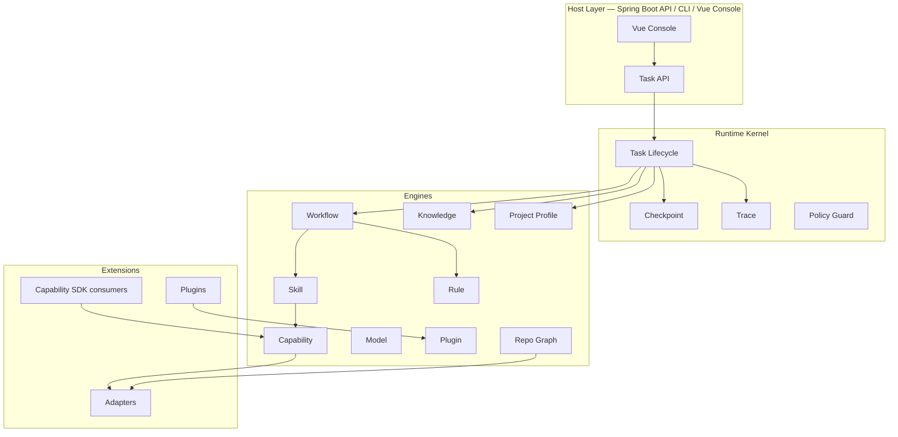

# 00 · Overview

## 一句话定义

**AI Software Engineering Runtime（AI4SE Runtime）** 是一个面向 **无人值守软件工程任务** 的可插拔执行平台：接收结构化 Task → 按 Project Profile 装配上下文 → 由 Workflow 编排 → 经 Rule 治理 → 调用 Skill / Capability / Model → 读写 Repository Graph 与 Knowledge → 持久化 Checkpoint 与 Trace → 产出可审计、可恢复、可跨项目复用的工程结果。

它 **不是** AI Coding Agent（开放域对话助手），也 **不是** 一次性 Prompt 代码生成器。

## Runtime ≠ Coding Agent（硬边界）

| 维度 | AI SE Runtime（本项目） | AI Coding Agent（非目标） |
|------|-------------------------|---------------------------|
| 主对象 | **Task**（软件工程工作单元） | Chat / Session / Message |
| 控制权 | **Workflow + Rule** 决定下一步 | 模型自由决定工具调用 |
| 交互默认 | **无人值守（Unattended）** | 人机多轮对话 |
| 成功标准 | 验收门禁 / 测试 / 规范 / 产物契约 | 用户主观“看起来对” |
| 扩展方式 | Plugin / Capability SDK / Profile | Prompt 与工具堆砌 |
| 可恢复性 | **Checkpoint** 续跑 | 通常重新聊 |
| 可观测性 | **Trace** 全链路 | 聊天记录为主 |
| 复用单元 | Profile / Plugin / Knowledge / Skill | 个人习惯与 Prompt |

> 实现禁令：禁止把 Kernel 做成“ReAct 自由 Agent 循环”。模型调用必须落在 Workflow/Skill 声明的节点内，并接受 Rule 与 schema 约束。

详见 [ADR-0007](../adr/0007-runtime-not-agent.md)。

## 核心执行命题

```text
Task Submitted
  → Resolve Project Profile + Knowledge
  → Bind Workspace / Repository Graph Snapshot
  → Start Workflow Instance
  → (Plan → Act → Verify → Reflect)*   # Iteration，受预算与 Checkpoint 约束
  → Persist Trace + Artifacts
  → Succeeded | Failed | Cancelled | NeedsPolicyException
```

无人值守是 **默认模式**：Human 节点仅用于策略例外（高危操作、预算耗尽需提权），不是主路径。

详见 [21-unattended-execution.md](./21-unattended-execution.md)。

## 一等子系统总览



## 设计原则（v1 不可妥协）

| # | 原则 | 含义 |
|---|------|------|
| P1 | Kernel 无领域业务 | 编码/评审/发布等领域只在 Plugin |
| P2 | Task 一等公民 | 对外 API 以 Task 为准；Iteration/Loop 是 Task 内部执行概念 |
| P3 | Capability 原子化 + SDK 化 | 副作用唯一入口；对外提供 Capability SDK |
| P4 | Plugin 唯一业务扩展面 | 不改 Kernel 即可扩展 |
| P5 | Adapter 隔离外部 | 无厂商 SDK 进入 Engine |
| P6 | 依赖单向向下 | Host → Kernel → Engine → SPI → Extension |
| P7 | 默认可无人值守 | Profile + Rule + Checkpoint 支撑自动跑完 |
| P8 | 一切可恢复、可追溯 | Checkpoint + Trace 强制 |
| P9 | 跨项目复用 | Profile / Plugin / Knowledge / Skill 可移植 |
| P10 | 技术栈冻结 | Java + Spring Boot（服务端）+ Vue（控制台）优先 |
| P11 | 声明优先 | Workflow / Rule / Skill / Profile 元数据声明式 |
| P12 | 长期演进 | SPI 版本化；破坏性变更走 ADR |

## 文档怎么读（实现前必读顺序）

1. 本文 → [01-runtime-architecture.md](./01-runtime-architecture.md)
2. [15-task-lifecycle.md](./15-task-lifecycle.md) → [16-checkpoint.md](./16-checkpoint.md) → [17-trace.md](./17-trace.md)
3. [19-project-profile.md](./19-project-profile.md) → [18-knowledge.md](./18-knowledge.md)
4. Engines：`02`–`09`；Capability SDK：`20`
5. 技术栈与目录：`22` / `10`；扩展：`14`
6. 统一验收：[`99-acceptance-checklist.md`](./99-acceptance-checklist.md)

## 本阶段边界

| 允许 | 禁止 |
|------|------|
| Architecture / ADR / RFC / Roadmap | 任何业务实现代码 |
| 接口形状、数据模型、事件、表级概念 | Runtime 可运行实现 |
| Mermaid / C4 / 模块关系 | Prompt 正文生成 |
| Spring / Vue 模块规划 | 生成业务 Controller/Service 实现 |

## 术语速查

| 术语 | 定义 |
|------|------|
| **Task** | 一次软件工程工作请求与其完整执行生命周期 |
| **Iteration** | Task 内一次 Plan→Act→Verify→Reflect 循环（旧文称 Loop 的执行回合） |
| **Workflow** | Task 的编排骨架 |
| **Skill** | 可复用中等粒度程序 |
| **Capability** | 原子副作用能力 |
| **Rule** | 声明式治理策略 |
| **Checkpoint** | 可恢复执行快照 |
| **Trace** | 分层执行轨迹（Span 树） |
| **Knowledge** | 可检索、可治理的工程知识资产 |
| **Project Profile** | 项目级装配与约定，支撑跨项目无人值守 |
| **Capability SDK** | 开发/测试/打包 Capability 的官方 SDK |
