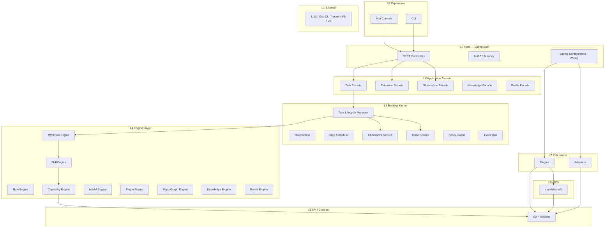
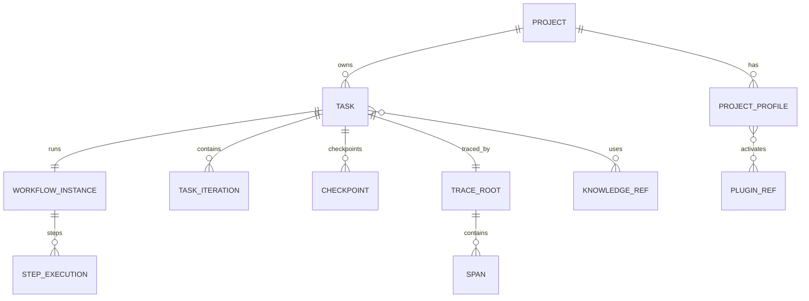
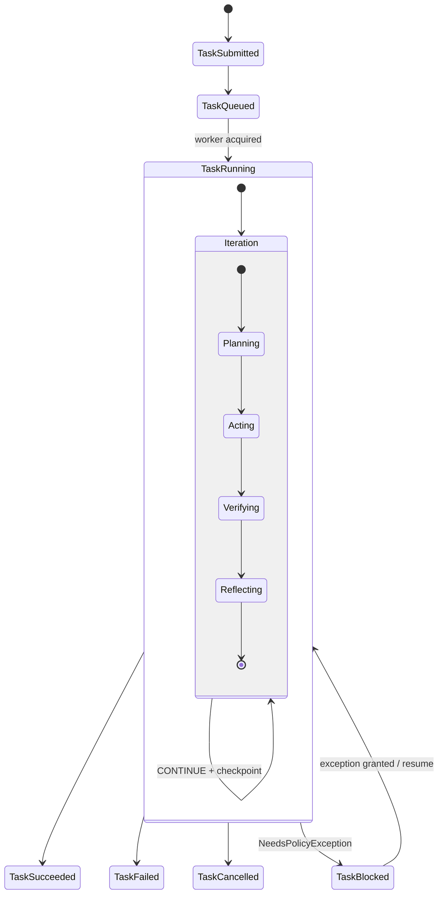
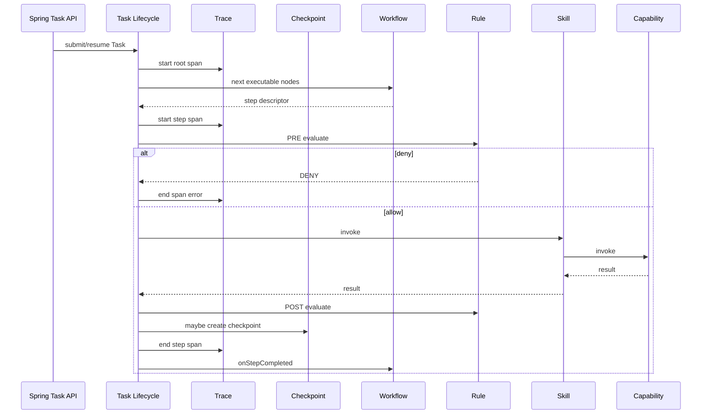

# 01 · Runtime Overall Architecture

## 1. 系统定位

AI4SE Runtime v1 是 **可独立部署的软件工程任务执行平台**（Spring Boot 宿主），亦可将 Kernel 以库形式嵌入。对外提供：

| API 面 | 职责 |
|--------|------|
| **Task API** | 提交 / 查询 / 取消 / 续跑（从 Checkpoint） / 策略例外确认 |
| **Extension API** | Plugin / Adapter / Profile 管理 |
| **Observation API** | Trace 查询、Timeline、审计导出 |
| **Knowledge API** | 知识资产检索与治理（权限受限） |
| **Profile API** | Project Profile CRUD / 校验 / 激活 |

它不替代 IDE、CI、Issue Tracker；通过 Adapter 协作。  
Vue Console 是观测与配置 UI，**不是**通用 Chat Agent 界面。

技术栈见 [22-tech-stack.md](./22-tech-stack.md)、[ADR-0008](../adr/0008-java-spring-vue.md)。

## 2. 逻辑架构（八层）

在原七层基础上，将 **SDK / Console** 显式化：

**依赖只允许向下。** Skill→Capability 为允许的原子层下沉。同层 Engine 禁止环状硬依赖。

## 3. 对象模型（统一后）

| 对象 | 说明 |
|------|------|
| `Project` | 工程/仓库逻辑实体 |
| `ProjectProfile` | 项目装配与约定（无人值守关键） |
| `Task` | 工作请求 + 生命周期 |
| `TaskContext` | 目标、权限、预算、memory、artifacts、graph snapshot |
| `WorkflowInstance` | 当前编排实例 |
| `TaskIteration` | 一次 Plan→Act→Verify→Reflect |
| `Checkpoint` | 可恢复快照 |
| `Trace` / `Span` | 执行轨迹 |
| `KnowledgeItem` | 知识资产 |
| `AuditEvent` | 不可变审计事件（可与 Trace 关联） |

## 4. Task 与 Iteration 的关系

- **Task 状态机**：平台级（排队、运行、阻塞、终态）→ 见 [15-task-lifecycle.md](./15-task-lifecycle.md)
- **Iteration 阶段**：工程闭环语义（与初版 Loop phases 对齐）→ 由 Workflow 节点驱动，不是模型自由循环

## 5. 一次 Step 的控制流（含 Checkpoint / Trace）

## 6. 横切关注点

| 关注点 | 归属 |
|--------|------|
| 权限 / 预算 / 出站白名单 | Policy Guard + Rule + Profile |
| 恢复 | Checkpoint Service |
| 观测 | Trace Service + Observation Engine |
| 配置 | Profile Engine + Spring Config |
| 知识检索 | Knowledge Engine（只读默认；写入受 Rule） |
| 错误分类 | `RETRYABLE` / `FATAL` / `NEEDS_POLICY_EXCEPTION` / `VALIDATION` |

> 初版 `NEEDS_HUMAN` 统一为 **`NEEDS_POLICY_EXCEPTION`**（策略例外），强调非对话式人工介入。

## 7. 非目标（v1）

- 通用 Chat Agent / 开放域助手产品
- 分布式多活编排（可单机多 Worker；跨区域以后再说）
- Kernel 内置领域 Prompt
- 无 Profile 的“对任意仓库即兴发挥”作为默认路径

## 8. 相关文档

- Task：[15](./15-task-lifecycle.md) · Checkpoint：[16](./16-checkpoint.md) · Trace：[17](./17-trace.md)
- Knowledge：[18](./18-knowledge.md) · Profile：[19](./19-project-profile.md) · Capability SDK：[20](./20-capability-sdk.md)
- 无人值守：[21](./21-unattended-execution.md) · 技术栈：[22](./22-tech-stack.md)
- 统一验收：[99](./99-acceptance-checklist.md)
