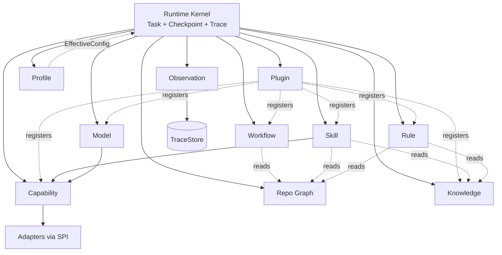

# 02 · Engines

Engine 是 Runtime Kernel 之下的一等执行子系统。每个 Engine：

1. 拥有清晰边界与公开 API（供 Kernel / Facade 调用）
2. 只依赖 SPI / Contract，不依赖具体 Plugin / Adapter 实现
3. 不直接依赖其他 Engine（Skill→Capability 原子下沉除外；协作经 Kernel 或只读 Context）

## Engine 总表（统一后）

| Engine | 模块 | 一句话职责 |
|--------|------|------------|
| Runtime Kernel | `runtime-kernel` | Task 生命周期、Context、调度、Policy、Checkpoint、Trace 协作 |
| Workflow Engine | `engine-workflow` | Workflow 定义/实例推进 |
| Skill Engine | `engine-skill` | Skill 注册与执行 |
| Rule Engine | `engine-rule` | Rule 匹配与决策 |
| Capability Engine | `engine-capability` | Capability 调用管道 |
| Model Engine | `engine-model` | Model Provider 路由与调用 |
| Plugin Engine | `engine-plugin` | Plugin 生命周期与贡献注册 |
| Repository Graph Engine | `engine-repo-graph` | 工程图构建与查询 |
| Knowledge Engine | `engine-knowledge` | 知识检索与治理 |
| Profile Engine | `engine-profile` | Project Profile 加载/校验/快照/合并 |
| Observation Engine | `engine-observation` | Trace 投影、Timeline、成本聚合 |

Checkpoint / Trace **服务**位于 Kernel，Store 在 persistence SPI；Observation 消费 Trace。

## 协作图

## 各 Engine 要点（增量）

### Profile Engine

Task 提交时：`validate → snapshot → merge overrides → EffectiveConfig` 注入 TaskContext。

### Knowledge Engine

白名单检索；Hit 必进 Trace；写入提案制。

### Observation Engine

以 Trace 为中心；提供 Console/API 查询；不再只是“日志投影”。

### Capability Engine

与 **Capability SDK** 分离：Engine 依赖 SPI；开发者依赖 SDK。见 `20-capability-sdk.md`。

### Kernel 内 Checkpoint / Trace Service

不是独立 Engine 模块亦可，但必须是一等服务；持久化经 `spi-persistence`。

## 详细专章

| Engine | Doc |
|--------|-----|
| Workflow | `09` |
| Skill | `08` |
| Rule | `07` |
| Capability | `03` + `20` |
| Repo Graph | `06` |
| Plugin | `04` |
| Adapter（非 Engine，扩展） | `05` |
| Knowledge | `18` |
| Profile | `19` |
| Task/Checkpoint/Trace | `15` `16` `17` |
