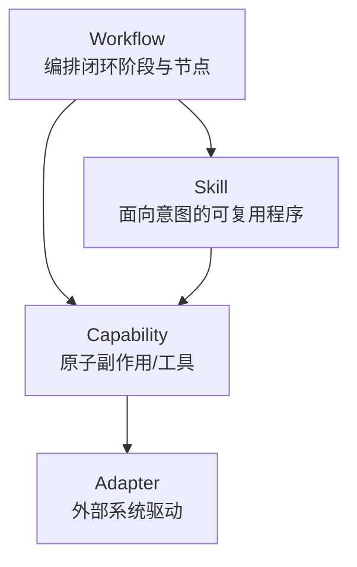

# 03 · Capabilities

## 定义

**Capability** 是 Runtime 中 **最小可调用、可权限化、可审计的原子能力**。

- Skill / Workflow / Model 编排最终都落到 Capability（或纯内存计算）
- 任何外部副作用（读盘、写盘、网络、进程、VCS）必须经 Capability

## 放置位置

| 类型 | 放置 | 说明 |
|------|------|------|
| Capability SPI / 契约 | `spi-capability` | 接口、描述符、输入输出 schema、错误码 |
| **Capability SDK** | `sdk/capability-sdk` (+ test) | 开发/测试/打包工具；**Engine 不得依赖** |
| Capability Engine | `engine-capability` | 注册表、鉴权、调用管道 |
| Capability 实现 | **Plugin 模块内** `.../capability/` | 经 SDK 实现；由 Plugin 贡献注册 |
| 内置最小集（可选） | `plugin-builtin` | 仅自举必需（如 `context.get`、`artifact.put`） |

**开发者规则：业务 Capability 永远不要放进 Kernel；新 Capability 必须走 Capability SDK（见 [20-capability-sdk.md](./20-capability-sdk.md)）。**

## Capability Descriptor（概念字段）

| 字段 | 说明 |
|------|------|
| `id` | 全局唯一，建议 `namespace.name`（如 `git.commit`） |
| `version` | SemVer |
| `displayName` | 人类可读名 |
| `description` | 用途说明 |
| `inputSchema` | JSON Schema / 等价结构 |
| `outputSchema` | JSON Schema / 等价结构 |
| `sideEffects` | `NONE` / `READ` / `WRITE` / `NETWORK` / `PROCESS` |
| `idempotency` | `NONE` / `KEYED` / `NATURAL` |
| `requiredPermissions` | 权限标签集合 |
| `requiredAdapters` | 依赖的 Adapter 类型 |
| `timeoutHint` | 建议超时 |
| `tags` | 发现与路由用标签 |

## 调用管道

## v1 Capability 分类目录（规划，非实现）

### A. Context & Artifact

| ID | Side Effect | 说明 |
|----|-------------|------|
| `context.get` | NONE | 读取 Context 分区 |
| `context.patch` | NONE | 更新可变记忆（受 Rule 约束） |
| `artifact.put` | WRITE* | 写入 Loop 产物区 |
| `artifact.get` | READ* | 读取产物 |

\*相对 Runtime 工作区，仍视为副作用。

### B. Repository & Code

| ID | Side Effect | 说明 |
|----|-------------|------|
| `repo.readFile` | READ | 读文件 |
| `repo.writeFile` | WRITE | 写文件（受路径白名单） |
| `repo.search` | READ | 文本 / 符号搜索 |
| `repo.graph.query` | READ | 查询 Repository Graph |
| `repo.graph.refresh` | READ | 增量刷新图 |

### C. VCS

| ID | Side Effect | 说明 |
|----|-------------|------|
| `git.status` | READ | 工作区状态 |
| `git.diff` | READ | diff |
| `git.commit` | WRITE | 提交（高权限） |
| `git.branch` | WRITE | 分支操作 |

### D. Quality Gates

| ID | Side Effect | 说明 |
|----|-------------|------|
| `test.run` | PROCESS | 跑测试 |
| `lint.run` | PROCESS | 静态检查 |
| `build.run` | PROCESS | 构建 |

### E. Collaboration

| ID | Side Effect | 说明 |
|----|-------------|------|
| `tracker.getIssue` | NETWORK | 读 Issue |
| `tracker.comment` | NETWORK | 评论 |
| `ci.trigger` | NETWORK | 触发流水线 |
| `ci.getStatus` | NETWORK | 查询状态 |

### F. Model Bridge（注意分层）

| ID | Side Effect | 说明 |
|----|-------------|------|
| `model.invoke` | NETWORK | 可选桥接；默认推荐 Kernel → Model Engine（见 ADR-0003） |
| `knowledge.search` | READ | 检索 Knowledge（经 Knowledge Engine） |
| `knowledge.propose` | WRITE | 提案写入知识（默认 DRAFT） |

## Capability vs Skill vs Workflow

| 概念 | 粒度 | 是否可编排多步 | 是否可有副作用 |
|------|------|----------------|----------------|
| Workflow | 最大 | 是（流程级） | 间接 |
| Skill | 中 | 是（程序级） | 间接 |
| Capability | 最小 | 否（单次调用） | 直接（经 Adapter） |

## 权限模型（架构）

Capability 声明 `requiredPermissions`；Loop 启动时 Host 授予 `grantedPermissions`；调用时 Capability Engine 做集合包含检查。Rule 可进一步收紧，不可放宽（除非 Host 明确授权的 Privilege Escalation 流程——v1 不支持自动放宽）。

## 相关文档

- Plugin 如何贡献 Capability：[04-plugin-system.md](./04-plugin-system.md)
- 扩展指南：[14-extension-guides.md](./14-extension-guides.md)
- RFC：[../rfc/0003-capability-spi.md](../rfc/0003-capability-spi.md)
