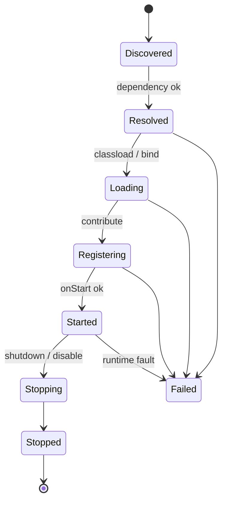
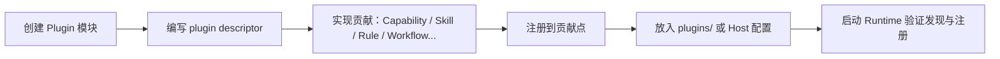

# 04 · Plugin System

## 定义

**Plugin** 是 Runtime 的 **唯一业务扩展单元**。它通过声明贡献点，向各 Engine 注册 Workflow / Skill / Rule / Capability / Adapter / ModelProvider。

Kernel 永不 import 业务 Plugin 代码；只依赖 Plugin SPI。

## 目标

- 业务团队可独立交付 Plugin JAR / 目录包
- 扩展不改 Kernel
- 贡献可发现、可版本化、可禁用

## Plugin 生命周期



## 贡献点（Contribution Points）

| Contribution | 注册到 | 说明 |
|--------------|--------|------|
| `workflows` | Workflow Engine | WorkflowDefinition |
| `skills` | Skill Engine | SkillDescriptor + Program |
| `rules` | Rule Engine | RuleDefinition |
| `capabilities` | Capability Engine | CapabilityDescriptor + Impl |
| `adapters` | Adapter Registry | Adapter 实现 |
| `modelProviders` | Model Engine | Model Provider |
| `graphEnrichers` | Repo Graph Engine | 图增强器（语言/框架特定） |
| `observers` | Observation Engine | 自定义事件投影（可选） |

## Plugin Descriptor（概念）

```yaml
# 概念示例 — 非实现、非 Prompt
id: com.example.coding-loop
version: 1.0.0
runtimeApiVersion: "1"
name: Coding Loop Plugin
dependencies:
  - id: com.ai4se.plugin-builtin
    versionRange: ">=1.0.0"
contributions:
  workflows:
    - id: coding.standard-loop
      resource: workflows/standard-loop.yaml
  skills:
    - id: coding.implement-task
      class: ... # 或 resource 声明式
  rules:
    - id: coding.no-force-push
      resource: rules/no-force-push.yaml
  capabilities:
    - id: coding.apply-patch
      class: ...
  adapters: []
  modelProviders: []
```

## 发现机制（v1）

优先级：

1. Host 显式配置的 Plugin 路径列表
2. 约定目录：`plugins/`
3. Classpath ServiceLoader / 等价清单扫描

v1 **不要求**远程插件市场与热插拔。

## 隔离模型（v1）

| 方案 | v1 决策 |
|------|---------|
| ClassLoader 隔离 | **建议**：每 Plugin 可选独立 ClassLoader |
| 进程隔离 | 不做 |
| 权限隔离 | 经 Capability Permission + Rule |
| 资源配额 | Loop 级预算，非 Plugin 级（可后续） |

详见 [ADR-0002](../adr/0002-plugin-first-extension.md)。

## Plugin 开发最小路径



完整步骤见 [14-extension-guides.md](./14-extension-guides.md)。

## Plugin vs Adapter

| | Plugin | Adapter |
|--|--------|---------|
| 角色 | 业务/领域扩展包 | 外部系统驱动 |
| 可贡献 | 几乎全部贡献点 | 主要实现端口接口 |
| 可包含 Adapter？ | 可以（打包交付） | — |
| 可包含业务 Workflow？ | 可以 | 不可以 |

推荐：基础设施 Adapter（OpenAI、Git）可独立 Adapter 模块；领域逻辑用 Plugin 组装。

## 失败策略

| 阶段失败 | 策略 |
|----------|------|
| 单个 Plugin Resolve 失败 | 记录错误；若标记 `required` 则阻止启动，否则跳过 |
| Register 冲突（同 id） | 按版本策略 / 显式优先级；冲突且无法解决则失败 |
| Started 后运行时错误 | 隔离到 Loop 错误；不自动卸载（v1） |

## 相关 RFC

- [0002-plugin-spi.md](../rfc/0002-plugin-spi.md)
