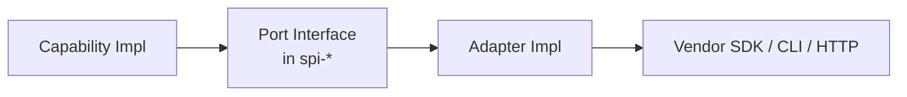
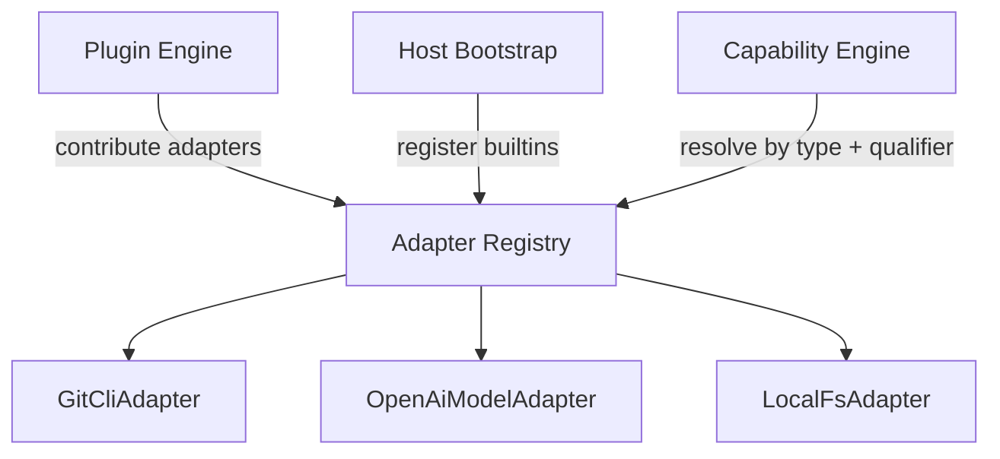

# 05 · Adapter System

## 定义

**Adapter** 实现 SPI 端口，把 Runtime 内部调用翻译为外部系统操作。Engine / Capability 依赖端口接口，不依赖厂商 SDK。



## 设计目标

- 可替换：同样 `GitPort` 可有 JGit Adapter / CLI Adapter
- 可测试：单测使用 InMemory / Fake Adapter
- 可审计：Adapter 边界打点（由 Capability Engine 统一更佳）

## Adapter 分类

| 类别 | Port 示例 | 外部系统 |
|------|-----------|----------|
| Model | `ModelPort` | OpenAI / Azure / 本地模型网关 |
| VCS | `GitPort` | Git |
| Filesystem | `FileSystemPort` | 本地 / 沙箱 FS |
| Process | `ProcessPort` | 测试 / 构建命令 |
| Tracker | `IssueTrackerPort` | Jira / GitHub Issues |
| CI | `CiPort` | Jenkins / GitHub Actions |
| Secret | `SecretPort` | Vault / Env |
| Clock / Id | `ClockPort` / `IdPort` | 系统 |

## 注册与解析



解析键：`portType` + 可选 `qualifier`（如 `model.provider=openai`）。

## Model Adapter（新增 Model 的关键路径）

新增一种模型提供方 = 新增 **Model Provider Adapter**（或 Plugin 内贡献 `modelProviders`）：

1. 实现 `ModelPort`（chat / complete / embed — v1 以 chat+structured 为主）
2. 声明能力标签：`supportsTools`、`supportsJsonSchema`、`maxContext`、`costClass`
3. 注册到 Model Engine
4. 配置路由规则（Host 配置或 Rule）

**禁止**在 Kernel 写死某个厂商 API。

详见扩展指南「新增 Model」。

## 错误映射

Adapter 必须将厂商错误映射为 Runtime 标准错误：

| 类别 | 含义 | 典型处理 |
|------|------|----------|
| `RETRYABLE` | 限流、超时、5xx | Kernel / Capability 可重试 |
| `FATAL` | 鉴权失败、资源不存在且不可恢复 | 失败 Loop 或该 Step |
| `NEEDS_HUMAN` | 需人工确认（如危险操作） | 暂停 Loop |
| `VALIDATION` | 输入不合法 | 不重试 |

## 安全约束

- Adapter 不解析业务 Rule；只执行被请求的技术操作
- 密钥只经 `SecretPort`，禁止打日志明文
- 网络 Adapter 遵守 Host 出站白名单（Policy Guard）

## 目录放置

```
adapters/
  adapter-git-cli/
  adapter-fs-local/
  adapter-model-openai/
  adapter-model-local/
  adapter-tracker-github/
  adapter-ci-github-actions/
```

或由 Plugin 内嵌 `internal adapter`（适合强绑定场景）。

## 相关

- ADR：[0004-adapter-isolation.md](../adr/0004-adapter-isolation.md)
- RFC：[0007-model-adapter.md](../rfc/0007-model-adapter.md)
