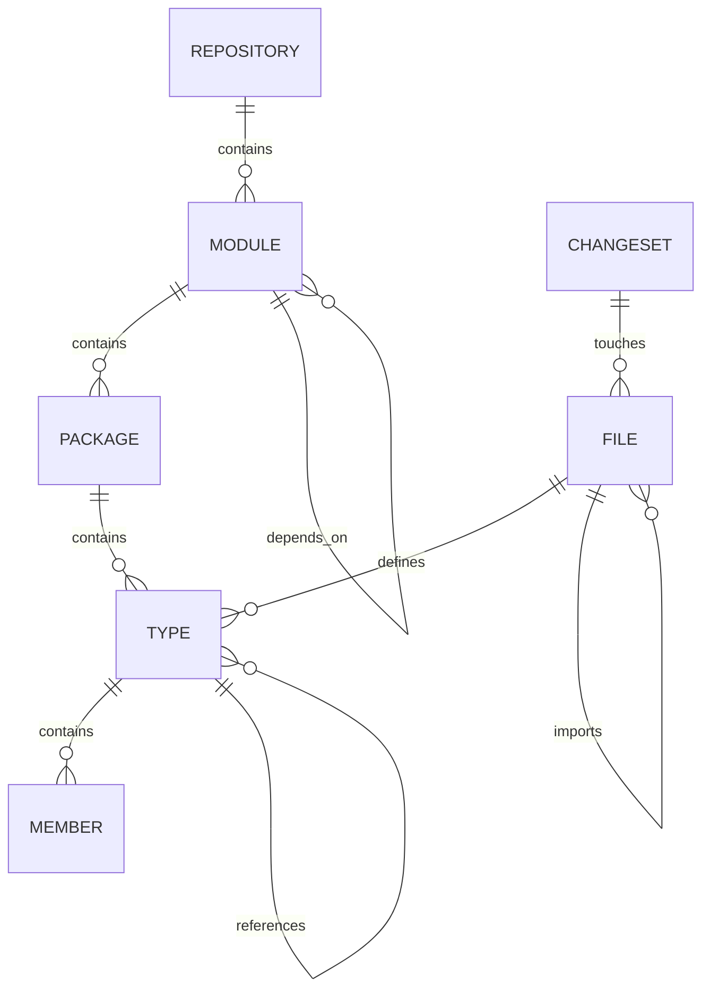
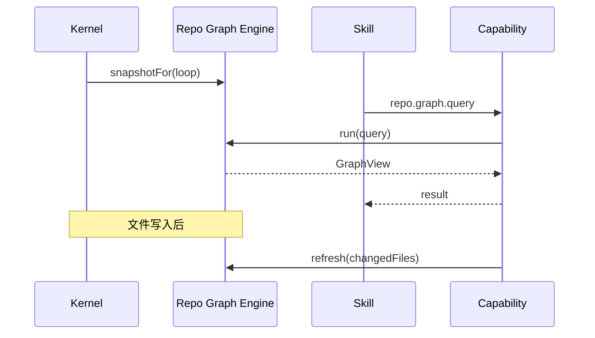

# 06 · Repository Graph

## 定义

**Repository Graph（RG）** 是工程仓库的可查询图模型，为 Planning / Skill / Rule / Model 提供结构化上下文，避免每次全仓盲扫。

## 目标

- 回答：模块边界、依赖方向、符号位置、变更影响面
- 支持增量更新（文件变更 → 局部失效重算）
- 允许多语言 Enricher（Plugin 贡献）

## 图模型（概念）

### 节点类型（v1）

| Node | 关键属性 |
|------|----------|
| `Repository` | rootPath, vcsHead |
| `Module` | coords, language, buildSystem |
| `Package` | name |
| `Type` | FQN, kind(class/interface/enum…) |
| `Member` | name, signature |
| `File` | path, language, hash |
| `Symbol` | 通用符号（跨语言） |
| `Artifact` | Loop 产物引用（可选挂载） |

### 边类型（v1）

| Edge | 含义 |
|------|------|
| `CONTAINS` | 结构包含 |
| `DEPENDS_ON` | 模块/包依赖 |
| `REFERENCES` | 类型/符号引用 |
| `DEFINES` | 文件定义符号 |
| `IMPORTS` | 文件导入 |
| `TESTED_BY` | 测试关系（Enricher） |
| `GENERATED_FROM` | 生成关系（可选） |

## Engine 职责

Repository Graph Engine：

1. **Build**：初次索引（经 FS / Git / Language Adapter）
2. **Query**：预定义查询 + 有限图遍历 API
3. **Invalidate / Refresh**：按文件集合增量更新
4. **Snapshot**：绑定到 LoopContext 的只读视图（某次 Loop 期间相对稳定）

## 查询 API（架构级清单）

| Query | 用途 |
|-------|------|
| `findSymbol(name/FQN)` | 定位定义 |
| `moduleOf(path)` | 路径归属模块 |
| `dependencies(module, depth)` | 依赖扇出 |
| `dependents(module, depth)` | 依赖扇入 |
| `impactOf(files)` | 变更影响 |
| `owners(path)`（可选） | CODEOWNERS 类信息 |
| `testsFor(symbol/file)` | 相关测试 |

禁止暴露任意图灵完备查询语言给 Model 直接执行（防滥用）；v1 仅白名单查询。

## 与 Loop 的关系

## Enricher（Plugin 贡献）

语言/框架特定逻辑通过 `GraphEnricher` 贡献：

- Java/Maven Enricher
- TypeScript/pnpm Enricher
- 测试框架 Enricher

核心 Engine 只维护通用模型与管道。

## 存储

| 方案 | v1 |
|------|----|
| 内存图 + 文件哈希索引 | **默认** |
| 持久化 DB | 可选后续 |
| 全量 LSP 替换 RG | 不采用；可 Adapter 辅助 |

## 相关

- ADR：[0005-repository-graph.md](../adr/0005-repository-graph.md)
