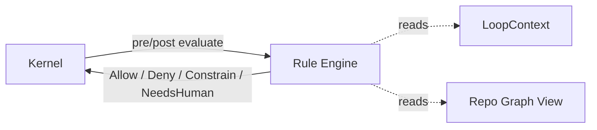
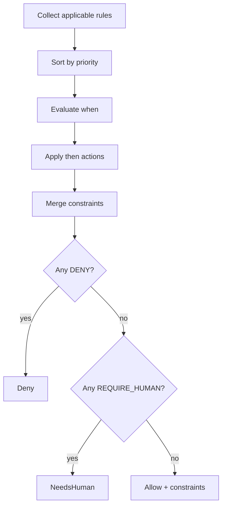

# 07 · Rule Engine

## 定义

**Rule Engine** 执行声明式规则，对 Loop 的决策与副作用施加治理：允许、拒绝、附加约束、要求人工、标记风险。

Rule **不是**通用编程语言；它是策略层。

## 在架构中的位置



Kernel 在每个 Step 前后调用 Rule Engine；Capability 调用前也可挂 Capability-scoped Rules。

## Rule 结构（概念）

| 字段 | 说明 |
|------|------|
| `id` | 唯一 ID |
| `version` | 版本 |
| `scope` | `GLOBAL` / `WORKFLOW` / `STEP` / `CAPABILITY` |
| `phase` | `PRE` / `POST` / `BOTH` |
| `priority` | 数值，小者优先（冲突解决策略见下） |
| `when` | 匹配条件（事实匹配，非自由代码） |
| `then` | 动作列表 |
| `enabled` | 开关 |
| `tags` | 分类 |

### when（事实）

可匹配的事实来源：

- Loop 元数据（目标类型、预算剩余）
- Step 类型与节点 ID
- Capability ID / sideEffects
- Context 标志位（由 Skill 写入的结构化字段）
- Repo Graph 查询结果（白名单 query）
- 上一步结果状态

### then（动作）

| Action | 含义 |
|--------|------|
| `ALLOW` | 显式允许（默认也可隐式允许） |
| `DENY` | 拒绝并给出 reasonCode |
| `ADD_CONSTRAINT` | 追加约束（路径白名单、禁止 push 等） |
| `REQUIRE_HUMAN` / **`REQUIRE_POLICY_EXCEPTION`** | 暂停等待策略例外批准（现行推荐后者） |
| `EMIT_EVENT` | 审计/告警事件 |
| `SET_FLAG` | 设置 Context 标志（受限键空间） |

**v1 禁止 Rule 直接调用 Capability（防策略层产生副作用）。**

## 求值顺序



冲突：任一 `DENY` 胜出；`REQUIRE_HUMAN` 高于纯 `ALLOW`；约束取交集（更严）。

## 示例（概念 YAML，非实现）

```yaml
id: safety.deny-force-push
scope: CAPABILITY
phase: PRE
priority: 10
when:
  capabilityId: git.push
  args.force: true
then:
  - type: DENY
    reasonCode: FORCE_PUSH_FORBIDDEN
```

```yaml
id: quality.require-tests-on-prod-module
scope: STEP
phase: POST
priority: 20
when:
  workflowId: coding.standard-loop
  stepId: verify
  facts.changedModules.containsProduction: true
  facts.testResult.failed: true
then:
  - type: DENY
    reasonCode: TESTS_MUST_PASS
```

## 新增 Rule 怎么做

1. 在 Plugin 的 `rules/` 增加声明文件（或等价描述符）
2. 在 Plugin Descriptor 的 `contributions.rules` 注册
3. 确认 `when` 所需事实由现有 Engine 提供；若缺事实，优先扩展 **Observation / Context 事实提供者**，而不是在 Rule 里写代码
4. 单测：给定 Context 快照 → 期望 Decision

详见 [14-extension-guides.md](./14-extension-guides.md) 与 [RFC-0006](../rfc/0006-rule-dsl.md)。

## 非目标

- 不做完整 RETE 专家系统（v1 线性匹配足够）
- Rule 内不写 Prompt
- Rule 不替代 Workflow 分支（复杂分支用 Workflow）
