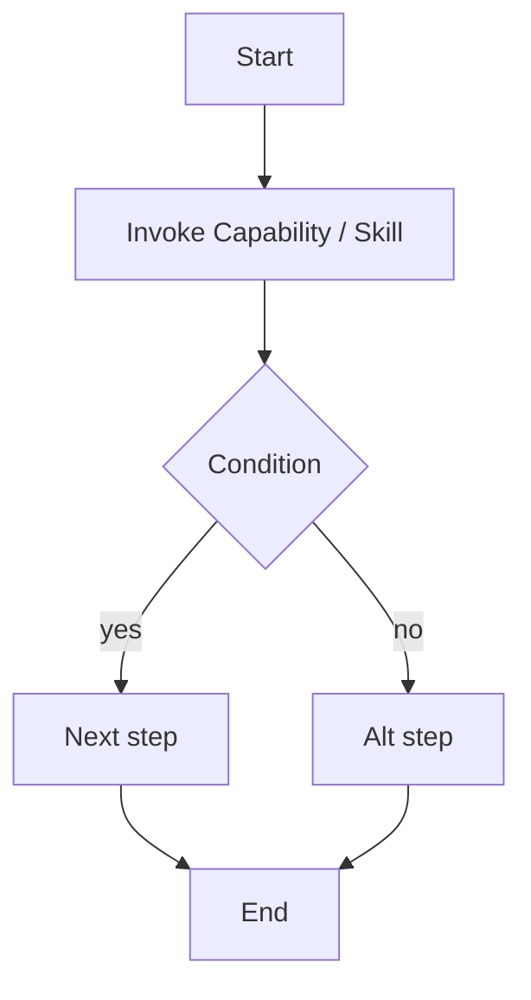
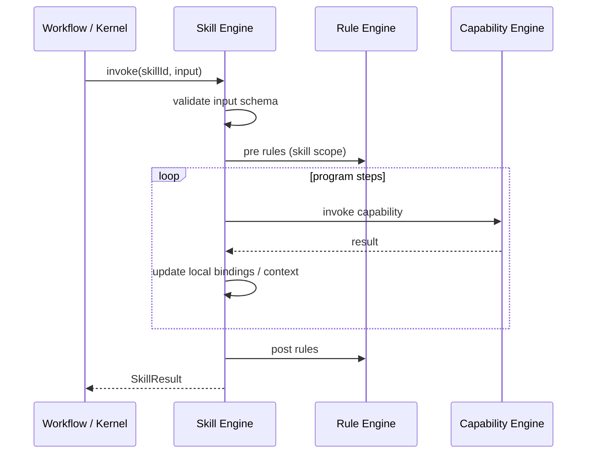

# 08 · Skill Engine

## 定义

**Skill** 是面向意图的可复用程序单元：把多个 Capability（及子 Skill）编排成可被 Workflow 节点调用的「能力包」。

Skill 比 Workflow 小，比 Capability 大。

## 职责边界

| 该做 | 不该做 |
|------|--------|
| 表达可复用的领域步骤 | 管理整个 Loop 生命周期 |
| 调用 Capability / 子 Skill | 直接调用 Adapter / SDK |
| 读写 LoopContext 约定字段 | 绕过 Rule / Permission |
| 声明所需权限与输入输出 | 内嵌厂商特定 API |

## Skill Descriptor

| 字段 | 说明 |
|------|------|
| `id` | 如 `coding.implement-change` |
| `version` | SemVer |
| `inputSchema` / `outputSchema` | 结构化契约 |
| `requiredCapabilities` | 静态声明，便于启动期校验 |
| `requiredPermissions` | 权限 |
| `programKind` | `DECLARATIVE` / `COMPILED`（v1 主推声明式） |
| `tags` | 发现 |

## Program 模型（声明式）



支持的控制结构（v1）：

- `sequence`
- `conditional`（基于 Context 事实 / 上一步输出）
- `forEach`（有限集合，必须有上限）
- `invokeCapability`
- `invokeSkill`
- `setContext`（受限键）
- `fail` / `succeed`

**不支持**：任意脚本、无限循环、反射。

## 执行管道



## Skill 目录放置

```
plugins/<plugin-id>/
  skills/
    implement-change/
      skill.yaml          # descriptor + program
    review-diff/
      skill.yaml
```

或 Java/Kotlin 类实现 `SkillProgram` SPI（复杂 Skill），仍由 Plugin 贡献——**本阶段只定义，不实现**。

## 新增 Skill 怎么做

1. 选定 Plugin（或新建 Plugin）
2. 编写 `skill.yaml`：id、schema、program
3. 确保 `requiredCapabilities` 已由某 Plugin 提供
4. 在 Plugin Descriptor 注册
5. 在目标 Workflow 节点引用 `skillRef: coding.implement-change`
6. 用 Fake Capability 做程序路径测试

详见 [14-extension-guides.md](./14-extension-guides.md) 与 [RFC-0005](../rfc/0005-skill-spi.md)。

## Skill 与 Model

Skill 可通过 Kernel / `model.invoke` Capability 使用模型，但：

- Prompt 模板属于 **Plugin 资源**，不属于 Kernel
- 本 Blueprint **不生成任何 Prompt 内容**
- Model 输出必须对照 Skill 声明的结构化 schema 校验
