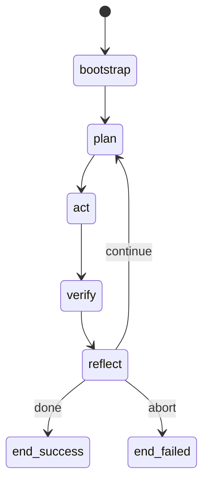

# 09 · Workflow Engine

## 定义

**Workflow** 描述一次 AI Loop（或子循环）的阶段、节点、转移、守卫与补偿。它是 Runtime 的 **编排骨架**。

## 与 Task 的关系

- 每个 `Task` 绑定一个根 `WorkflowDefinition`（经 Profile 路由或 TaskRequest 指定）
- Workflow 节点执行委托给 Skill / Capability / Model / PolicyException / 子 Workflow
- Reflecting 是 Workflow 的显式节点；`CONTINUE` 前由 Kernel 写 Checkpoint

> 初版称 “与 Loop 的关系”；现行对外对象为 Task，内部迭代为 TaskIteration。

## 节点类型（v1）

| Node Type | 说明 |
|-----------|------|
| `skill` | 调用 Skill |
| `capability` | 直接调用 Capability（慎用，优先 Skill） |
| `model` | 经 Model Engine 的结构化调用 |
| `ruleGate` | 显式规则门（补充自动 pre/post） |
| `human` / `policyException` | 等待策略例外批准（非聊天）；现行推荐 `policyException` |
| `fork` / `join` | 并行 |
| `subworkflow` | 嵌套流程 |
| `reflect` | 汇总结论并选择下一边 |
| `end` | 成功 / 失败终止 |

## 定义模型（概念）



对应声明式片段（概念）：

```yaml
id: coding.standard-loop
version: 1.0.0
entry: bootstrap
nodes:
  bootstrap: { type: capability, ref: repo.graph.refresh }
  plan:      { type: skill, ref: coding.plan-task }
  act:       { type: skill, ref: coding.implement-change }
  verify:    { type: skill, ref: coding.run-quality-gates }
  reflect:   { type: reflect }
  end_success: { type: end, status: SUCCEEDED }
  end_failed:  { type: end, status: FAILED }
edges:
  - from: bootstrap to: plan
  - from: plan to: act
  - from: act to: verify
  - from: verify to: reflect
  - from: reflect to: plan when: decision == CONTINUE
  - from: reflect to: end_success when: decision == DONE
  - from: reflect to: end_failed when: decision == ABORT
```

## Engine 职责

1. 加载与校验定义（可达性、类型、引用存在性）
2. 实例化 `WorkflowInstance`（cursor、history、branch state）
3. 向 Kernel 提供 `pollNextExecutableNodes()`
4. 接收 Step 结果，推进转移
5. 处理取消与补偿（v1：尽力而为的 compensation hooks）

## 守卫与预算

- Edge `when` 只能基于结构化 Decision / Context 事实
- 全局 `maxIterations` / `maxSteps` 由 Workflow 元数据 + Kernel Policy 双重约束
- 超限 → `Failed` + reasonCode `BUDGET_EXCEEDED`

## 新增 Workflow 怎么做

1. 在 Plugin 创建 `workflows/<name>.yaml`
2. 确保引用的 Skill / Capability / 子 Workflow 均已贡献
3. Plugin Descriptor 注册
4. Host / 请求指定 `workflowId`（或 Rule 选择默认 Workflow）
5. 用 Workflow 校验器做静态检查 + 干跑（dry-run）测试

详见 [14-extension-guides.md](./14-extension-guides.md) 与 [RFC-0004](../rfc/0004-workflow-dsl.md)、[ADR-0006](../adr/0006-workflow-as-orchestration.md)。

## 非目标

- v1 不做 BPMN 全兼容
- 不做跨进程分布式工作流引擎
- Workflow DSL 内不嵌入 Prompt 文本（Model 节点只引用 Plugin 内 template id）
