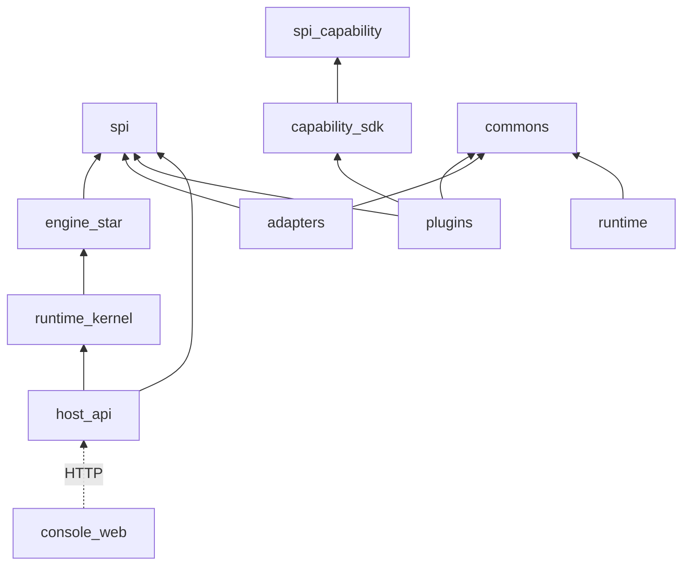

# 10 · Directory Structure

目标仓库目录约定。**本阶段仅文档，不创建业务源码实现。**

```text
ai4se-runtime/
├── README.md
├── project-roadmap.md
├── docs/
│   ├── architecture/
│   ├── adr/
│   └── rfc/
│
├── pom.xml                          # Maven 父工程（实现阶段）
│
├── spi/                             # L3 契约
│   ├── spi-plugin/
│   ├── spi-capability/
│   ├── spi-adapter/
│   ├── spi-model/
│   ├── spi-skill/
│   ├── spi-rule/
│   ├── spi-workflow/
│   ├── spi-repo-graph/
│   ├── spi-knowledge/
│   ├── spi-profile/
│   └── spi-persistence/             # Task/Checkpoint/Trace stores
│
├── sdk/                             # 开发者 SDK（引擎不依赖）
│   ├── capability-sdk/
│   ├── capability-sdk-test/
│   └── capability-sdk-bom/
│
├── runtime/
│   ├── runtime-kernel/              # Task lifecycle, checkpoint, trace svc, policy
│   ├── engine-workflow/
│   ├── engine-skill/
│   ├── engine-rule/
│   ├── engine-capability/
│   ├── engine-model/
│   ├── engine-plugin/
│   ├── engine-repo-graph/
│   ├── engine-knowledge/
│   ├── engine-profile/
│   └── engine-observation/
│
├── adapters/
│   ├── adapter-fs-local/
│   ├── adapter-git-cli/
│   ├── adapter-process-local/
│   ├── adapter-model-openai/
│   ├── adapter-model-local/
│   ├── adapter-tracker-github/
│   ├── adapter-ci-github-actions/
│   └── adapter-persistence-jdbc/
│
├── plugins/
│   ├── plugin-builtin/
│   └── plugin-coding-loop/          # 领域示例（实现后期）
│
├── hosts/
│   ├── host-api/                    # Spring Boot REST
│   └── host-cli/                    # 可选 CLI 调 API 或内嵌
│
├── console-web/                     # Vue 3 控制台
│   ├── package.json
│   └── src/
│
├── profiles/                        # 可版本管理的 Profile 样例（声明，非代码）
│   └── _examples/
│
├── commons/
│   ├── commons-json/
│   ├── commons-ids/
│   └── commons-result/
│
└── tests/
    ├── architecture-tests/          # ArchUnit
    └── contract-tests/
```

## 模块归属速查

| 新增… | 放哪里 |
|-------|--------|
| 端口/SPI | `spi-*` |
| Capability 开发依赖 | `sdk/capability-sdk` |
| Engine | `runtime/engine-*` |
| Task/Checkpoint/Trace 核心 | `runtime/runtime-kernel` |
| 外部系统 | `adapters/*` |
| 领域扩展 | `plugins/*` |
| REST | `hosts/host-api` |
| 控制台 | `console-web` |
| Profile 声明 | `profiles/` 或配置中心 |
| 文档 | `docs/**` |

## 包名

```text
com.ai4se.runtime.spi.*
com.ai4se.runtime.sdk.capability.*
com.ai4se.runtime.kernel.*
com.ai4se.runtime.engine.*
com.ai4se.runtime.adapter.*
com.ai4se.runtime.plugin.*
com.ai4se.runtime.host.*
```

## 依赖方向



**禁止**：`spi → runtime`；`runtime → plugins/adapters` 实现类；`engine-* → capability-sdk`；`console-web` 直连 DB。
