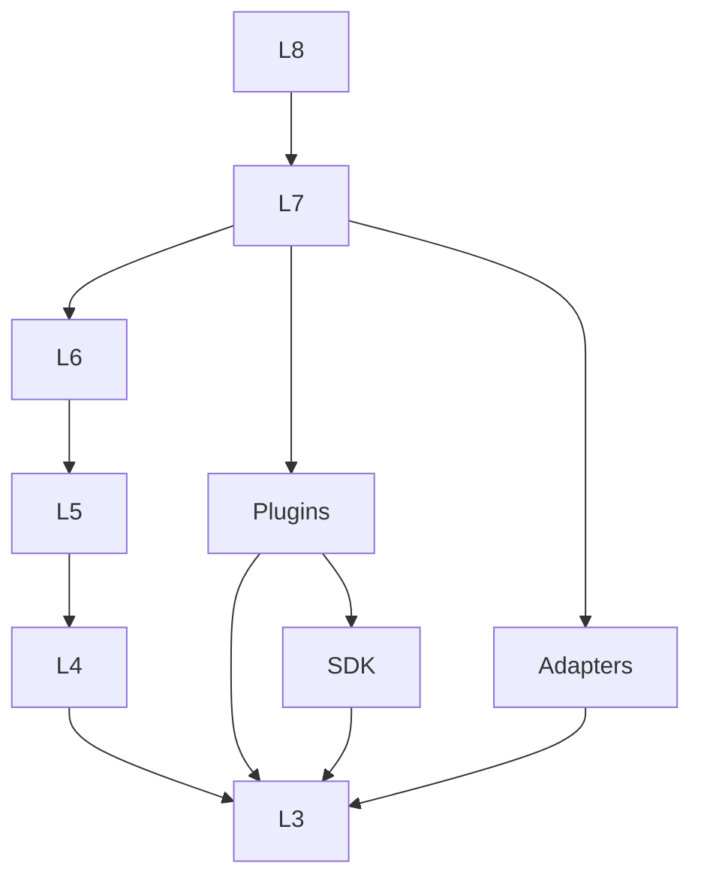

# 11 · Layers & Dependency Directions

## 层职责（八层）

| Layer | 名称 | 职责 | 禁止 |
|-------|------|------|------|
| L8 | Experience | Vue Console / CLI UX | 直连 DB / Adapter |
| L7 | Host | Spring Boot、安全、装配 | 领域 Workflow 内容 |
| L6 | Facade | Task/Profile/Knowledge/Observation API | 厂商 SDK |
| L5 | Kernel | Task 生命周期、Checkpoint、Trace、Policy、调度 | 领域 Skill 逻辑 |
| L4 | Engines | 各执行子系统 | 依赖 Plugin 实现类 |
| L3 | SPI | 契约 | IO / 厂商 SDK |
| L2b | SDK | Capability SDK（扩展开发） | 被 Engine 依赖 |
| L2 | Extensions | Plugin / Adapter | 反向依赖 Host |
| L1 | External | 真实系统 | — |

## 依赖规则

### 允许

- Host 装配 Adapter/Plugin
- Skill Engine → Capability Engine
- Plugin → capability-sdk
- 任意层 → commons

### 禁止

- SPI → Engine/Host
- Engine → Plugin/Adapter 实现
- **Engine → capability-sdk**
- Plugin → Host
- Console → persistence

## TaskContext 数据依赖

见 [15-task-lifecycle.md](./15-task-lifecycle.md)。Profile 快照在 Task 创建时注入，运行中不可暗改。

## 版本

- `runtimeApiVersion`：Plugin/Profile/SDK 声明
- 破坏性变更：ADR + 主版本
