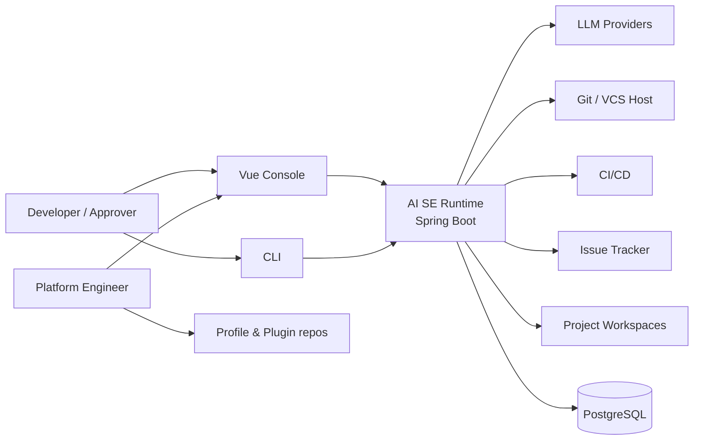
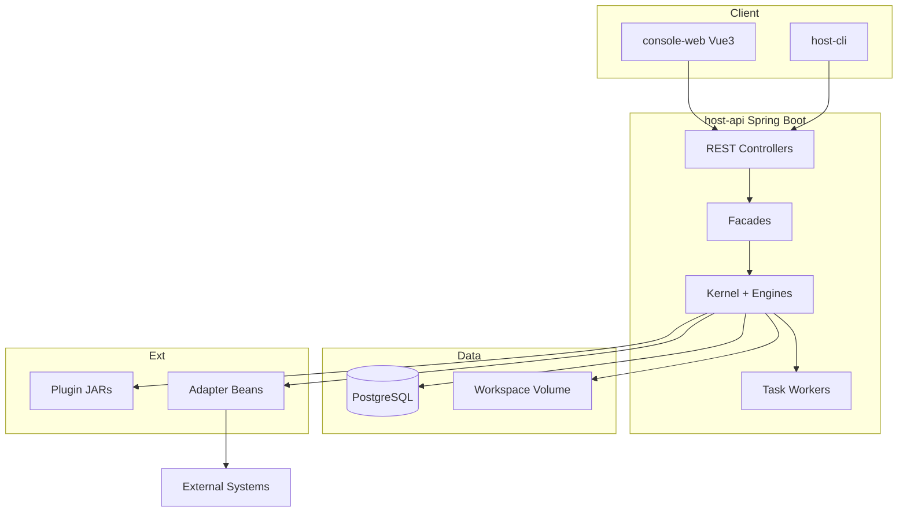
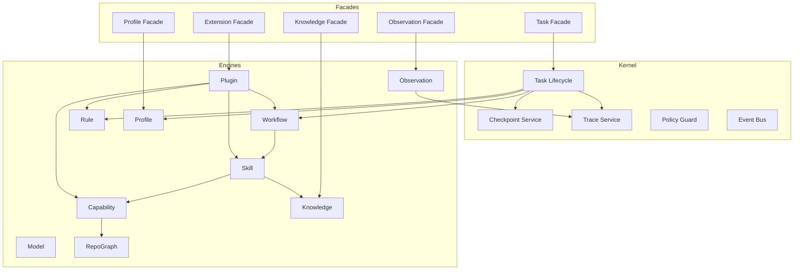

# 12 · C4 Architecture Diagrams

## Level 1 — System Context

**说明**：人与系统的主交互是 Task 提交、策略例外批准、Profile 配置与 Trace 复盘；不是开放域聊天。

## Level 2 — Containers

## Level 3 — Components

## Level 4 — Code 指引

类级细节见各 RFC；实现约定：

- `com.ai4se.runtime.host.api.*` — Controllers / DTOs
- `com.ai4se.runtime.kernel.task.*` — Task 状态机
- `com.ai4se.runtime.kernel.checkpoint.*`
- `com.ai4se.runtime.kernel.trace.*`
- `com.ai4se.runtime.engine.*`
- `com.ai4se.runtime.sdk.capability.*` — 仅 Plugin 使用
