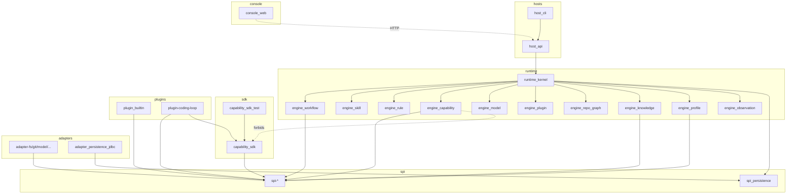
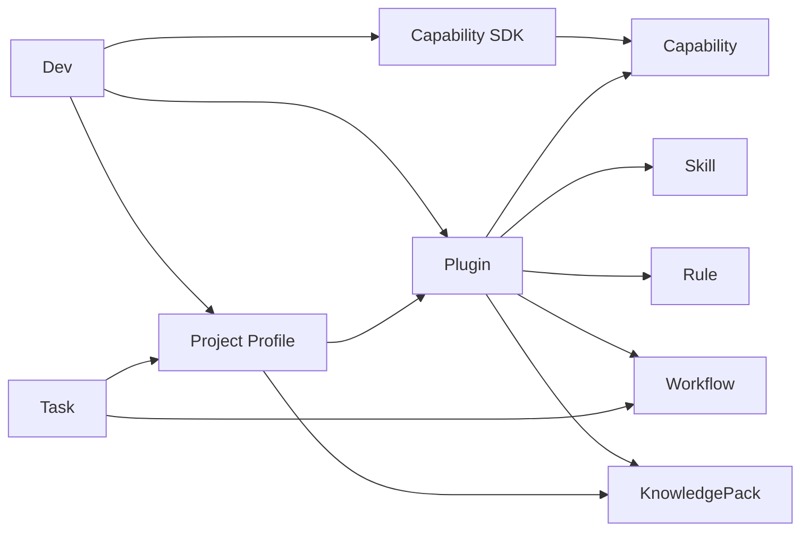
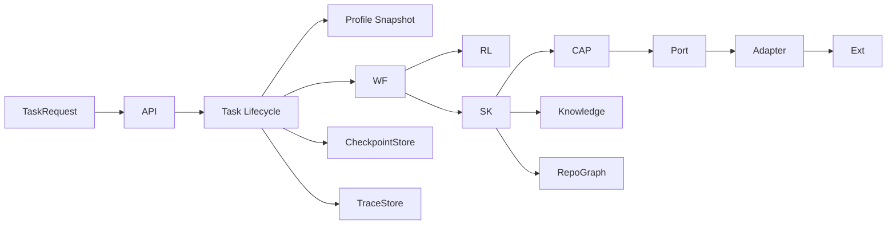

# 13 · Module Relationship Diagrams

## 模块全景（统一后）

## 扩展开发关系

## 数据流

## 测试与模块

| 测试 | 模块 |
|------|------|
| Unit | 单 Engine、SDK Harness |
| ArchUnit | 依赖方向（含禁止 engine→sdk） |
| Contract | Profile/Plugin/Workflow/Rule 描述符 |
| API | host-api Testcontainers |
| E2E | Fake Model + 样例 Profile（后期） |
