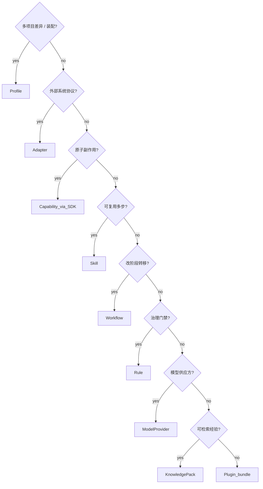

# 14 · Extension Guides

实现扩展时按本章操作。全程 **无业务代码示例要求**；只规定步骤与验收。开发 Capability 时使用 **Capability SDK**（见 `20`）。

---

## A. 新增 Plugin

1. 建 `plugins/plugin-<name>/`，依赖 `spi-*` + 按需 `capability-sdk`
2. 编写 `plugin.yaml`：`id/version/runtimeApiVersion/dependencies/contributions`
3. 贡献 Workflow / Skill / Rule / Capability / KnowledgePack / ModelProvider / Adapter / GraphEnricher
4. 实现 `Plugin` start/stop，注册贡献
5. 由 Host 装载；启动期校验 ID 冲突与依赖闭合

验收：不依赖 `runtime-kernel` 实现类；副作用只经 Capability。

---

## B. 新增 Workflow

1. `plugins/.../workflows/<id>.yaml`
2. 节点引用已有 Skill/Capability/子 Workflow；含终止与预算
3. Reflect 输出结构化 `CONTINUE|DONE|ABORT`
4. CONTINUE 路径需可触发 Checkpoint（引擎保证 + 定义勿绕过）
5. Descriptor 注册；静态校验

---

## C. 新增 Skill

1. `skills/<id>/skill.yaml` + 声明式 program
2. `requiredCapabilities` 闭合
3. 无直接 Adapter 调用；循环有 limit
4. 需要项目事实时走 Knowledge/RepoGraph 查询 Capability

---

## D. 新增 Rule

1. `rules/<id>.yaml`：scope/phase/priority/when/then
2. 无副作用；DENY 带稳定 reasonCode
3. 高危操作返回 `REQUIRE_POLICY_EXCEPTION` 而非聊天式提问

---

## E. 新增 Model Provider

1. `adapters/adapter-model-<vendor>/` 实现 ModelPort
2. 注册 labels；错误映射标准 taxonomy
3. Profile `model` 段配置路由
4. Kernel 无厂商 SDK

---

## F. 新增 Capability（经 SDK）

1. 引入 `capability-sdk` + `capability-sdk-test`
2. 实现 Capability + Descriptor（sideEffects/permissions/schemas/idempotency）
3. 只经 Port 访问外部
4. Harness 测试：成功、校验失败、权限、幂等
5. Plugin 贡献注册

---

## G. 新增 Adapter

1. 确认 Port；缺失则先 RFC 扩 SPI
2. `adapters/adapter-<tech>/` 实现 + Fake
3. Host/Plugin 注册

---

## H. 新增 / 接入 Project Profile

1. 在 `profiles/<project>/` 编写 Profile YAML
2. 声明 plugins、workflowRouting、budget、permissions、knowledge、checkpoint、runMode
3. `ProfileEngine.validate` 全绿
4. 激活为项目默认
5. 提交试跑 Task（DRY_RUN 建议先）

---

## I. 新增 Knowledge Pack

1. 定义 Pack id/version/scope
2. 录入 Item（kind/tags/status）
3. Profile `knowledge.packs` 引用
4. 检索 Hit 必须可在 Trace 中看到 cite

---

## 决策树

