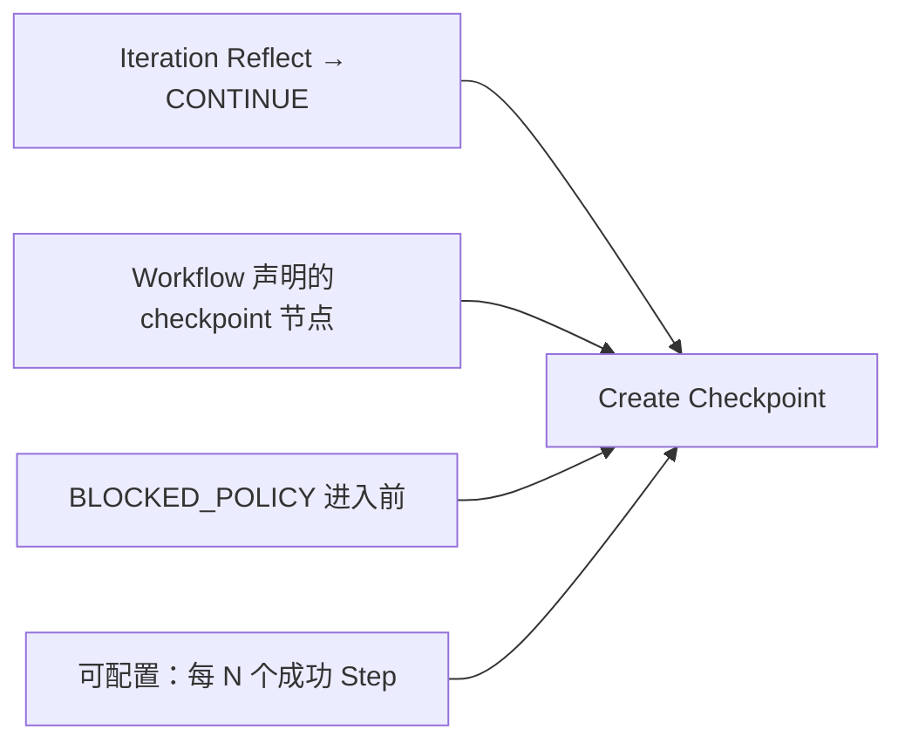

# 16 · Checkpoint

## 定义

**Checkpoint** 是 Task 在可信边界上的 **耐久恢复点**：包含足以在新进程中继续执行的最小状态，而不需要重放全部历史副作用。

无 Checkpoint 的 Runtime 无法满足无人值守与崩溃恢复。

## 设计目标

1. 进程崩溃后可从最近 Checkpoint 恢复
2. 恢复后 **不重复危险副作用**（或按幂等键去重）
3. Checkpoint 本身可审计、可选择保留策略
4. 不把整个工作区二进制塞进 Checkpoint（工作区以 git ref / file hash 为准）

## 何时创建（强制边界）



| 触发 | v1 要求 |
|------|---------|
| Iteration 边界（CONTINUE） | **必须** |
| 进入 `BLOCKED_POLICY` 前 | **必须** |
| 显式 `checkpoint` Workflow 节点 | 支持 |
| 每个 Capability WRITE 后 | 可选（成本高，默认关） |
| 定时 | 不做 |

## Checkpoint 内容模型

| 字段 | 说明 |
|------|------|
| `checkpointId` | 唯一 ID |
| `taskId` | 所属 Task |
| `sequence` | 单调序号 |
| `createdAt` | 时间 |
| `workflowCursor` | 节点游标 / 并行 branch 状态 |
| `iterationIndex` | 当前迭代号 |
| `taskContextSnapshot` | 可序列化 Context 分区（不含瞬时锁） |
| `budgetRemaining` | 剩余预算 |
| `graphSnapshotId` | Repo Graph 快照引用 |
| `knowledgeViewRef` | 可选 |
| `artifactsIndex` | 产物清单（路径/hash），非全量字节 |
| `workspaceFingerprint` | HEAD commit / dirty hash 策略 |
| `traceSpanId` | 关联 Span |
| `integrityHash` | 内容校验 |

### 不入库（或外置）

- 完整 Vendor 原始 Model 响应（可外置对象存储指针）
- IDE 临时文件
- Adapter 连接池状态

## 恢复流程

```mermaid
sequenceDiagram
  participant W as Worker
  participant TLM as Task Lifecycle
  participant CP as Checkpoint Service
  participant WF as Workflow Engine
  participant IDEM as Idempotency Store

  W->>TLM: resume(taskId) / reclaim lease
  TLM->>CP: loadLatest(taskId)
  CP-->>TLM: checkpoint
  TLM->>TLM: verify integrity + workspaceFingerprint policy
  TLM->>WF: restore cursor
  TLM->>IDEM: warm idempotency keys
  TLM->>TLM: status=RUNNING
  Note over TLM: continue next steps; WRITE caps use idempotencyKey
```

### 工作区一致性策略（Profile 可配）

| 策略 | 行为 |
|------|------|
| `REQUIRE_CLEAN_MATCH` | fingerprint 不一致则失败 |
| `ALLOW_DIRTY_IF_HASH_MATCH` | 允许未提交但 hash 集合一致 |
| `REBASE_TO_REF` | 强制 checkout 到记录 ref（危险，需 Rule 允许） |

默认：`REQUIRE_CLEAN_MATCH`。

## 幂等与副作用

Checkpoint 恢复 **不能保证** 外部世界未变（CI 已触发、Issue 已评论）。因此：

1. 所有 `WRITE`/`NETWORK`/`PROCESS` Capability 必须支持 `idempotencyKey`（或声明 `NATURAL` 幂等）
2. Idempotency Store 与 Checkpoint 同事务或可重建
3. 非幂等操作必须在 Rule 中标记为高危，恢复后跳过或改走策略例外

## 存储

| 方案 | v1 |
|------|----|
| DB 表 `checkpoint` + JSON/BLOB payload | **默认**（Spring + JDBC/JPA） |
| 对象存储放大附件 | 可选 |
| 仅内存 | 禁止用于生产路径 |

保留策略：按 Task 保留全部，或 `keepLastN` + 终态归档（Profile 配置）。

## 模块

- SPI：`CheckpointStore` in `spi-persistence`
- 实现：`adapter-persistence-*`
- 服务：`runtime-kernel` 内 `CheckpointService`
- 引擎协作：Workflow 提供 cursor 序列化 SPI

## 相关

- ADR-0010 · RFC-0009 · Task `15`
