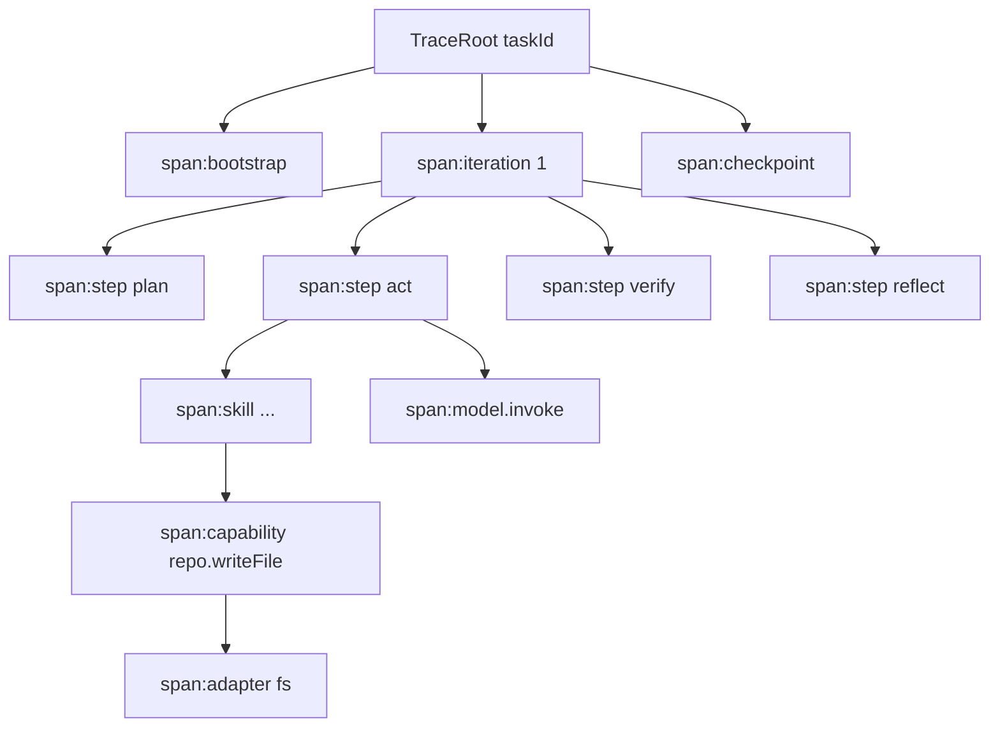
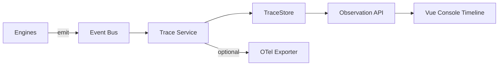

# 17 · Trace

## 定义

**Trace** 是一次 Task 执行的分层轨迹：以 Span 树记录“谁在什么时候做了什么、输入输出摘要、耗时、错误与关联实体”，支撑排障、审计、成本分析与无人值守验收。

Trace ≠ 聊天记录。  
Trace ≠ 仅应用日志。  
AuditEvent 可挂到 Span，但 Trace 是主观测模型。

## 目标

1. 任一失败 Task 可只靠 Trace + Checkpoint 复盘
2. Vue Console 可渲染 Span 时间线
3. 可导出 OpenTelemetry 兼容视角（v1 可先内部模型，导出可选）
4. 敏感载荷默认记录摘要/哈希，不落明文密钥

## Span 模型

### Span 字段

| 字段 | 说明 |
|------|------|
| `traceId` | 等于或关联 TaskId 策略（v1：独立 traceId，强绑 taskId） |
| `spanId` | 唯一 |
| `parentSpanId` | 树 |
| `name` | 稳定操作名，如 `capability:git.commit` |
| `kind` | `TASK` `ITERATION` `STEP` `SKILL` `CAPABILITY` `MODEL` `RULE` `ADAPTER` `CHECKPOINT` `KNOWLEDGE` |
| `startTime` / `endTime` | 时间 |
| `status` | `OK` `ERROR` `CANCELLED` |
| `attributes` | 结构化键值（workflowNodeId、iteration、pluginId…） |
| `events` | 时间点事件 |
| `resourceUsage` | tokens、cpu hint、bytes written |
| `links` | checkpointId、artifactId、knowledgeId |
| `error` | taxonomy + reasonCode + 摘要 |

## 强制埋点点

| 位置 | Span Kind | 必须属性 |
|------|-----------|----------|
| Task 起止 | TASK | projectId, profileId, workflowId, runMode |
| Iteration | ITERATION | index, decision |
| Workflow step | STEP | nodeId, nodeType |
| Rule 决策 | RULE | ruleId, decision, reasonCode |
| Skill | SKILL | skillId |
| Capability | CAPABILITY | capabilityId, sideEffects |
| Model | MODEL | providerId, modelAlias, token usage |
| Checkpoint | CHECKPOINT | checkpointId, sequence |
| Knowledge query | KNOWLEDGE | scope, resultCount |

未打点视为实现缺陷（契约测试可扫关键路径）。

## 与 Observation Engine

初版 Observation Engine 升级为：**Trace 为中心**，Metrics/Audit 为投影。

## 查询 API（实现级清单）

| API | 说明 |
|-----|------|
| `GET /tasks/{id}/trace` | 整树或摘要 |
| `GET /tasks/{id}/trace/spans/{spanId}` | 详情 |
| `GET /tasks/{id}/timeline` | UI 友好扁平事件 |
| `GET /tasks/{id}/cost` | 由 MODEL spans 聚合 |

## 数据保留

- 热数据：DB
- 冷数据：归档存储（Phase 后期）
- PII/密钥：Attribute 红线名单（Profile + 全局）

## 模块

- `engine-observation` + `TraceService` in kernel 协作
- `spi-persistence`:`TraceStore`
- Vue：`console-web` Trace 视图

## 相关

- ADR-0011 · RFC-0010
