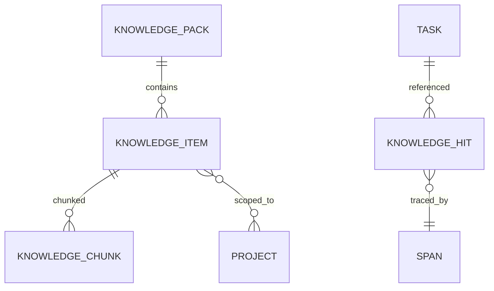
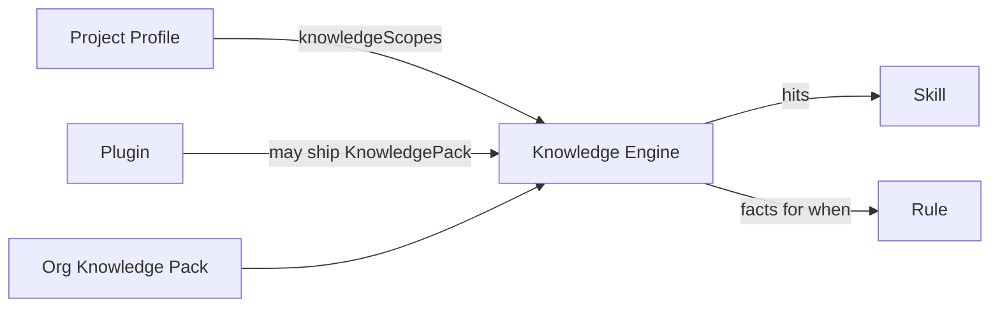

# 18 · Knowledge

## 定义

**Knowledge** 是 Runtime 可检索、可治理、可跨 Task/跨项目复用的 **软件工程知识资产**，为 Planning / Skill / Rule 提供结构化参考，而不是把“聊天历史”当记忆。

Knowledge ≠ TaskContext.memory（后者是单 Task 工作记忆）  
Knowledge ≠ Repository Graph（后者是代码结构事实）  
Knowledge ≠ Prompt 模板仓库（模板属 Plugin 资源；Knowledge 是可治理内容对象）

## 目标

1. 让无人值守 Task 能复用组织级/项目级工程约定与历史经验
2. 检索可控：scope、权限、引用审计
3. 写入可控：默认只读；写入走 Capability + Rule
4. 支持跨项目复用（组织级 Knowledge Pack）

## 知识类型（v1）

| Kind | 说明 | 示例 |
|------|------|------|
| `CONVENTION` | 约定与规范摘要 | 分支策略、包结构约定 |
| `PLAYBOOK` | 可引用的排障/实施步骤索引 | “DB 迁移检查清单” |
| `DECISION_RECORD` | 架构/业务决策摘要 | ADR 精华（可链到文档） |
| `PATTERN` | 可复用实现模式索引 | 错误处理模式 |
| `INCIDENT_LESSON` | 事故教训 | 禁止事项 |
| `PROJECT_FACT` | 稳定项目事实 | 模块职责说明 |
| `TASK_RETROSPECT` | Task 结束后沉淀（受审） | 某类失败的根因标签 |

## 对象模型



| 对象 | 字段要点 |
|------|----------|
| `KnowledgePack` | id, version, scope(`ORG`/`PROJECT`), owners |
| `KnowledgeItem` | id, kind, title, tags, status(`DRAFT`/`ACTIVE`/`DEPRECATED`), projectScope |
| `KnowledgeChunk` | 检索单元；embedding 可选（v1 可先关键词/标签） |
| `KnowledgeHit` | taskId, itemId, score, spanId |

## Knowledge Engine 职责

1. **Index**：从 Pack / 导入器构建索引
2. **Query**：白名单查询（语义检索可选）
3. **Govern**：激活/弃用、权限
4. **Cite**：向 Task 返回带引用的 Hit，强制写入 Trace
5. **Ingest**（可选）：Task 结束后的回顾提案 → 人工或 Rule 批准后入库

## 查询 API（白名单）

| Query | 说明 |
|-------|------|
| `search(scope, text, kinds[], limit)` | 主检索 |
| `get(itemId)` | 详情 |
| `listByTags(tags)` | 标签 |
| `relatedToModules(modules[])` | 结合 Repo Graph 模块名 |

禁止：对知识库任意脚本；禁止 Model 直接 SQL。

## 与 Profile / Plugin 的关系



- Profile 声明本项目启用哪些 Pack / scope
- Plugin 可附带领域 Pack（版本随 Plugin）
- 组织级 Pack 实现跨项目复用

## 写入路径

```text
propose (Capability knowledge.propose)
  → Rule gate
  → status=DRAFT
  → approve (API / 策略例外)
  → ACTIVE
```

无人值守默认 **不自动激活** 新知识（防污染）；Profile 默认 `autoActivateRetrospect=false`。

## 存储

- 元数据：DB
- 正文：DB 或对象存储
- 向量：可选组件（后期）；v1 可用全文检索

## 模块

- `engine-knowledge`
- `spi-knowledge`
- Capability：`knowledge.search` / `knowledge.propose`（builtin 或 plugin）
- Adapter：检索后端

## 相关

- ADR-0012 · RFC-0011 · Profile `19`
