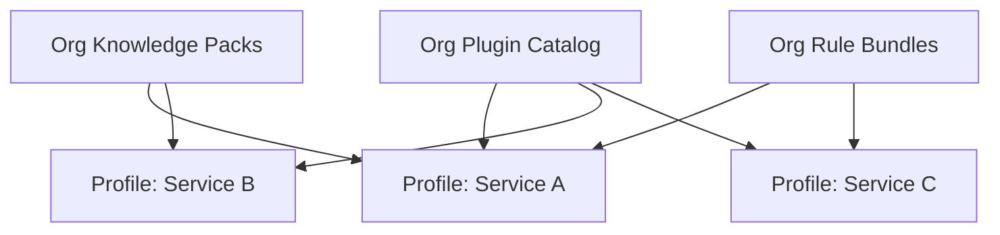

# 19 · Project Profile

## 定义

**Project Profile** 是某个工程在 Runtime 上的 **可版本化装配描述**：声明启用哪些 Plugin、默认 Workflow 路由、权限基线、预算、质量门、Knowledge 范围、Checkpoint/工作区策略等。

没有 Profile，Runtime 无法在多项目间无人值守地“知道该怎么跑”。

Profile ≠ 应用 `application.yml`（后者是宿主基础设施配置）  
Profile ≠ Plugin（Plugin 提供能力；Profile 选择与约束能力）  
Profile ≠ TaskRequest（Task 可覆盖部分字段，但基线来自 Profile）

## 目标

1. **跨项目复用**：同一套 Plugin + 不同 Profile
2. **无人值守**：把项目差异收敛到声明，而不是改 Kernel
3. **可校验**：启动前静态校验引用闭合
4. **可演进**：Profile 版本化；Task 绑定提交时快照

## Profile 文档结构（概念）

```yaml
# 概念示例 — 非业务实现
id: acme.paymentservice.default
version: 3.2.0
projectId: acme.paymentservice
runtimeApiVersion: "1"

plugins:
  - id: com.ai4se.plugin-builtin
    versionRange: ">=1.0.0"
  - id: com.ai4se.plugin-coding-loop
    versionRange: ">=2.0.0"

workflowRouting:
  default: coding.standard-task
  byGoalType:
    BUGFIX: coding.bugfix-task
    DEPENDENCY_BUMP: coding.dep-bump-task

permissions:
  baseline:
    - repo.read
    - repo.write
    - test.run
    - git.commit
  deny:
    - git.push.force

budget:
  maxIterations: 8
  maxSteps: 200
  maxTokens: 400000
  maxWallClock: PT2H

qualityGates:
  requireTests: true
  lintRequired: true
  coverageFloor: 0.0   # 项目可提高

knowledge:
  scopes: [ORG.engineering, PROJECT.local]
  packs: [org.ai4se.conventions, acme.paymentservice.facts]

repository:
  languageHints: [JAVA]
  buildSystem: MAVEN
  testCommandRef: capability:test.run

checkpoint:
  workspacePolicy: REQUIRE_CLEAN_MATCH
  keepLastN: 50

model:
  defaultProvider: openai
  allowedProviders: [openai, local]
  taskRoutes:
    planning: { labels: [strong] }
    verify_summary: { labels: [cheap] }

runMode:
  default: UNATTENDED
  policyExceptionTimeout: PT30M

rules:
  extra:
    - ref: acme.paymentservice.no-touch-billing-core
```

## Profile Engine 职责

| 职责 | 说明 |
|------|------|
| Load / Validate | 引用的 plugin/workflow/rule/pack 是否存在 |
| Activate | 项目默认 Profile |
| Snapshot | Task 创建时冻结 ProfileRevision |
| Merge | baseline ⊕ TaskRequest overrides（只允许收紧或 Profile 白名单字段覆盖） |
| Export / Import | 跨环境迁移 |

### 覆盖规则（安全）

- Task 可 **收紧** 权限/预算，不可擅自放宽 deny 列表
- 放宽必须走 `NEEDS_POLICY_EXCEPTION` 或管理员 API
- `runMode` 从 `UNATTENDED` 改为需人工确认的模式 → 记入 Trace

## 跨项目复用模型



复用层级：

1. **Org 层**：Plugin、Rule Bundle、Knowledge Pack  
2. **Profile 层**：选择 + 项目特化  
3. **Task 层**：单次覆盖（受限）

## 与目录/模块

```text
profiles/                          # 可版本管理的 Profile 仓库（可选独立 repo）
  acme.paymentservice/
    default.yaml
    ci-strict.yaml

runtime/engine-profile/
spi/spi-profile/
hosts/host-api/.../ProfileController
console-web/.../ProfileEditor
```

## 校验清单（启动 Task 前）

- [ ] `runtimeApiVersion` 兼容
- [ ] plugins 可解析且无冲突
- [ ] default/byGoalType workflow 存在
- [ ] knowledge packs 可访问
- [ ] budget 字段合法
- [ ] deny 权限与 baseline 无矛盾
- [ ] checkpoint.workspacePolicy 受支持

## Vue Console 职责

- Profile 编辑、diff、版本、激活
- 校验错误展示
- 不提供“自由聊天改配置”作为主路径

## 相关

- ADR-0013 · RFC-0012 · Unattended `21` · Knowledge `18`
