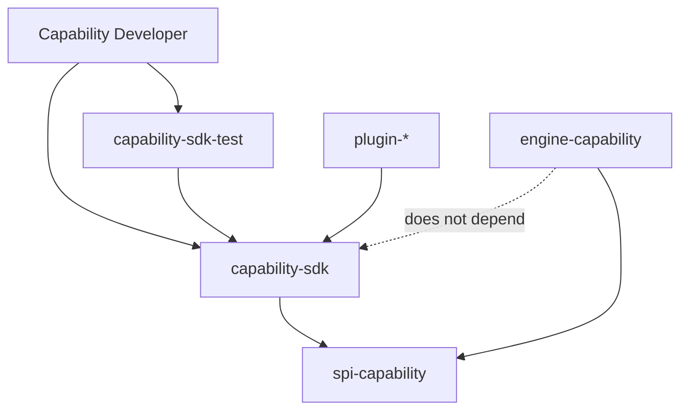

# 20 · Capability SDK

## 定义

**Capability SDK** 是面向扩展开发者的官方工具包：用于 **实现、描述、测试、打包、版本化** Capability（及常用支撑类型），使跨项目 Plugin 能稳定复用同一套能力开发方式。

Capability SPI = 引擎识别的契约  
Capability SDK = 开发者高效遵守该契约的库与测试基座  

仅有 SPI、没有 SDK，团队无法在“不读其他资料”的情况下高质量交付 Capability。

## 目标

1. 新 Capability 有标准项目模板与依赖
2. 单元测试不需要启动完整 Spring 容器（提供 Fake ports / 测试夹具）
3. Schema、权限、副作用、幂等在编译期/测试期可检查
4. 与 Plugin 打包集成（descriptor 生成可选）
5. Java 优先；与 Spring Boot 宿主兼容但不强制 Capability 实现依赖 Spring

## 模块边界

```text
sdk/
  capability-sdk/              # 主 SDK（API + 注解 + 校验）
  capability-sdk-test/         # JUnit 扩展、Fake Adapter、黄金用例
  capability-sdk-bom/          # 版本 BOM（可选）
spi/
  spi-capability/              # 纯接口（SDK 依赖它）
```



**硬规则：`engine-capability` 不得依赖 `capability-sdk`**（避免引擎与开发工具耦合）。SDK 只给 Plugin/Adapter 测试用。

## SDK 提供的核心 API（实现级清单）

### 1. 描述与注册

| API | 用途 |
|-----|------|
| `@CapabilityComponent` / `Capability` 基类 | 声明 id、version、sideEffects |
| `CapabilityDescriptorBuilder` | 编程式构建 descriptor |
| `Schema` 辅助 | JSON Schema 加载与校验 |
| `Permission` 常量集 | 标准权限名 |

### 2. 执行上下文

| API | 用途 |
|-----|------|
| `CapabilityEnv` | 获取 Port、只读 Context、Clock、IdGenerator |
| `Ports.get(GitPort.class)` | 类型安全取 Port |
| `Idempotency.keyed(key)` | 声明幂等键 |

### 3. 结果与错误

| API | 用途 |
|-----|------|
| `CapabilityResult.ok(output)` | 成功 |
| `CapabilityErrors.validation/retryable/fatal/policy` | 标准错误 |
| `ReasonCodes` | 稳定错误码 |

### 4. 测试夹具（capability-sdk-test）

| API | 用途 |
|-----|------|
| `@CapabilityTest` | JUnit 扩展 |
| `FakeFileSystemPort` 等 | 内存 Fake |
| `CapabilityTestHarness.invoke(id, input)` | 调实现 |
| `DescriptorContractAssert` | 契约断言 |
| `SideEffectRecorder` | 断言副作用 |

## 开发一个 Capability 的标准步骤

1. 建 Plugin 模块，引入 `capability-sdk` + `capability-sdk-test`
2. 实现 `Capability`（或 SDK 基类），填写 Descriptor
3. 只通过 Port 访问外部世界
4. 用 Harness 写：幸福路径、校验失败、权限不足、幂等重复调用
5. 在 `plugin.yaml` 贡献注册
6. 契约测试确认 id 命名空间、schema 可解析

详见 [14-extension-guides.md](./14-extension-guides.md)（已与 SDK 对齐的章节需同步）。

## 版本兼容策略

| 变更 | 版本影响 |
|------|----------|
| 新增可选输出字段 | MINOR |
| 新增强制输入字段 | MAJOR |
| sideEffects 变严（READ→WRITE） | MAJOR |
| 权限新增要求 | MAJOR |
| 错误码新增 | MINOR |
| 错误码语义变更 | MAJOR |

SDK BOM 与 `runtimeApiVersion` 对齐发布。

## 与 Spring Boot 的关系

- Host 用 Spring 扫描/装配 Plugin 与 Adapter
- Capability 实现 **推荐纯 Java**；若使用 Spring 注解，仅限 Plugin 模块内，不得泄漏到 spi
- SDK 不强制 `@Service`；提供可选 `SpringCapabilityRegistrar`（sdk 可选子模块）供 Plugin 使用

## 非目标

- SDK 不实现 Workflow/Skill DSL 解析
- SDK 不内置任何厂商 Model/Git 逻辑（那是 Adapter）
- SDK 不生成 Prompt

## 相关

- ADR-0014（Capability SDK）· RFC-0003 修订说明 · Architecture `03`
