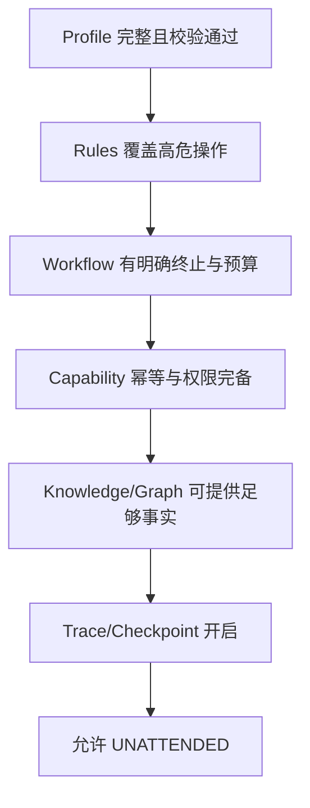
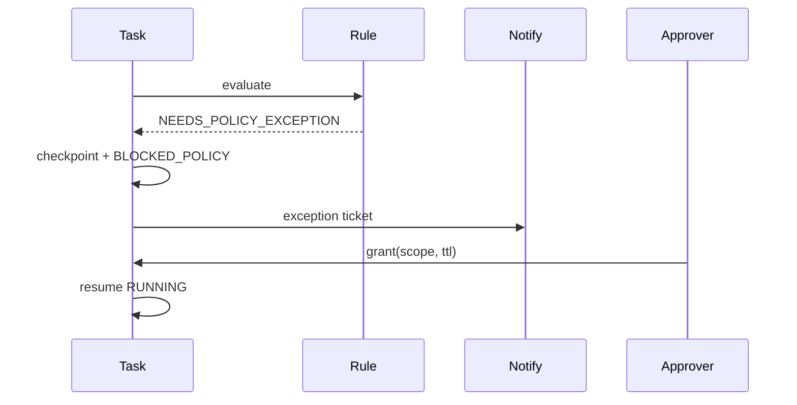

# 21 · Unattended Execution

## 定义

**无人值守（Unattended）** 是 Runtime 的默认运行模式：Task 在无人工对话的情况下，依据 Project Profile、Workflow、Rule、预算与 Checkpoint，自动跑到终态（成功/失败/取消），仅在 **策略例外** 时阻塞。

## 为什么是默认

AI SE Runtime 的价值是规模化执行软件工程任务，而不是陪伴式编程。若主路径依赖人工确认，系统退化为慢速 Agent 聊天。

## 模式对比

| 模式 | 行为 | 适用 |
|------|------|------|
| `UNATTENDED` | 自动跑；仅 POLICY 阻塞 | 默认 |
| `UNATTENDED_STRICT` | 任何 `REQUIRE_POLICY_EXCEPTION` 直接失败 | CI 批量 |
| `ATTENDED_GATES` | 关键门禁节点可预注册审批人 | 受控发布 |
| `DRY_RUN` | 禁止 WRITE/NETWORK 副作用 | 校验 |

Chat-driven 模式 **不提供**。

## 无人值守成立条件（检查表）

缺任一条件 → Task VALIDATING 失败或降级（按 Profile）。

## 策略例外（替代“找人聊天”）

当 Rule/Capability 返回 `NEEDS_POLICY_EXCEPTION`：

1. 写 Checkpoint  
2. Task → `BLOCKED_POLICY`  
3. 通知通道（Webhook/邮件/控制台）发送 **结构化例外请求**（reasonCode、风险、建议动作）  
4. 审批人调用 `grant` / `deny` API（非自由文本指挥下一步）  
5. 超时：按 Profile 失败或取消  

## 失败即终态（不假装成功）

无人值守必须诚实失败：

- 质量门失败 → FAILED（或 CONTINUE 迭代直至预算耗尽）
- 预算耗尽 → FAILED `BUDGET_EXCEEDED`
- 工作区与 Checkpoint 不一致且策略不允许 → FAILED

禁止：模型“口头说完成”而跳过 verify。

## Profile 关键字段

见 [19-project-profile.md](./19-project-profile.md) 的 `runMode`、`budget`、`qualityGates`、`checkpoint`、`permissions.deny`。

## 相关

- ADR-0007 · Task `15` · Rule `07`
