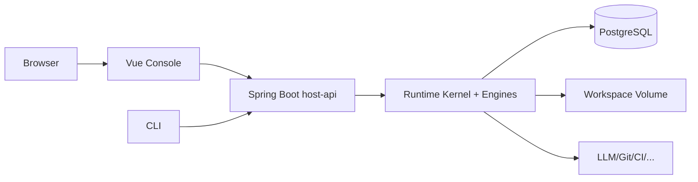
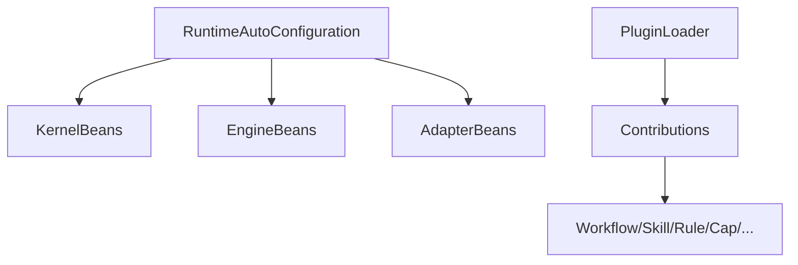

# 22 · Tech Stack & Deployment View

## 决策摘要

| 层 | 技术选型（v1 冻结） |
|----|---------------------|
| 语言（Runtime） | **Java 8**（团队当前基线；与 IDEA `corretto-1.8` 对齐） |
| 服务宿主 | **Spring Boot 3.x** |
| 构建 | **Maven** 多模块（可用 Gradle，但文档与示例以 Maven 为准） |
| 持久化 | JDBC/JPA + PostgreSQL（开发可用 H2） |
| 控制台 | **Vue 3 + TypeScript + Vite** |
| 契约测试 | JUnit 5 + ArchUnit |
| 容器 | 可选 Docker Compose（api + db + console） |

详见 [ADR-0008](../adr/0008-java-spring-vue.md)。

## 为何这样选

- Java/Spring：企业工程集成、类型安全、成熟观测与事务、与现有 SE 工具链匹配
- Vue：Task/Trace/Profile 控制台足够；避免做成 ChatUI 框架绑死
- 明确不选：以 Python Agent 框架作为 Kernel 主实现

## 逻辑部署

## 进程建议（v1）

| 进程 | 内容 |
|------|------|
| `host-api` | Spring Boot：REST + 嵌入 Kernel + Worker 线程池 |
| `console-web` | Vue 静态资源；可 nginx 同域反代 API |
| `postgres` | Task/Checkpoint/Trace/Profile/Knowledge 元数据 |

后期可拆 `worker` 独立进程抢 lease；v1 允许同进程。

## Spring 装配原则

- 所有 Engine 以 Spring Bean 形式存在，但 **引擎逻辑不依赖 Web 层**
- Plugin 冷加载在 ApplicationReady 或显式 admin API
- 禁止 Controller 直接调 Adapter

## Vue Console 信息架构（非 Chat）

| 页面 | 用途 |
|------|------|
| Tasks | 列表/详情/取消/续跑/策略例外批准 |
| Trace | Span 树与 timeline |
| Profiles | 编辑/校验/版本 |
| Plugins | 已装载贡献浏览 |
| Knowledge | 检索与审批 DRAFT |
| Projects | 项目与默认 Profile |

## 目录落位（相对初版增量）

见更新后的 [10-directory-structure.md](./10-directory-structure.md)：新增 `sdk/`、`engine-knowledge`、`engine-profile`、`spi-persistence`、`console-web/`、`profiles/`。

## 相关

- ADR-0008 · Directory `10` · Roadmap
