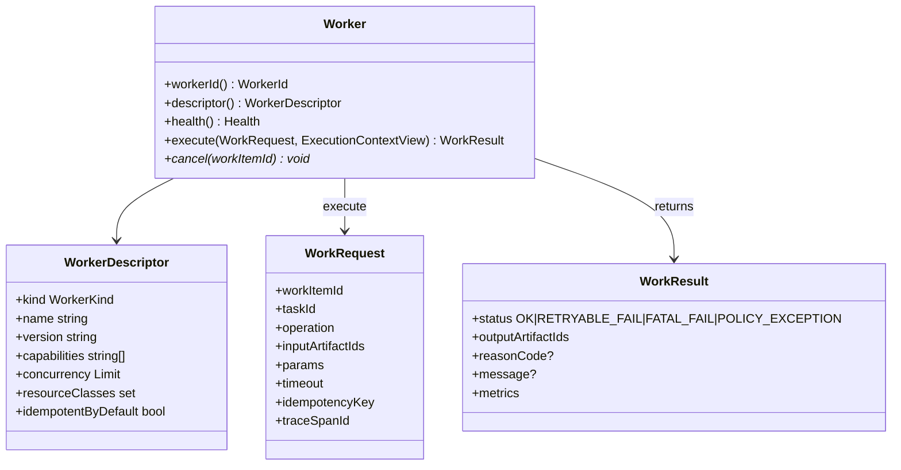
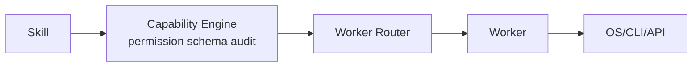

# 03 · Worker（Kernel Core Object）

## 1. 定义

**Worker** 是 Kernel 的 **统一执行接口**：把一次 `WorkRequest` 变成零到多个 **Artifact** + **WorkResult**。

Claude CLI、Codex CLI、Maven、Git、Playwright、本地脚本、HTTP 工具……在 Kernel 看来都是 Worker。

Worker ≠ Task（Task 是工作单元）  
Worker ≠ Scheduler（Scheduler 决定谁何时跑）  
Worker ≠ Capability（Capability 是权限化契约；Worker 是执行实现）

## 2. 统一接口（稳定）

### `execute` 契约

1. **只读** `ExecutionContextView`（见 `05`）；需要写入产物走 ArtifactStore（经 Kernel 注入的句柄）
2. **禁止**自己改 Task 状态
3. **禁止**自己调度其他 WorkItem（可返回“建议”，由 Scheduler/Workflow 吸收）
4. 必须可按 `idempotencyKey` 安全重入（或明确声明不可重入并由 Scheduler 隔离）
5. 超时由 Scheduler 强制；Worker 应响应 `cancel`

## 3. WorkerKind（v1）

| kind | 说明 | 示例实现 |
|------|------|----------|
| `CLI_AGENT` | 外部 AI CLI 代理 | `worker.cli.claude`, `worker.cli.codex` |
| `BUILD` | 构建系统 | `worker.build.maven`, `worker.build.gradle` |
| `VCS` | 版本控制 | `worker.vcs.git` |
| `TEST` | 测试运行器 | `worker.test.maven`, `worker.test.junit` |
| `BROWSER` | 浏览器自动化 | `worker.browser.playwright` |
| `PROCESS` | 通用进程 | `worker.process.shell`（高危，默认关闭） |
| `REPO` | 仓库读写/搜索 | `worker.repo.fs` |
| `MODEL_API` | 托管模型 HTTP API | `worker.model.openai` |
| `KNOWLEDGE` | 知识检索 | `worker.knowledge.local` |
| `CUSTOM` | Plugin 扩展 | `worker.custom.*` |

## 4. 内置 Worker 目录（规划，非实现）

| workerId | kind | 典型 operation | 产出 kind 例 |
|----------|------|----------------|--------------|
| `worker.cli.claude` | CLI_AGENT | `agent.run` | `model.structured`, `code.patch`, `report.summary` |
| `worker.cli.codex` | CLI_AGENT | `agent.run` | 同上 |
| `worker.build.maven` | BUILD | `verify`, `package`, `test` | `build.log`, `test.report`, `build.artifact` |
| `worker.vcs.git` | VCS | `status`, `diff`, `commit`, `checkout` | `vcs.diff-stat`, `vcs.commit-ref`, `code.patch` |
| `worker.browser.playwright` | BROWSER | `script.run`, `smoke` | `browser.screenshot`, `browser.trace`, `test.report` |
| `worker.repo.fs` | REPO | `read`, `write`, `search` | `code.file-set` |
| `worker.model.openai` | MODEL_API | `complete.structured` | `model.structured` |

`operation` 是 Worker 内的命令名；对外权限仍映射到 Capability ID（如 `git.commit` → `worker.vcs.git` + `commit`）。

## 5. Worker 与 Capability / Adapter 的关系

| 层 | 职责 |
|----|------|
| Capability | “能否做、参数是否合法、如何审计” |
| Worker | “具体怎么做、产出什么 Artifact” |
| Adapter | 历史 Blueprint 中的端口实现；**Sprint-0.5 起：进程型/CLI 型 Adapter 收敛为 Worker**；纯 SDK 封装可作为 Worker 内部细节 |

**决策**：新设计以 Worker 为一等执行对象；`adapter-*` 模块可实现为 Worker，或作为 Worker 内部依赖。不再平行维护两套“执行入口”叙事。详见 `06-reconciliation.md`。

## 6. 注册与发现

- Plugin / Host 启动时向 **WorkerRegistry** 注册
- Descriptor 声明：`capabilities[]`（可履行的 capabilityId）、`resourceClasses`（`cpu`,`gpu`,`network`,`browser`）、并发上限
- Scheduler 选 Worker：`capabilityId + labels + health + concurrency + affinity`

## 7. CLI Agent Worker 特殊约束（Claude / Codex）

| 规则 | 说明 |
|------|------|
| 输入必须是 Artifact + 结构化 params | 禁止 Kernel 塞入未治理 Prompt 正文作为唯一输入 |
| 输出必须落 Artifact | 至少 `model.structured` 或 `code.patch` / `report.summary` |
| 结构化校验失败 | `RETRYABLE_FAIL` 或 `FATAL_FAIL`（Profile 配） |
| 不允许 Worker 自行开启无限工具循环绕过 Workflow | 仍由 WorkItem 边界切分 |
| 密钥 | 经 Secret 注入，禁止写 Artifact 明文 |

这保证 Runtime 仍是 SE Runtime，而不是把控制权交给 CLI Agent。

## 8. 健康、并发与隔离

- `health()`：`UP` `DEGRADED` `DOWN`
- 并发：每 Worker 实例 `maxConcurrent`
- 工作目录：每次 execute 使用 Task workspace + 可选 sandbox
- 资源类冲突：如 `browser` 全局信号量由 Scheduler 管理

## 9. 非职责

- 不推进 Task 状态机  
- 不解释 Workflow 全图  
- 不持久化 Checkpoint（可触发建议事件）
