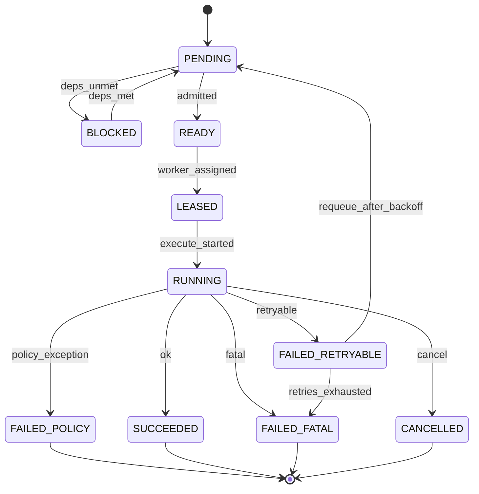
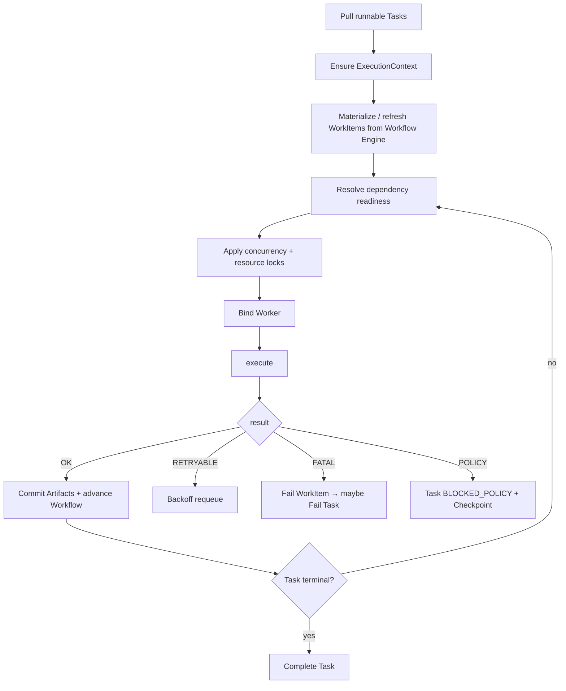
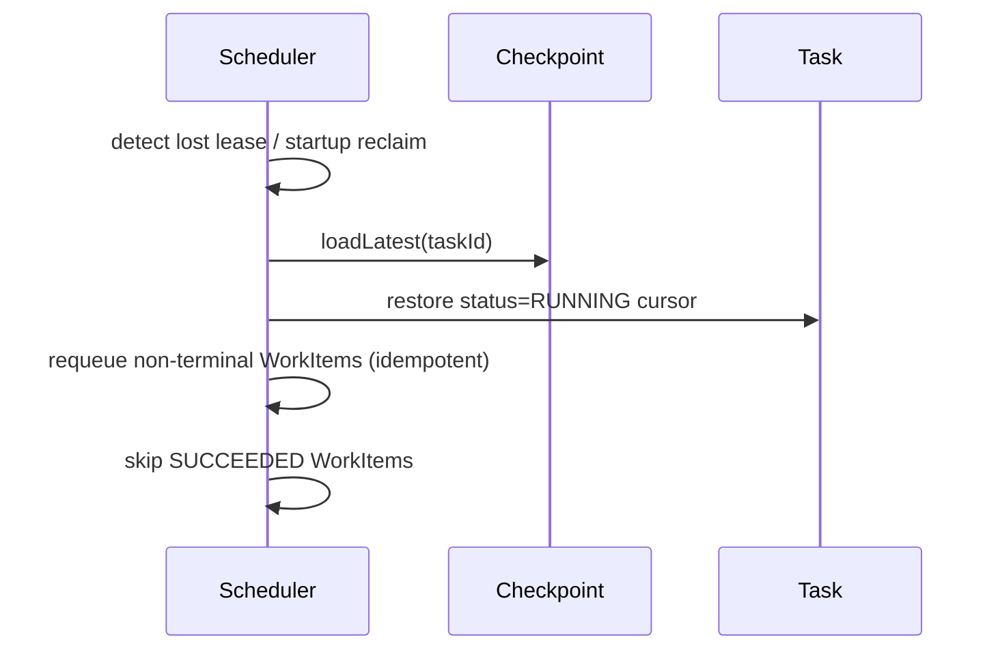

# 04 · Scheduler（Kernel Core Object）

## 1. 定义

**Scheduler** 是 Kernel 中唯一负责 **排队、依赖解析、派发、重试、恢复、并发控制** 的组件。它推进 Task 状态机，并把就绪的 **WorkItem** 交给匹配的 **Worker**。

Scheduler ≠ Workflow Engine（后者解释 DSL、生成/推进节点；Scheduler 执行调度策略）  
Scheduler ≠ Worker（后者只执行）

## 2. 职责边界

| 负责 | 不负责 |
|------|--------|
| Task 入队 / 优先级 / 租约 | 解析 Workflow YAML 语义细节 |
| WorkItem 依赖图就绪判定 | 实现 Git/Maven/CLI |
| 选择 Worker、限流、并发 | 修改 Artifact 内容 |
| 重试退避、恢复派发 | Rule 策略内容（只执行决策结果） |
| 触发 Checkpoint 边界 | UI |

## 3. WorkItem（调度原子）

WorkItem 是 Scheduler 的货币，从属于 Task。

### WorkItem 字段（稳定）

| 字段 | 说明 |
|------|------|
| `workItemId` | ID |
| `taskId` | 所属 Task |
| `name` / `nodeId` | 对应 Workflow 节点或其他来源 |
| `capabilityId` | 权限契约 |
| `workerSelector` | kind/labels/workerId 提示 |
| `operation` | Worker 内操作名 |
| `inputArtifactIds` | 依赖产物 |
| `dependsOnWorkItemIds` | 显式依赖 |
| `params` | 结构化参数 |
| `status` | 上表 |
| `attempt` / `maxAttempts` | 重试 |
| `idempotencyKey` | |
| `priority` | 可继承 Task |
| `leaseOwner` / `leaseDeadline` | |
| `timeout` | |
| `outputArtifactIds` | 完成后回填 |
| `lastError` | |

## 4. 调度循环（逻辑）

## 5. 队列与优先级

### 队列层级

1. **Task 队列**：按 `priority`、`createdAt`（可公平策略）  
2. **WorkItem 就绪队列**：每 Task 内局部顺序 + 全局资源约束  

### 录取（admit）

- Project 级 `maxConcurrentTasks`（Profile）  
- 全局 `maxConcurrentTasks`（Host 配置）  
- 资源类信号量：`browser`, `gpu`, `heavy_build`  

## 6. 依赖模型

WorkItem 就绪条件（全部满足）：

1. `dependsOnWorkItemIds` 均为 `SUCCEEDED`
2. `inputArtifactIds` 均存在且 `COMMITTED`
3. Task 处于可执行状态（`RUNNING` 等）
4. Rule PRE 对应该 capability 允许（或未判定，由执行前再判）

依赖形成 DAG；禁止环（物化时检测）。

## 7. 重试策略

| 来源 | 行为 |
|------|------|
| `WorkResult.RETRYABLE_FAIL` | `attempt++`，指数退避 + 抖动，回 `PENDING` |
| 超时 | 默认 RETRYABLE（可配置 FATAL） |
| Worker DOWN | 更换 Worker 实例或退避 |
| `maxAttempts` 耗尽 | `FAILED_FATAL`；Task 级策略：失败或跳过（默认失败） |

退避参数来自 Profile：`retry.base`, `retry.max`, `retry.multiplier`。

## 8. 恢复（与 Checkpoint）

规则：

- 已 `SUCCEEDED` 的 WorkItem 不重跑  
- `RUNNING`/`LEASED` 且租约丢失 → 标记中断，按幂等重跑或人工策略  
- 恢复后先校验 workspace fingerprint（Checkpoint 策略）

## 9. 并发与租约

| 概念 | 说明 |
|------|------|
| Task lease | 同一 Task 同时仅一个调度所有者（worker 进程） |
| WorkItem lease | 执行中绑定具体 Worker 会话 |
| 心跳 | lease 续约；超时视为丢失 |

v1：单机多线程或多实例抢占 DB lease 均可；Scheduler 逻辑相同。

## 10. Scheduler × Workflow Engine

| Workflow Engine | Scheduler |
|-----------------|-----------|
| 解释节点、边、守卫 | 不管 DSL |
| 提供 `nextWorkItems(task, cursor, ctx)` | 调用该 API 物化 WorkItem |
| 接收 `onWorkItemCompleted` | 推进 cursor |

**控制权**：Workflow 决定“下一步是什么”；Scheduler 决定“何时、由谁、以何并发执行”。

## 11. 稳定事件

`WorkItemQueued` `WorkItemReady` `WorkItemLeased` `WorkItemStarted` `WorkItemSucceeded` `WorkItemRetryScheduled` `WorkItemFailed` `TaskLeaseAcquired` `TaskLeaseLost` `SchedulerThrottled`

## 12. 非职责

- 不实现 Playwright/Maven  
- 不存储 Artifact blob  
- 不做前端任务列表（只提供查询端口）
