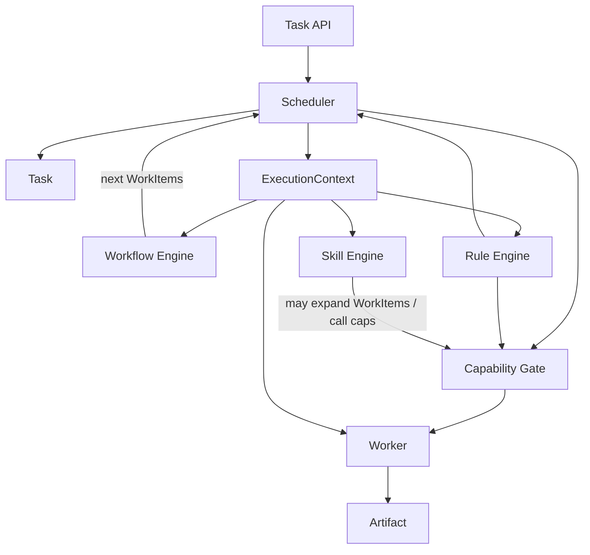

# 06 · Reconciliation with Architecture Blueprint

本文把 Sprint-0.5 五大对象与既有 Blueprint 对齐，避免两套叙事。

## 1. 总映射

| Blueprint 概念 | Kernel 五大中的位置 |
|----------------|---------------------|
| Task / TaskContext | **Task** + **ExecutionContext**（拆分：生命周期 vs 执行视图） |
| Loop / Iteration | Task 内 `iterationIndex` + Workflow 段；不再对外主对象 |
| Artifact（context 分区） | 升级为独立核心对象 **Artifact** |
| Adapter（CLI/进程/Git…） | 收敛为 **Worker** 实现 |
| Capability | 门禁契约；执行路由到 Worker |
| Capability SDK | 仍用于声明/测试 Capability；Worker 侧可有 Worker SDK（后置） |
| Scheduler（曾隐含在 Kernel） | 一等核心对象 **Scheduler** |
| Profile / Graph / Knowledge / Rule / Skill | 进入 **ExecutionContext** 分区 |
| Checkpoint / Trace | 仍关联 Task；非五大，但不变 |
| Workflow / Skill Engines | 向 Scheduler 提供 WorkItem；读 Context |
| Plugin | 贡献 Worker、Capability、Skill、Rule、Workflow、KnowledgePack |

## 2. 控制流对齐（统一后）

## 3. 文档权威层级

| 主题 | 权威来源 |
|------|----------|
| Task 状态枚举 | `kernel/01-task.md` |
| Artifact 模型 | `kernel/02-artifact.md` |
| Worker 接口与目录 | `kernel/03-worker.md` |
| 调度/重试/依赖 | `kernel/04-scheduler.md` |
| 上下文分区 | `kernel/05-execution-context.md` |
| Profile/Knowledge 内容模型 | `architecture/18`,`19` |
| Checkpoint/Trace | `architecture/16`,`17` |
| 技术栈 | `architecture/22`（实现阶段） |

Blueprint `15-task-lifecycle.md` 保留为导读；**冲突以 kernel/01 为准**，后续可把 15 改为指向 kernel。

## 4. 明确不改动的原则

- Runtime ≠ Coding Agent（ADR-0007）  
- 无人值守默认（architecture/21）  
- 不进入 Java 业务实现直到 Kernel 验收通过（本 Sprint）  
- Plugin 仍是业务扩展面  

## 5. 实现阶段模块暗示（仍不实现）

| Kernel 对象 | 未来模块暗示 |
|-------------|--------------|
| Task | `runtime-kernel` / `spi-persistence` |
| Artifact | `runtime-kernel` + `ArtifactStore` |
| Worker | `spi-worker` + `workers/worker-*`（可由原 adapters 迁入） |
| Scheduler | `runtime-kernel` 核心包 `scheduler` |
| ExecutionContext | `runtime-kernel` 核心包 `context` |
