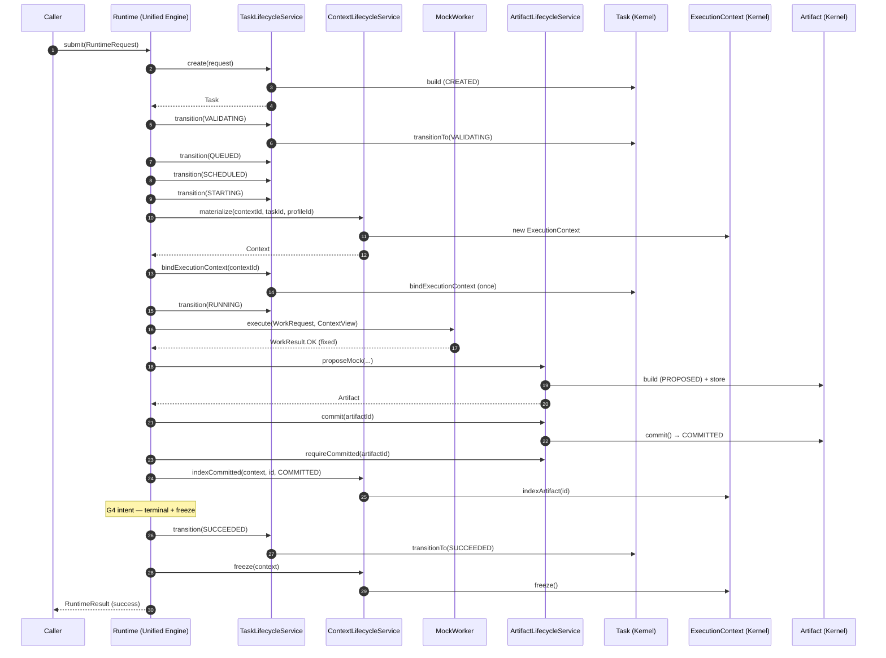

# Sprint-3 / Task-001 — Walking Skeleton

> 第一条可运行链路：`Runtime.submit` → Task → ExecutionContext → MockWorker → Mock Artifact → SUCCEEDED → `RuntimeResult`  
> **不接** Claude CLI / 模型 / 真实 Worker  
> 约束权威：[runtime-invariants.md](./architecture/runtime-invariants.md) · [runtime-enforcement.md](./architecture/runtime-enforcement.md)（Frozen）

## 1. Runtime 时序（文字）

1. Caller 调用 `Runtime.submit(RuntimeRequest)`
2. **Task Lifecycle Service** 创建 Task（`CREATED`，身份字段只写一次）
3. Engine 经合法转移推进：`VALIDATING → QUEUED → SCHEDULED → STARTING`
4. **Context Lifecycle Service** materialize `ExecutionContext`；Task **bind 一次**（G3 / T4）
5. Task → `RUNNING`
6. Engine 构造 `WorkRequest`，调用 **MockWorker.execute**（固定 OK，无副作用产物登记）
7. **Artifact Lifecycle Service** `propose`（`PROPOSED`）→ `commit`（`COMMITTED`）
8. Context **仅索引 COMMITTED** Artifact（G5 / E4）
9. Engine 同一意图内：Task → `SUCCEEDED`，再 `freeze` Context（G4）
10. 返回 `RuntimeResult`（taskId / contextId / SUCCEEDED / artifactIds）

## 2. Mermaid Sequence Diagram

## 3. Enforcement 映射（本骨架）

| Invariant | 如何保证 |
|-----------|----------|
| G1 | 唯一入口 `Runtime.submit` 必建 Task |
| G2 | 结果只带回 `ArtifactId` 列表 |
| G3 / T4 | 一次 materialize + bind；无第二 Context |
| G4 | SUCCEEDED 后立即 freeze；测试断言 frozen |
| G5 / E4 | `indexCommitted` 拒绝非 COMMITTED |
| T2 | 仅经 `Task.transitionTo` + 合法表 |
| A3 | `propose` → `commit` 管线 |
| E3 | freeze 后写索引抛错（单测覆盖） |

## 4. 模块入口

- Java：`ai4se-runtime-engine` → `com.ai4se.runtime.engine.Runtime`
- 测试：`RuntimeWalkingSkeletonTest`
