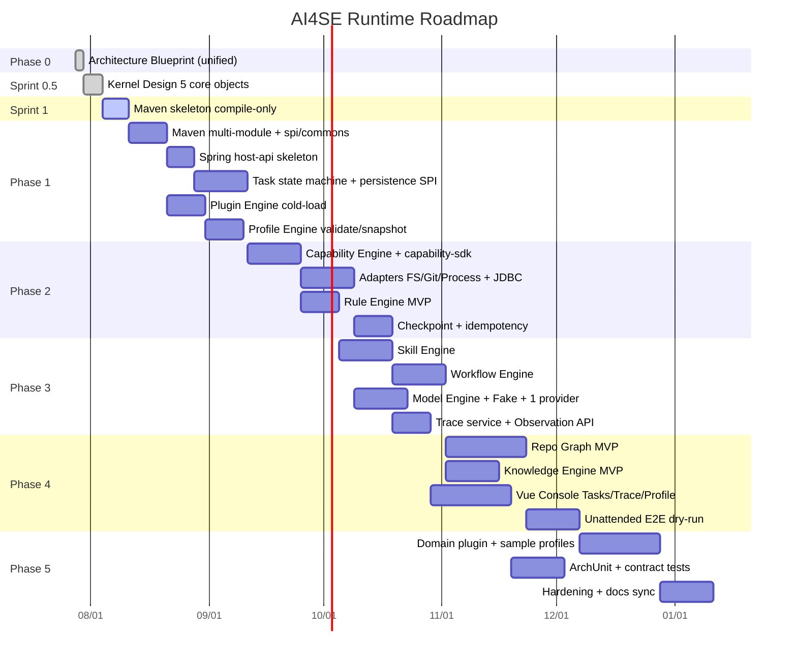

# Project Roadmap — AI Software Engineering Runtime

> Architecture Blueprint 统一修订后的实现路线。本文件只规划，不启动业务实现。

## 总览

## Phase 0 — Architecture Blueprint

| Deliverable | Status |
|-------------|--------|
| 定位 Runtime ≠ Agent、无人值守默认 | Done |
| Task / Checkpoint / Trace / Knowledge / Profile / Capability SDK | Done |
| 技术栈 Java/Spring/Vue | Done |
| 统一验收清单 `99` | Done |
| 零业务实现代码 | Done |

---

## Sprint-0.5 — Kernel Design（当前 · 禁止 Java 实现）

**目标：** 冻结 5 个 Kernel 核心对象契约，不写业务代码。

| 核心对象 | 文档 | Status |
|----------|------|--------|
| Task | `docs/architecture/kernel/01-task.md` | Drafted |
| Artifact | `kernel/02-artifact.md` | Drafted |
| Worker | `kernel/03-worker.md` | Drafted |
| Scheduler | `kernel/04-scheduler.md` | Drafted |
| ExecutionContext | `kernel/05-execution-context.md` | Drafted |
| 对齐 Blueprint | `kernel/06-reconciliation.md` | Drafted |
| 验收 | `kernel/99-kernel-acceptance.md` | Pending review |

退出：`kernel/99` 签字 Pass → 进入 Sprint-1。

---

## Sprint-1 — Kernel Skeleton（当前）

**目标：** 可编译 Maven 多模块；核心对象与 SPI 编译通过；依赖方向正确。

| 交付 | Status |
|------|--------|
| Parent `ai4se-runtime` + 10 modules | Done |
| Task / Artifact / ExecutionContext in `ai4se-kernel` | Done |
| Worker / Capability / Plugin / Rule / Skill / Model APIs | Done |
| Scheduler SPI + WorkItem | Done |
| host 占位（无 Spring 接线） | Done |
| 无 CLI / 无 Workflow 实现 | Done |
| `mvn compile` / `mvn test` | Verified |

**不做：** Claude/Codex CLI、Workflow Engine、真实调度循环、持久化。

下一阶段：Scheduler 内存实现 + Task 状态推进（仍可不接 CLI）。

---

## Phase 1 — Skeleton 深化（Sprint-1 之后）

- Maven 多模块按 `10-directory-structure.md`
- `spi-*` + `spi-persistence` + commons
- `host-api` Spring Boot 空壳：`/health`、`/tasks` 草稿接口
- Task 状态机 + JDBC schema（task 表）
- Plugin 冷加载；Profile validate/snapshot
- ArchUnit：禁止 engine→sdk、runtime→adapter 实现

退出：能 submit 一个 DRY_RUN Task 到 QUEUED/FAILED（无真实副作用），Profile 校验可运行。

---

## Phase 2 — Capability SDK, Adapters, Rule, Checkpoint

- `capability-sdk` / `capability-sdk-test`
- Capability Engine 全管道
- FS/Git/Process + persistence adapters + Fakes
- Rule Engine PRE/POST
- Checkpoint 强制边界 + 幂等存储

退出：崩溃恢复演示（kill -9 后 resume）；Rule 拒绝高危操作。

---

## Phase 3 — Skill, Workflow, Model, Trace

- Skill / Workflow 声明式执行
- Model Engine + FakeProvider
- Trace 强制埋点 + Observation API
- 策略例外 BLOCKED_POLICY API

退出：Fake Model 下 UNATTENDED Task 跑到 SUCCEEDED/FAILED；Trace 可查询。

---

## Phase 4 — Graph, Knowledge, Vue, E2E

- Repo Graph MVP + 一种语言 Enricher
- Knowledge Pack 检索 + Trace cite
- Vue Console：Tasks / Trace / Profiles
- 样例 Profile + 样例仓库干跑

退出：控制台可完成一次无人值守干跑复盘。

---

## Phase 5 — Domain & Hardening

- `plugin-coding-loop`（仍可后置 Prompt 内容治理）
- 组织级 Plugin/Knowledge 复用示例
- 合同测试与安全加固
- RFC 状态冻结为 Accepted

---

## 不在 v1

- 自由 Chat Agent 产品
- 分布式工作流引擎
- Kernel 内置 Prompt
- 无 Profile 的默认即兴执行

## 文档/实现漂移规则

先更新 ADR/RFC/Architecture，再改代码。每个 Phase 结束回归 `99-acceptance-checklist.md` 的 D 类问题。
