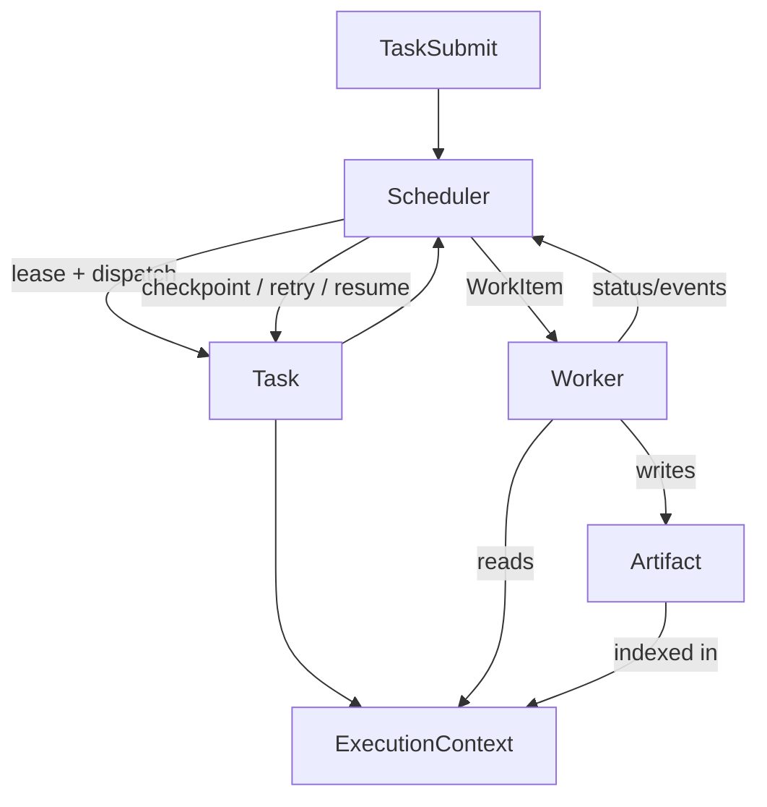

# Sprint-0.5 · Kernel Design

> **Status: Frozen**  
> 任何后续修改必须通过 ADR。  
>
> **目标**：冻结 Runtime Kernel 的核心对象契约。  
> **非目标**：任何 Java / Spring / Vue 业务实现。  
> **下游**：实现阶段以本目录契约 + Invariants / Enforcement 为准；若冲突，先改 ADR 再改实现。

## 为什么有 Sprint-0.5

Blueprint 已定义 Engines、Plugin、Capability、Profile 等。进入编码前，必须先把 **Kernel 真正稳定的运行时对象** 钉死——否则 Engine 会各自发明状态、产物与执行器，导致无法演进。

本 Sprint 只回答一件事：

> Kernel 内存续、调度、执行、产出时，到底在操作哪 5 类对象？

## 五个核心对象

| # | 对象 | 一句话 | 专章 |
|---|------|--------|------|
| 1 | **Task** | 可调度、可恢复、可审计的软件工程工作单元及其状态机 | [01-task.md](./01-task.md) |
| 2 | **Artifact** | 所有阶段产物的统一抽象（计划、补丁、报告、日志句柄…） | [02-artifact.md](./02-artifact.md) |
| 3 | **Worker** | 统一执行接口（边界协作方；活动实现见 worker-api） | [_archive …/03-worker.md](../../_archive/architecture/kernel/03-worker.md) |
| 4 | **Scheduler** | 队列、依赖、重试（Deferred） | [_archive …/04-scheduler.md](../../_archive/architecture/kernel/04-scheduler.md) |
| 5 | **ExecutionContext** | 单次执行可见的运行时上下文 | [05-execution-context.md](./05-execution-context.md) |

关系总图：[00-object-model.md](./00-object-model.md)  
与 Blueprint 对齐（归档）：[_archive …/06-reconciliation.md](../../_archive/architecture/kernel/06-reconciliation.md)  
验收清单（归档）：[_archive …/99-kernel-acceptance.md](../../_archive/architecture/kernel/99-kernel-acceptance.md)  
决策：[ADR-0015](../../adr/0015-five-kernel-objects.md)

## 对象协作（一张图）

## 稳定原则

1. **这 5 个对象的字段名、状态枚举、生命周期事件在 v1 主版本内不可随意改**（破坏性变更走 ADR + MAJOR）
2. Engine / Plugin / Capability **围绕** 它们运作，而不是另起并行对象体系
3. Worker 是执行面；Capability 是权限与契约面（见 reconciliation）
4. Artifact 是唯一允许跨阶段传递的“产物货币”
5. ExecutionContext 是唯一允许 Worker/Skill 读取的运行时视图（禁止直读全局单例）

## 阅读顺序

1. `00-object-model` → 2. `01` / `02` / `05` → 3. Invariants / Enforcement → 4. 归档章按需查阅 `_archive`
