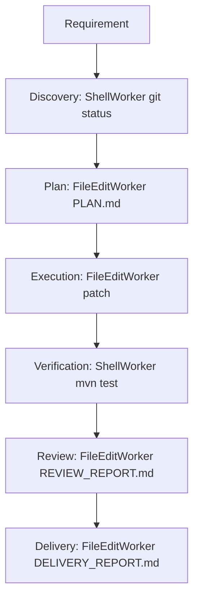

# First Production Delivery Report

Mode: First Production Delivery

Overall: PASS · TotalDurationMs=1385

---

## 【A】本次 Requirement

Fix first-delivery-sample so ConfigService reads app.timeout.ms from application.properties (expected 5000), expose TimeoutSource, and document the config contract in README. Verify with Maven tests.

Workspace (run copy): `/Users/peng.lv/IdeaProjects/ai4se-runtime/ai4se-demo/target/first-delivery-work`

## 【B】Execution Flow（Mermaid）

Stage outcomes:

- DISCOVERY: OK task=task_1_467c7049 worker=worker_shell cp=cp_9_6b3cc129 23ms
- PLAN: OK task=task_14_0e349f6c worker=worker_file_edit cp=cp_22_254c78be 1ms
- EXECUTION: OK task=task_25_8d911200 worker=worker_file_edit cp=cp_33_fcfdacc7 1ms
- VERIFICATION: OK task=task_36_c7fe953d worker=worker_shell cp=cp_44_52dc4afe 1360ms
- REVIEW: OK task=task_46_40eae5da worker=worker_file_edit cp=cp_54_b939d598 0ms
- DELIVERY: OK task=task_56_a04a20c2 worker=worker_file_edit cp=cp_64_357c88c9 0ms

## 【C】修改文件列表

### Modified (sample workspace via Runtime Worker)

- `src/main/java/com/example/delivery/ConfigService.java`
- `README.md`

### Added (sample workspace via Runtime Worker)

- `src/main/java/com/example/delivery/TimeoutSource.java`
- `PLAN.md`
- `REVIEW_REPORT.md`
- `DELIVERY_REPORT.md`

### Deleted

- (none)

### Supporting Runtime / Demo changes (agent-authored to enable proof)

- Modified: `Runtime.java`, `RuntimeResult.java`, `ShellWorker.java`
- Added: `FileEditWorker.java`, demo delivery package, sample workspace, tests
- Added: `docs/first-production-delivery-report.md` (this file)

## 【D】新增 Class

| Class | 职责 | 为什么不能复用已有对象 |
|-------|------|------------------------|
| `FileEditWorker` | 在 workspace 内写文本文件并产出 manifest Artifact | `ShellWorker` 仅允许 echo/pwd/git/mvn；不能安全承载多文件补丁 |
| `TimeoutSource` (sample) | 超时配置接口 | 业务需求「增加一个接口」；不属于 Runtime Kernel |
| Demo delivery formatters / pipeline | 多阶段编排 + 报告文本 | 禁止新增 Workflow；编排暂放 Demo |

## 【E】新增 Artifact Type

- **未新增 Kernel ArtifactKind / Domain。**
- Worker 仅通过现有 Artifact 管线提交不同 **name**：
  - `file-edit-manifest.txt`（FileEditWorker）
  - `shell-stdout.txt`（ShellWorker）
- 报告文件是 workspace 文件，不是新 Kernel Object。

## 【F】新增 Test

| Test | 覆盖 |
|------|------|
| `FileEditWorkerTest` | 写文件成功；拒绝 `..` 路径 |
| `ShellWorkerTest` (extended) | `mvn -f … -q test` allowlist 解析 |
| `FirstProductionDeliveryTest` | 端到端六阶段交付 + VERIFICATION 绿 |
| `CheckpointIntegrationTest` / result fields | `RuntimeResult.checkpointId` / `durationMs` |
| sample `ConfigServiceTest` | 业务验收：timeoutMs==5000 |

## 【G】Architecture Drift

| Check | Result |
|-------|--------|
| 新增 Domain | **No** |
| 新增 Kernel Object | **No** |
| 新增 Scheduler / Workflow / Plugin / Capability / Knowledge / Rule / Resume / DB / Bus / MQ | **No** |
| 违反 Frozen | **No**（仍 Orchestrator + Worker SPI；Checkpoint 只写不 Resume） |
| 职责漂移 | Demo 承担阶段编排（证据见 Lessons）；Runtime 仍单次 submit |
| 过度设计 | FileEditWorker 为最小可证伪补丁工人；无引擎空壳 |

## 【H】Lessons Learned

Evidence only:

1. **Runtime.submit = 单 Worker 步**：六阶段靠 Demo 串 6 次 submit；没有 Runtime 内阶段状态机也能交付，但交付编排不在 Runtime 边界内。
2. **Delivery Report 字段缺口曾存在**：本次给 `RuntimeResult` 补了 `checkpointId` / `durationMs` / `workerId` / `goalType`，否则报告只能翻 store。
3. **真交付需要写文件 + 跑测**：原 Shell allowlist（echo/pwd/git）不足以改代码；FileEditWorker + 受限 `mvn -f … -q test` 是证据驱动扩展，不是平台抽象。
4. **预算超时必须传到 Worker**：Verification 需 >30s；Runtime 改为使用 `Budget.maxWallClock`，否则 mvn 会被 ShellWorker 杀掉。

## 【I】Next Capability Recommendation（仅一个）

**推荐：Runtime Engine 内的固定串行 Stage Runner（硬编码阶段列表驱动多次 Worker 调用，仍无 Workflow DSL / Scheduler）。**

- **为什么：** 本次交付证明瓶颈在「阶段编排落在 Demo」，报告与验收需要跨阶段证据串联。
- **为什么不是别的：** 不是 Human-wait（本需求无澄清阻塞）；不是 Resume（未出现恢复痛点）；不是 Knowledge/Plugin（单样本交付未暴露召回/扩展问题）。

---

# ChatGPT Review Package

> Architecture Review only — no source dumps, no log walls.

## 1. 修改文件列表

- Sample (via Worker): ConfigService.java, README.md; added TimeoutSource.java, PLAN/REVIEW/DELIVERY reports
- Runtime: Runtime.java, RuntimeResult.java
- Workers: ShellWorker.java; added FileEditWorker.java
- Demo/Test: delivery package, FirstProductionDeliveryTest, FileEditWorkerTest
- Docs: docs/first-production-delivery-report.md

## 2. 新增对象职责

- FileEditWorker: workspace text patch → Artifact manifest
- TimeoutSource: sample domain interface
- Demo pipeline/formatters: external stage orchestration + report text

## 3. 新增 Artifact Type

- None at Kernel level. New Artifact **names** only: file-edit-manifest.txt

## 4. Execution Mermaid

## 5. Architecture Drift Summary

- No new Domain / Kernel Object / platform abstraction.
- Frozen preserved; Checkpoint write-only.
- Drift risk: stage orchestration lives in Demo (documented).

## 6. Lessons Learned

- Single-submit Runtime; multi-stage Demo.
- RuntimeResult needed checkpoint/duration/worker/goal for delivery reporting.
- Real edit + mvn verify required Worker extensions.
- Budget timeout must reach ShellWorker.

## 7. Next Capability

- Fixed serial Stage Runner inside Runtime Engine (not Workflow DSL).
