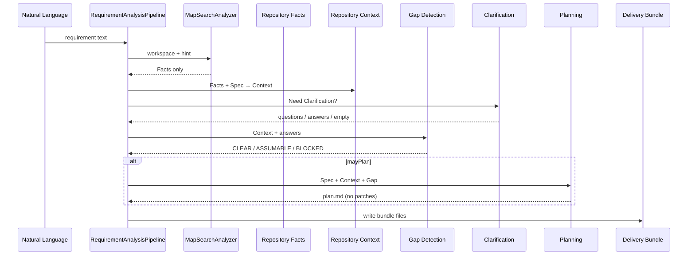

# Sprint-8 Pilot Requirement Analysis

> **Goal:** Prove Requirement Analysis Pipeline can emit a **legal Delivery Bundle**.  
> **Not:** Runtime / Worker / Graph / Knowledge / Coding / Patch generation.

## 1. Pipeline Sequence Diagram



## 2. Bundle Contract

Minimum files:

| File | Required |
|------|----------|
| `requirement.md` | yes |
| `analysis-context.md` | yes |
| `gap-report.md` | yes |
| `clarification.md` | yes (may be empty body) |
| `plan.md` | yes if `gap_status` ∈ {CLEAR, ASSUMABLE}; absent if BLOCKED |
| `verify.yaml` | yes |
| `profile.yaml` | yes |

Pilot also writes `facts.md` + `BUNDLE_STATUS.md` (audit helpers).  
**Forbidden in Analysis Bundle:** `patches/`, Implementation source, Runtime Task ids as authority.

## 3. Gap Contract

| Status | Rule | Plan? |
|--------|------|-------|
| CLEAR | blocking=0, assumable=0 | yes |
| ASSUMABLE | blocking=0, assumable>0 | yes (assumptions recorded) |
| BLOCKED | blocking>0 | **no** |

Pilot timeout default key may be **assumable**; missing order surface is **blocking**.

## 4. Clarification Contract

- Triggered by Context.`Need Clarification` / Gap Decision Needed.  
- File `clarification.md` always present.  
- Answers may come from `--answer` or pilot assumable defaults (documented in Gap Assumption).  
- Clarification **does not** write code.

## 5. Acceptance

| # | Criterion | Evidence |
|---|-----------|----------|
| A1 | NL → bundle without Runtime change | Arch: demo.analysis only |
| A2 | Required files exist when mayPlan | `RequirementAnalysisPipelineTest` |
| A3 | No `patches/` | test assert |
| A4 | Context has Candidate/Unknown/Need Clarification | `analysis-context.md` |
| A5 | Gap status recorded | `gap-report.md` |
| A6 | Plan has Design/Breakdown/Test/Risk; no patch | `plan.md` |

## 6. Architecture Drift

| Check | Result |
|-------|--------|
| Runtime / Worker SPI modified? | **No** |
| Graph / Knowledge / Scheduler / Workflow / StageRunner? | **No** |
| Analyzer outputs Facts only? | **Yes** (Context built in Pipeline) |
| Premature platform? | **No** — Demo pilot library |
| Risk | Pilot auto-assumptions must not be mistaken for production Human Gate |

## How to run

```bash
mvn -pl ai4se-demo -am test -Dtest=RequirementAnalysisPipelineTest
mvn -pl ai4se-demo exec:java -Ddemo.mainClass=com.ai4se.runtime.demo.analysis.PilotAnalysisMain
# output: ai4se-demo/target/pilot-delivery-bundle/
```
